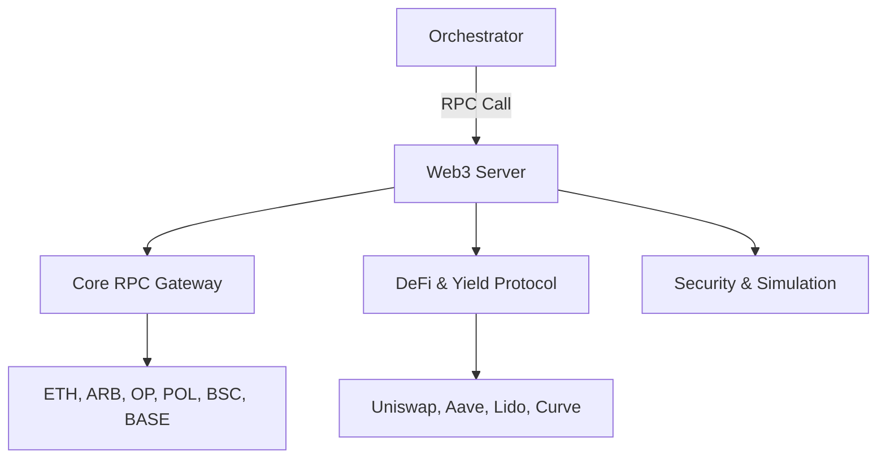

# 🔗 Web3 MCP Server

The **Web3 Server** provides a robust, standardized interface for interacting with blockchain networks. It abstracts the complexity of `web3.py` and RPC protocols into simple, research-ready tools for monitoring balances, auditing contracts, and executing transactions across major EVM-compatible chains.

## 🏗️ Architecture

The server implements a multi-chain architecture, allowing users to switch between Ethereum, Arbitrum, Optimism, Polygon, BSC, and Base.



## ✨ Features

### 🏦 Core RPC & Networking
- **Multi-Chain Support**: Instant switching between 6+ major networks with the `switch_chain` tool.
- **Atomic Inspection**: Deep dives into Blocks, Transactions, Nonces, and Gas Prices.
- **Bulk Balances**: High-speed multicall support for checking native or token balances across dozens of addresses in one call.

### 💸 DeFi & Yield Intelligence
- **Market Pricing**: Real-time token pricing via Uniswap V3 pools and Chainlink Oracles.
- **Lending & Staking**: Direct integration with Aave (Lending health/rates), Lido (ETH Staking), and Curve (Stableswap quotes).
- **Token Management**: ERC20 balance/allowance tracking and WETH wrap/unwrap operations.

### 🛡️ Smart Contract Operations
- **Universal Read**: Call any `view` or `constant` function on any smart contract by providing the signature and arguments.
- **Security Check**: Simulate transactions (dry run) to estimate gas and verify outcomes before broadcast.
- **Decoding**: Trace and decode transaction input data from raw hex into human-readable parameters.

### 👤 Identity & Naming
- **ENS Resolution**: Seamlessly bridge the gap between human-readable names (`alice.eth`) and hex addresses via forward and reverse resolution.

## 🔌 Tool Categories

| Category | Tools | Application |
|:---------|:------|:------------|
| **Core** | `get_block`, `get_gas_price` | Status |
| **Token** | `get_usdt_balance`, `get_token_metadata` | Assets |
| **DeFi** | `get_uniswap_price`, `get_aave_reserve_data` | Markets |
| **Action** | `send_eth`, `approve_token` | Operations |
| **Safety** | `simulate_transaction`, `estimate_gas` | Guardrails |

## 🚀 Usage

```python
# Get the Aave lending rates for USDC
result = await client.call_tool("get_usdc_aave_data", {
    "rpc_url": "https://eth-mainnet.g.alchemy.com/v2/..."
})
```
