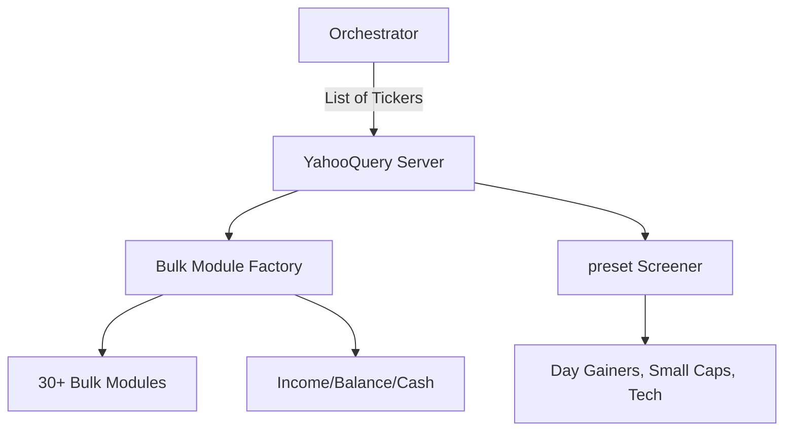

# 🏭 YahooQuery MCP Server 

The **YahooQuery Server** (codenamed "The Bulk Factory") is a high-performance financial data engine optimized for batch retrieval. Unlike standard single-ticker tools, this server is designed to fetch dozens of data modules for lists of symbols in parallel, making it ideal for large-scale market research and screening.

## 🏗️ Architecture

The server leverages the `yahooquery` Python library to bypass standard API limitations, providing deep access to Yahoo Finance's internal data structures.



## ✨ Features

### 🚀 Bulk Data Retrieval
- **30+ Simultaneous Modules**: Retrieve data for `esg_scores`, `major_holders`, `insider_transactions`, `asset_profile`, and more for a list of tickers (e.g., all of the S&P 100) in one call.
- **Aggregated Reports**: Multi-talent tools that combine Fundamentals, Ownership, Earnings, and Technicals into a single response.

### 📊 Deep Financials & Options
- **Multi-Ticker Financials**: Download Annual or Quarterly Balance Sheets, Cash Flow statements, and Income Statements for multiple companies at once.
- **Options Chains**: Fetch open contracts for a list of tickers to compare volatility and open interest across sectors.

### 🏹 Advanced Market Screening
- **20+ Preset Screeners**: Access specialized lists like `undervalued_growth_stocks`, `aggressive_small_caps`, `most_shorted_stocks`, and various industry-specific sectors.
- **Market Trending**: Identify trending securities by country (US, ID, etc.).

### 🔍 Discovery & news
- **Instrument Search**: Find symbols for non-equity assets like Gold, Bitcoin, and Global Bonds.
- **Ticker News**: Real-time news ingestion for a list of symbols.

## 🔌 Tool Categories

| Category | Tools | Application |
|:---------|:------|:------------|
| **Bulk** | `get_bulk_asset_profile`, `get_bulk_esg_scores`, etc. | Massive Data Mining |
| **Financials**| `get_bulk_income_statement_annual` | Fundamental Analysis |
| **Screen** | `screen_undervalued_growth`, `screen_sector_technology` | Opportunity ID |
| **Funds** | `get_fund_holdings`, `get_fund_sector_weightings` | Portfolio Tracking |

## 🚀 Usage

```python
# Get ESG scores for a list of tech stocks
result = await client.call_tool("get_bulk_esg_scores", {
    "tickers": ["AAPL", "MSFT", "GOOGL", "NVDA"]
})
```
