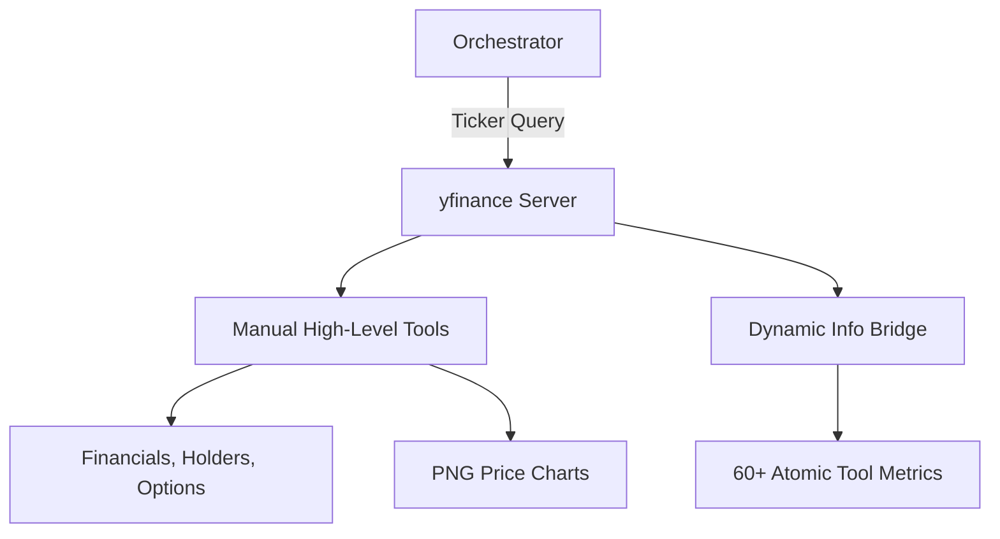

# 📈 yfinance MCP Server

The **yfinance Server** provides a "Bloomberg-lite" experience for financial research. It is a highly granular data engine that exposes nearly every available metric from Yahoo Finance, from core price action to intricate risk metrics and board compensation.

## 🏗️ Architecture

The server implements a "Double-Layer" tool registration: a set of high-level manual tools for complex objects, and a dynamic "Info Bridge" that unrolls 60+ individual metadata fields into atomic tools.



## ✨ Features

### 🏢 Deep Fundamental Access
- **Complete Financials**: Annual/Quarterly Income Statement, Balance Sheet, and Cash Flow.
- **Ownership Intelligence**: Breakdown of Major Holders, Institutional/Mutual Fund holdings, and the full Insider Roster with recent transactions.
- **Analyst Context**: Buy/Sell ratings, Upgrades/Downgrades, and consensus Price Targets.

### 📊 Atomic Metrics (Info Bridge)
Access 60+ specific metrics as individual tools including:
- **Valuation**: `peg_ratio`, `enterprise_to_ebitda`, `price_to_book`.
- **Profitability**: `operating_margins`, `return_on_equity`, `gross_profits`.
- **Risk**: `audit_risk`, `board_risk`, `overall_risk`.
- **Trading**: `short_percent_of_float`, `dividend_yield`, `payout_ratio`.

### 📉 Analysis & Visualization
- **Technical Analysis**: Built-in calculation of 15+ indicators including RSI, MACD, and multiple SMA/EMA periods.
- **Chart Generation**: Generates clean, research-ready PNG price charts.
- **Market Data**: Real-time quotes, Dividends, Splits, and full Option Chains.

## 🔌 Tool Categories

| Category | Typical Tools | Count |
|:---------|:--------------|:-----:|
| **Valuation** | `get_peg_ratio`, `get_pe_ratio` | 10 |
| **Financials**| `get_income_statement_annual`, `get_ebitda` | 15 |
| **Analysis** | `get_analyst_ratings`, `calculate_indicators` | 10 |
| **Holders** | `get_institutional_holders`, `get_insider_roster` | 5 |
| **Trading** | `get_dividend_yield`, `get_short_ratio` | 20+ |

## 🚀 Usage

```python
# Get the net income trend for a ticker
result = await client.call_tool("get_net_income", {
    "ticker": "TSLA"
})
```
