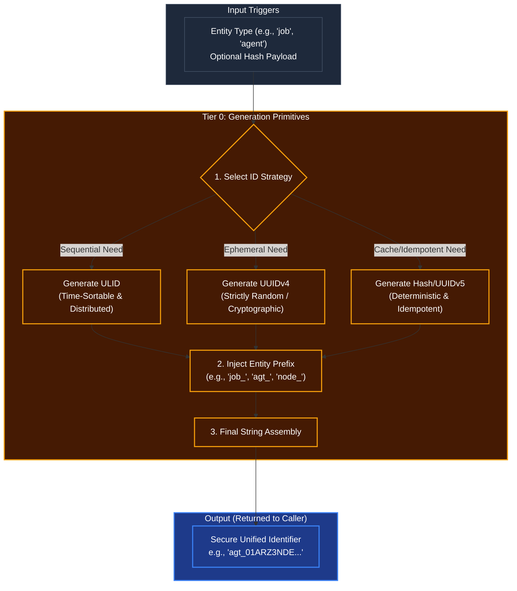

# Global ID & Hashing Primitives

## Overview
As part of **Tier 0 (Base Foundation)**, the ID generation rules dictate how Kea uniquely tracks everything from tiny internal sub-tasks to massive long-term macro-goals stored in the Vault. Tier 0 functions are strictly self-contained and do not depend on any higher-level cognitive layer. They provide the universal bedrock of identity for the entire system.

By standardizing ID generation here, we ensure that the database (Vault) never receives conflicting primary keys, and distributed instances of the Corporate Kernel can spawn agents without race conditions.

## Architecture & Flow

## Key Mechanisms
1. **ULID for Time-Sortable Objects**: When creating an Agent, a Job, or a Memory, Kea uses ULIDs (Universally Unique Lexicographically Sortable Identifiers). This allows the Vault database to sort billions of events natively by time without needing a separate `created_at` index, dramatically speeding up Tier 4 context retrieval.
2. **UUIDv4 for Ephemeral/Secure Objects**: If an ID is only needed for a temporary session token or a cryptographic nonce, a pure random UUID is generated to prevent sequence prediction attacks.
3. **Deterministic Hashing (UUIDv5)**: If an agent processes the exact same document twice, the system uses a SHA-256 hash or UUIDv5 based on the document's contents. This guarantees "Idempotency"—the database knows it's the same file and won't duplicate the vector embeddings, saving massive amounts of Corporate storage budget.
4. **The Stripe Prefix Rule**: All IDs are prefixed with a human-readable tag (like Stripe's API: `cus_x` or `ch_y`). For example, `agt_` for agents, `job_` for OODA loop tasks. This ensures developers and monitoring tools instantly know what an ID represents without querying the database.

## Function Decomposition

### `generate_id`
- **Signature**: `generate_id(entity_type: str, payload: bytes | None = None) -> str`
- **Description**: Top-level unified entry point. Delegates to the appropriate ID generation strategy based on `entity_type` and presence of `payload`. If a payload is provided, uses deterministic hashing for idempotency. Otherwise, selects ULID (time-sortable entities) or UUIDv4 (ephemeral entities) based on the entity type's configuration. Returns the final prefixed identifier string.
- **Calls**: `select_id_strategy()`, `generate_ulid()`, `generate_uuid4()`, `generate_deterministic_hash()`, `inject_entity_prefix()`.

### `select_id_strategy`
- **Signature**: `select_id_strategy(entity_type: str, has_payload: bool) -> IdStrategy`
- **Description**: Reads the entity type configuration from `shared/config.py` to determine the appropriate ID generation strategy. Maps entity types to strategies: persistent/ordered entities (agent, job, memory) to ULID, ephemeral/security entities (session, nonce) to UUIDv4, and content-addressable entities (document, embedding) with payloads to deterministic hashing.
- **Calls**: Config lookup from `shared/config.py`.

### `generate_ulid`
- **Signature**: `generate_ulid() -> str`
- **Description**: Generates a ULID (Universally Unique Lexicographically Sortable Identifier). The first 48 bits encode millisecond-precision UTC timestamp, followed by 80 bits of cryptographic randomness. Guarantees time-sortability for the Vault database, eliminating the need for separate `created_at` indices on high-volume tables.
- **Calls**: ULID library primitive.

### `generate_uuid4`
- **Signature**: `generate_uuid4() -> str`
- **Description**: Generates a cryptographically random UUIDv4. Used for ephemeral session tokens, nonces, and any ID where time-sortability is irrelevant and unpredictability is paramount. Prevents sequence prediction attacks on temporary resources.
- **Calls**: `uuid.uuid4()` standard library.

### `generate_deterministic_hash`
- **Signature**: `generate_deterministic_hash(payload: bytes, namespace: str) -> str`
- **Description**: Produces a deterministic UUIDv5 (or SHA-256 truncated hash) from the given `payload` bytes and a `namespace` string. Identical payloads always produce the same ID, enabling idempotency: if an agent processes the same document twice, the Vault recognizes the duplicate and skips re-embedding.
- **Calls**: `uuid.uuid5()` or `hashlib.sha256()`.

### `inject_entity_prefix`
- **Signature**: `inject_entity_prefix(raw_id: str, entity_type: str) -> str`
- **Description**: Applies the Stripe-style prefix rule. Looks up the entity type's registered prefix from configuration (e.g., `agt_` for agents, `job_` for jobs, `node_` for DAG nodes, `mem_` for memories) and prepends it to the raw ID string. Ensures every ID in the system is instantly human-readable in logs and monitoring dashboards.
- **Calls**: Config lookup from `shared/config.py`.
