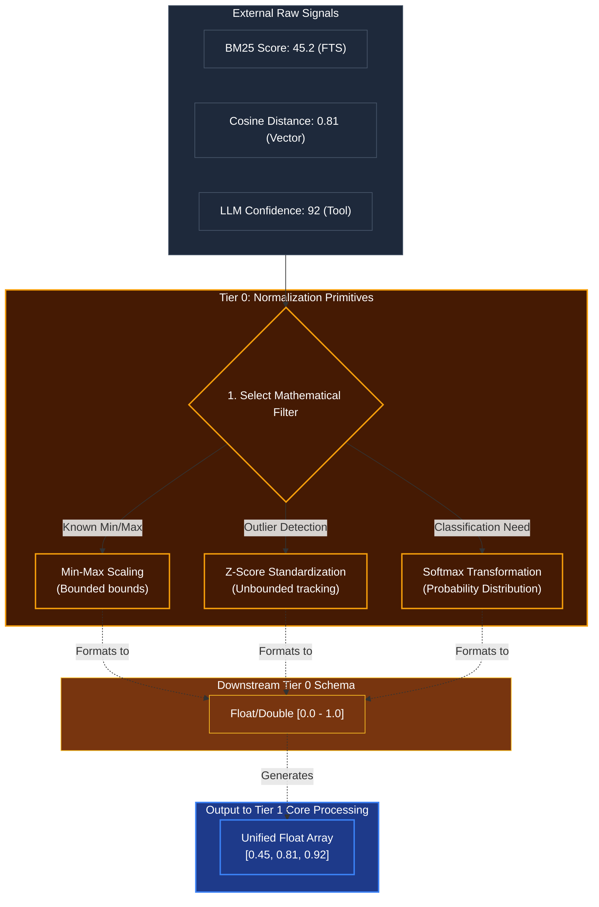

# Mathematical Normalization

## Overview
A critical **Tier 0** mathematical foundation. Different external sources provide confidence metrics in wildly varying formats: Vector Databases return cosine distances (0.0 to 2.0), SQL Full-Text Search returns BM25 scores (unbounded positives like 45.2), and NLP models return percentages (0 to 100). 

The normalization module scales all incoming numerical data to standard `0.0 - 1.0` arrays. This guarantees that Tier 1 (Classification) and Tier 2 (Cognitive Engines) can perform cross-signal math (like adding a vector score to a keyword score) without crashing or heavily biasing one metric.

## Architecture & Flow

## Key Mechanisms
1. **Min-Max Scaling**: Used when we know the absolute upper and lower limits of a signal. E.g., if a tool outputs a confidence rating from 1 to 10, Min-Max scales it cleanly linearly down to 0.1 to 1.0.
2. **Z-Score Standardization**: Used for unbounded data, like database search relevance where a score could theoretically be anything from 10 to 1,000. Z-Score tracks the arithmetic mean and standard deviation, allowing Kea to identify if a specific search result is a wild outlier (highly relevant) compared to the rest of the batch.
3. **Softmax**: Applied at the very end of Tier 1 Classification engines. It takes the output arrays and squeezes them so they all sum up to exactly `1.0`. This gives Tier 2 Plausibility a pure "Probability Distribution" (e.g. 70% chance of Intent A, 20% chance of Intent B, 10% chance of Intent C).

## Function Decomposition

### `select_normalization_strategy`
- **Signature**: `select_normalization_strategy(signal_metadata: SignalMetadata) -> NormalizationStrategy`
- **Description**: Inspects the metadata of an incoming signal (source type, known bounds, distribution characteristics) and selects the appropriate mathematical filter. Routes to Min-Max when bounds are known, Z-Score when the data is unbounded with trackable statistics, and Softmax when the downstream consumer requires a probability distribution.
- **Calls**: Config-driven strategy lookup from `shared/config.py`.

### `min_max_scale`
- **Signature**: `min_max_scale(value: float, min_bound: float, max_bound: float) -> float`
- **Description**: Applies linear Min-Max normalization: `(value - min) / (max - min)`. Clamps the result to `[0.0, 1.0]` to handle out-of-range inputs gracefully. Used for signals with deterministic upper and lower limits (e.g., tool confidence ratings 1-10).
- **Calls**: None (pure math).

### `z_score_normalize`
- **Signature**: `z_score_normalize(value: float, running_stats: RunningStatistics) -> float`
- **Description**: Computes `(value - mean) / std_dev` using a `RunningStatistics` object that tracks the rolling mean and standard deviation of a signal stream. The raw Z-Score is then mapped into `[0.0, 1.0]` via a sigmoid or CDF transform. Identifies outliers (highly relevant results) in unbounded distributions like BM25 scores.
- **Calls**: None (pure math with state read).

### `softmax_transform`
- **Signature**: `softmax_transform(scores: list[float]) -> list[float]`
- **Description**: Applies the softmax function across an array of raw scores, producing a probability distribution that sums to exactly `1.0`. Used at the output of Tier 1 classification engines to give Tier 2 a clean probability vector (e.g., 70% Intent A, 20% Intent B, 10% Intent C).
- **Calls**: None (pure math).

### `normalize_signal_batch`
- **Signature**: `normalize_signal_batch(raw_signals: list[RawSignal]) -> list[float]`
- **Description**: Top-level orchestrator. Takes a heterogeneous batch of raw signals from different sources (BM25, cosine, LLM confidence), routes each through `select_normalization_strategy`, applies the chosen normalizer, and returns a unified `[0.0, 1.0]` float array ready for cross-signal arithmetic in Tier 1.
- **Calls**: `select_normalization_strategy()`, `min_max_scale()`, `z_score_normalize()`, `softmax_transform()`.
