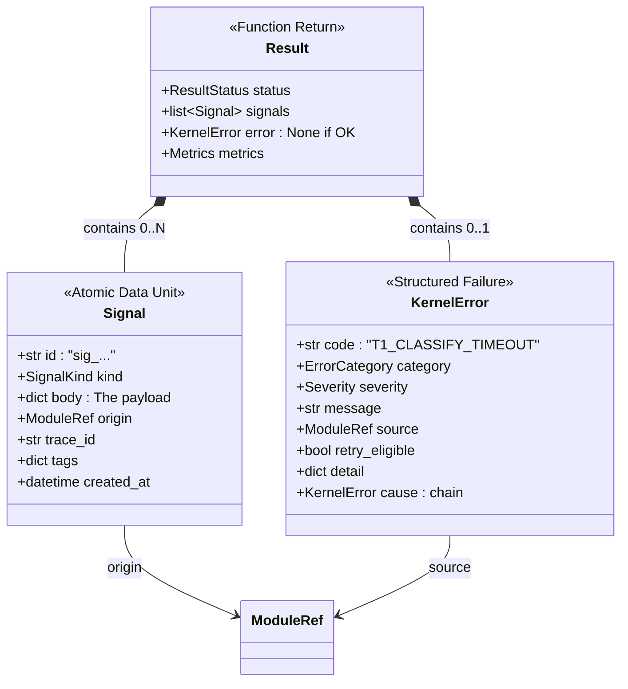
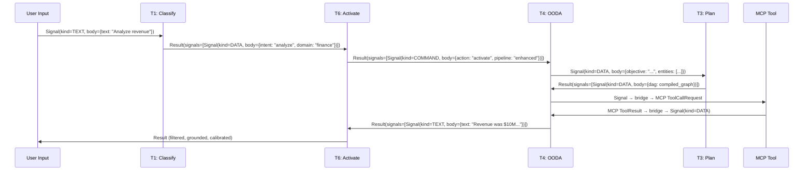
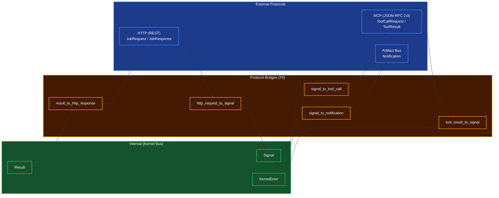

# Kernel Standard I/O Protocol

## Overview
The Kernel Standard I/O defines **how every module in the Human Kernel communicates** — module to module, tier to tier, kernel to MCP tools, kernel to HTTP services. It is the "blood type" of the cognitive pipeline.

The design follows one principle: **every function receives Signals, returns Results.** A `Signal` is the atomic data unit. A `Result` is the standardized output. A `KernelError` is a first-class citizen, not an exception. This makes the entire kernel encodable, decodable, traceable, and chainable — like n8n nodes, but for cognition.

**Relationship to Existing Code**: The production `shared/mcp/protocol.py` defines the **external** protocol (JSON-RPC 2.0 for MCP tool communication). This spec defines the **internal** protocol (how kernel tiers talk to each other). Bridge functions translate between the two.

## The Three Core Types



## Signal — The Atomic Data Unit

Every piece of data flowing through the kernel is a `Signal`. Signals are **immutable after creation** — modules create new signals, they never mutate incoming ones. This guarantees traceability.

### Schema

```python
class SignalKind(str, Enum):
    """What the signal carries."""
    TEXT = "text"          # Natural language (for LLM / display)
    DATA = "data"          # Structured data (dict, list, Pydantic model)
    FILE = "file"          # File reference (path, URL, binary ref)
    COMMAND = "command"     # Control instruction (activate, sleep, retry)
    STREAM = "stream"      # Streaming chunk (partial data, SSE events)

class ModuleRef(BaseModel):
    """A pointer to a specific function in the kernel."""
    tier: int              # 0-7
    module: str            # e.g., "classification", "ooda_loop", "noise_gate"
    function: str          # e.g., "classify", "observe", "filter_output"

class Signal(BaseModel):
    """The atomic, immutable data unit flowing through the kernel."""
    id: str                           # sig_<ULID> — unique, time-sortable
    kind: SignalKind                   # What type of payload
    body: dict[str, Any]              # The actual payload (typed per kind)
    origin: ModuleRef                 # Who created this signal
    trace_id: str                     # Correlation ID across the full pipeline
    tags: dict[str, str] = {}         # Flexible metadata (urgency, domain, etc.)
    created_at: datetime              # UTC timestamp
    parent_id: str | None = None      # ID of the signal that triggered this one
```

### Body Conventions Per Kind

The `body` dict is **typed by convention** based on `kind`. This keeps the schema simple (one dict) while maintaining structure:

| Kind | Required Body Keys | Example |
|---|---|---|
| `TEXT` | `text: str` | `{"text": "The revenue was $10M in Q3"}` |
| `DATA` | `data: Any`, `schema: str` | `{"data": [...], "schema": "list[AtomicInsight]", "count": 42}` |
| `FILE` | `file_id: str`, `file_type: str`, `path: str \| None` | `{"file_id": "report.pdf", "file_type": "pdf", "path": "/tmp/report.pdf"}` |
| `COMMAND` | `action: str`, `target: ModuleRef` | `{"action": "retry", "target": {"tier": 4, "module": "ooda_loop", "function": "act"}}` |
| `STREAM` | `chunk: str \| bytes`, `sequence: int`, `final: bool` | `{"chunk": "partial result...", "sequence": 3, "final": false}` |

### Tag Conventions

Tags carry metadata that **any module can read** without parsing the body. Standard tags:

| Tag Key | Values | Set By | Read By |
|---|---|---|---|
| `urgency` | `low`, `normal`, `high`, `critical` | T1 urgency scorer | T6 activation router |
| `domain` | `finance`, `code`, `general`, ... | T1 classifier | T6 activation router, T7 task router |
| `complexity` | `trivial`, `simple`, `moderate`, `complex` | T6 activation router | T4 OODA loop |
| `confidence` | `0.0` - `1.0` (as string) | T6 confidence calibrator | T6 noise gate |
| `grounding` | `0.0` - `1.0` (as string) | T6 hallucination monitor | T6 noise gate |
| `source_type` | `user`, `tool`, `agent`, `system` | T0 signal factory | All tiers |

## Result — The Universal Function Return

Every kernel function returns a `Result`. No exceptions, no raw dicts, no bare strings.

### Schema

```python
class ResultStatus(str, Enum):
    """Outcome of a kernel function."""
    OK = "ok"              # Fully successful
    PARTIAL = "partial"    # Partially successful (some signals, some errors)
    ERROR = "error"        # Failed — error field is populated
    SKIP = "skip"          # Intentionally skipped (e.g., activation router said dormant)

class Metrics(BaseModel):
    """Execution telemetry attached to every Result."""
    duration_ms: float = 0.0           # Wall clock time
    token_count: int = 0               # LLM tokens consumed (0 if no LLM call)
    cache_hit: bool = False            # Was this served from cache?
    module_ref: ModuleRef              # Which function produced this

class Result(BaseModel):
    """What every kernel function returns."""
    status: ResultStatus               # How did it go?
    signals: list[Signal] = []         # Output signals (may be empty for SKIP)
    error: KernelError | None = None   # Populated if status is ERROR or PARTIAL
    metrics: Metrics                   # Always present — timing, tokens, cache
```

### Chaining Convention (n8n-Style)

Like n8n, the output signals of one module become the input signals of the next. The kernel's execution engine (T4 OODA) manages this flow:



### Result Composition Rules

| Upstream Status | Downstream Behavior |
|---|---|
| `OK` | Normal processing — consume output signals |
| `PARTIAL` | Process available signals, log the error, continue |
| `ERROR` | Do NOT process signals — check `error.retry_eligible`, retry or escalate |
| `SKIP` | Pass through — this module was intentionally dormant |

## KernelError — Structured Failure

Errors are first-class data, not exceptions. They flow through the pipeline like signals, carrying enough context for any module to decide: retry, escalate, or abort.

### Schema

```python
class ErrorCategory(str, Enum):
    """What kind of failure."""
    INPUT = "input"            # Bad input data (validation, parsing, missing fields)
    PROCESSING = "processing"  # Logic failure (classification failed, plan invalid)
    EXTERNAL = "external"      # External dependency failed (MCP tool, API, network)
    RESOURCE = "resource"      # Out of budget, memory, or time
    POLICY = "policy"          # Blocked by guardrails, identity constraints, or ethics

class Severity(str, Enum):
    """How bad is it."""
    TRANSIENT = "transient"    # Retry will likely fix it (network blip, timeout)
    DEGRADED = "degraded"      # Partial functionality lost (can continue with reduced quality)
    FATAL = "fatal"            # Cannot continue — escalate or abort

class KernelError(BaseModel):
    """Structured error for any kernel failure."""
    code: str                          # Hierarchical: "T{tier}_{MODULE}_{REASON}"
    category: ErrorCategory
    severity: Severity
    message: str                       # Human-readable explanation
    source: ModuleRef                  # Which function failed
    retry_eligible: bool               # Can the caller retry?
    detail: dict[str, Any] = {}        # Additional context (stack trace, raw input, etc.)
    cause: KernelError | None = None   # Chained cause (for wrapping lower-tier errors)
```

### Error Code Convention

Error codes follow a strict hierarchical pattern: `T{tier}_{MODULE}_{REASON}`:

| Code | Category | Severity | Example Scenario |
|---|---|---|---|
| `T0_VALIDATION_SCHEMA_MISMATCH` | INPUT | TRANSIENT | Signal body doesn't match expected schema |
| `T0_CACHE_PRESSURE_EVICTION` | RESOURCE | DEGRADED | Cache evicted under memory pressure |
| `T1_CLASSIFY_LOW_CONFIDENCE` | PROCESSING | DEGRADED | Confidence below threshold, fallback triggered |
| `T1_CLASSIFY_TIMEOUT` | EXTERNAL | TRANSIENT | Embedding service timed out |
| `T2_DECOMPOSE_CYCLE_DETECTED` | PROCESSING | FATAL | Circular dependency in sub-goals |
| `T3_DAG_COMPILE_UNRESOLVED_DEPS` | PROCESSING | FATAL | DAG has unresolvable dependencies |
| `T4_TOOL_EXECUTION_FAILED` | EXTERNAL | TRANSIENT | MCP tool returned error |
| `T4_TOOL_TIMEOUT` | EXTERNAL | TRANSIENT | Tool execution exceeded timeout |
| `T5_BUDGET_EXHAUSTED` | RESOURCE | FATAL | Token/compute budget depleted |
| `T5_IDENTITY_VIOLATION` | POLICY | FATAL | Action violates role constraints |
| `T6_HALLUCINATION_DETECTED` | PROCESSING | DEGRADED | Output has fabricated claims |
| `T6_OVERCONFIDENCE_DETECTED` | PROCESSING | DEGRADED | Stated confidence exceeds evidence |
| `T6_LOOP_DETECTED` | PROCESSING | DEGRADED | Cognitive load monitor detected a loop |
| `T7_SPAWN_INSUFFICIENT_RESOURCES` | RESOURCE | TRANSIENT | Not enough hardware to spawn agent |

### Error Handling Contract

Every module follows the same error contract:

1. **Catch specific, wrap with context**: Never swallow errors. Catch the actual failure, wrap it in a `KernelError` with `cause` pointing to the original, return `Result(status=ERROR)`.
2. **Never throw**: Functions return `Result(status=ERROR, error=...)`, they do not raise Python exceptions across tier boundaries.
3. **Retry at the boundary**: The caller (not the callee) decides whether to retry. The `retry_eligible` flag and `severity` guide this decision.
4. **Escalate up**: If a tier cannot handle an error, it returns it upward. T4 errors bubble to T5. T5 errors bubble to T6. T6 errors bubble to T7.

## Protocol Bridges

The kernel has two communication zones — internal (in-process function calls) and external (MCP/HTTP). Bridge functions translate between them.

### Architecture



### Bridge Mappings

| Internal Type | External Type | Direction | Bridge Function |
|---|---|---|---|
| `Signal(kind=DATA)` | `ToolCallRequest` | OUT → MCP | `signal_to_tool_call()` |
| `ToolResult` | `Signal(kind=TEXT\|DATA\|FILE)` | MCP → IN | `tool_result_to_signal()` |
| `Result` | `JobResponse` / `SuccessResponse` / `ProblemDetails` | OUT → HTTP | `result_to_http_response()` |
| `JobRequest` / HTTP body | `Signal(kind=TEXT\|DATA)` | HTTP → IN | `http_request_to_signal()` |
| `Signal` | `JSONRPCNotification` | OUT → Bus | `signal_to_notification()` |
| `KernelError` | `ProblemDetails` (RFC 7807) | OUT → HTTP | `error_to_problem_details()` |
| `KernelError` | `JSONRPCError` | OUT → MCP | `error_to_jsonrpc_error()` |

## How It Maps to Existing Production Code

| Production Type (`shared/`) | Kernel Type (Redesign) | Relationship |
|---|---|---|
| `ToolOutput` (schemas.py) | `Signal(kind=TEXT\|DATA\|FILE)` | 1 ToolOutput → 1-3 Signals (text + data + files split) |
| `ToolResult` (protocol.py) | `Signal` (via bridge) | External protocol, bridged into internal |
| `NodeOutput` (protocol.py) | `Result` | Replaced by the richer Result type |
| `DataPayload` (schemas.py) | `Signal(kind=DATA).body` | Body convention replaces wrapper class |
| `FileReference` (schemas.py) | `Signal(kind=FILE).body` | Body convention replaces wrapper class |
| `IOEnvelope` (logging) | Observability view of Signal | Logging system reads Signal metadata for traces |
| `JSONRPCRequest` (protocol.py) | Unchanged — external MCP protocol | Bridge converts Signal ↔ JSONRPCRequest |
| `ProblemDetails` (schemas.py) | `KernelError` → `ProblemDetails` via bridge | KernelError is richer; ProblemDetails is the HTTP view |

## Function Registry

### Signal Factories

| Function | Signature | Purpose |
|----------|-----------|---------|
| `create_signal` | `(kind: SignalKind, body: dict, origin: ModuleRef, trace_id: str, tags: dict \| None, parent_id: str \| None) -> Signal` | Universal signal factory — generates ID, stamps timestamp |
| `create_text_signal` | `(text: str, origin: ModuleRef, trace_id: str, tags: dict \| None) -> Signal` | Convenience: TEXT signal from a string |
| `create_data_signal` | `(data: Any, schema: str, origin: ModuleRef, trace_id: str, tags: dict \| None) -> Signal` | Convenience: DATA signal from typed data |
| `create_file_signal` | `(file_id: str, file_type: str, path: str \| None, origin: ModuleRef, trace_id: str) -> Signal` | Convenience: FILE signal from a reference |
| `create_command_signal` | `(action: str, target: ModuleRef, origin: ModuleRef, trace_id: str, payload: dict \| None) -> Signal` | Convenience: COMMAND signal for control flow |
| `create_error_signal` | `(error: KernelError, origin: ModuleRef, trace_id: str) -> Signal` | Wrap a KernelError as a signal for pipeline propagation |

### Result Factories

| Function | Signature | Purpose |
|----------|-----------|---------|
| `ok` | `(signals: list[Signal], metrics: Metrics) -> Result` | Successful result |
| `partial` | `(signals: list[Signal], error: KernelError, metrics: Metrics) -> Result` | Partial success with error context |
| `fail` | `(error: KernelError, metrics: Metrics) -> Result` | Failed result — no output signals |
| `skip` | `(reason: str, metrics: Metrics) -> Result` | Intentionally skipped (dormant module) |

### Error Factories

| Function | Signature | Purpose |
|----------|-----------|---------|
| `create_error` | `(code: str, category: ErrorCategory, severity: Severity, message: str, source: ModuleRef, retry: bool, detail: dict \| None, cause: KernelError \| None) -> KernelError` | Universal error factory |
| `input_error` | `(message: str, source: ModuleRef, detail: dict \| None) -> KernelError` | Convenience: INPUT category, TRANSIENT severity |
| `processing_error` | `(message: str, source: ModuleRef, detail: dict \| None, cause: KernelError \| None) -> KernelError` | Convenience: PROCESSING category |
| `external_error` | `(message: str, source: ModuleRef, retry: bool, detail: dict \| None) -> KernelError` | Convenience: EXTERNAL category (tool/API failure) |
| `resource_error` | `(message: str, source: ModuleRef, detail: dict \| None) -> KernelError` | Convenience: RESOURCE category (budget/memory) |
| `policy_error` | `(message: str, source: ModuleRef, detail: dict \| None) -> KernelError` | Convenience: POLICY category (guardrail/identity) |
| `wrap_error` | `(outer_code: str, inner: KernelError, source: ModuleRef, message: str \| None) -> KernelError` | Wrap a lower-tier error with context |

### Protocol Bridges

| Function | Signature | Purpose |
|----------|-----------|---------|
| `signal_to_tool_call` | `(signal: Signal) -> ToolCallRequest` | Convert DATA signal to MCP tool invocation |
| `tool_result_to_signal` | `(result: ToolResult, tool_name: str, trace_id: str) -> list[Signal]` | Convert MCP result to 1-N signals (text + data + files) |
| `result_to_http_response` | `(result: Result) -> SuccessResponse \| ProblemDetails` | Convert Result to HTTP envelope |
| `http_request_to_signal` | `(request: JobRequest, trace_id: str) -> Signal` | Convert HTTP request to input signal |
| `signal_to_notification` | `(signal: Signal) -> JSONRPCNotification` | Convert signal to fire-and-forget bus message |
| `error_to_problem_details` | `(error: KernelError) -> ProblemDetails` | Convert KernelError to RFC 7807 |
| `error_to_jsonrpc_error` | `(error: KernelError) -> JSONRPCError` | Convert KernelError to JSON-RPC error |

### Validation

| Function | Signature | Purpose |
|----------|-----------|---------|
| `validate_signal` | `(signal: Signal) -> Signal \| KernelError` | Validate body matches kind conventions |
| `validate_result` | `(result: Result) -> Result \| KernelError` | Validate result consistency (ERROR status must have error, etc.) |

## Function Decomposition

### `create_signal`
- **Signature**: `create_signal(kind: SignalKind, body: dict[str, Any], origin: ModuleRef, trace_id: str, tags: dict[str, str] | None = None, parent_id: str | None = None) -> Signal`
- **Description**: Universal signal factory. Generates a time-sortable ULID via `id_and_hash.generate_id("signal")`, stamps the current UTC timestamp, and assembles the Signal. The `parent_id` enables lineage tracking — if this signal was derived from another, the chain is preserved. All tags are merged with the origin's default tags (tier number, module name). This is the ONLY way to create a Signal; direct construction is discouraged.
- **Calls**: `id_and_hash.generate_id()`.

### `create_text_signal`
- **Signature**: `create_text_signal(text: str, origin: ModuleRef, trace_id: str, tags: dict[str, str] | None = None) -> Signal`
- **Description**: Convenience factory for TEXT signals. Wraps the text string into the body convention `{"text": text}` and sets `kind=TEXT`. Used extensively by T4 (OODA Act output), T6 (noise gate filtered output), and T7 (team orchestration messages).
- **Calls**: `create_signal()`.

### `create_data_signal`
- **Signature**: `create_data_signal(data: Any, schema: str, origin: ModuleRef, trace_id: str, tags: dict[str, str] | None = None) -> Signal`
- **Description**: Convenience factory for DATA signals. Wraps structured data into `{"data": data, "schema": schema, "count": len(data) if list}`. The `schema` string is a type hint (e.g., `"list[AtomicInsight]"`, `"ClassificationResult"`) enabling downstream modules to validate before parsing. Used by all tiers for structured data passing.
- **Calls**: `create_signal()`.

### `create_file_signal`
- **Signature**: `create_file_signal(file_id: str, file_type: str, path: str | None, origin: ModuleRef, trace_id: str) -> Signal`
- **Description**: Convenience factory for FILE signals. Wraps file metadata into `{"file_id": file_id, "file_type": file_type, "path": path}`. The file itself is NOT embedded in the signal — only the reference. Actual file access goes through the Vault Service or MCP Host. Used by T4 when tools produce file artifacts.
- **Calls**: `create_signal()`.

### `create_command_signal`
- **Signature**: `create_command_signal(action: str, target: ModuleRef, origin: ModuleRef, trace_id: str, payload: dict[str, Any] | None = None) -> Signal`
- **Description**: Convenience factory for COMMAND signals. Wraps control instructions into `{"action": action, "target": target.model_dump(), ...payload}`. Standard actions: `"activate"` (wake a module), `"sleep"` (suspend), `"retry"` (re-execute with feedback), `"abort"` (kill current cycle), `"pivot"` (change objective). Used by T5 (lifecycle), T6 (activation router, load monitor), T7 (team orchestrator).
- **Calls**: `create_signal()`.

### `create_error`
- **Signature**: `create_error(code: str, category: ErrorCategory, severity: Severity, message: str, source: ModuleRef, retry: bool = False, detail: dict[str, Any] | None = None, cause: KernelError | None = None) -> KernelError`
- **Description**: Universal error factory. Validates the error code follows the `T{tier}_{MODULE}_{REASON}` convention. If a `cause` is provided, chains it — enabling full error provenance (e.g., T4 wraps a T1 classification failure with its own context). All fields are required except `detail` and `cause`, enforcing explicit error categorization rather than lazy "something went wrong" messages.
- **Calls**: None (pure construction with validation).

### `wrap_error`
- **Signature**: `wrap_error(outer_code: str, inner: KernelError, source: ModuleRef, message: str | None = None) -> KernelError`
- **Description**: Wraps a lower-tier error with an upper-tier context code. Preserves the inner error as `cause`, inherits `category` and `severity` from the inner error (promoting to FATAL if the outer tier cannot recover), and generates a new human-readable message that includes context about what the outer tier was doing when the inner error occurred. This is the standard pattern for error propagation across tier boundaries.
- **Calls**: `create_error()`.

### `tool_result_to_signal`
- **Signature**: `tool_result_to_signal(result: ToolResult, tool_name: str, trace_id: str) -> list[Signal]`
- **Description**: Bridges MCP external protocol to internal kernel signals. A single `ToolResult` may contain multiple content types (text + JSON + files). This function splits them into separate signals: `TextContent` → TEXT signal, `JSONContent` → DATA signal, `FileContent` → FILE signal, `ImageContent` → FILE signal. If `isError` is True, returns a single signal wrapping the error text. Each output signal shares the same `trace_id` and `parent_id` (linking them to the originating tool call signal).
- **Calls**: `create_text_signal()`, `create_data_signal()`, `create_file_signal()`.

### `signal_to_tool_call`
- **Signature**: `signal_to_tool_call(signal: Signal) -> ToolCallRequest`
- **Description**: Bridges internal DATA signal to MCP tool invocation. Reads `tool_name` from `signal.body["tool"]` and `arguments` from `signal.body["args"]`. Validates that the signal kind is DATA and the required keys are present. Returns a `ToolCallRequest` compatible with `shared/mcp/protocol.py`. If the signal is malformed, raises a KernelError(category=INPUT) rather than returning a bad request.
- **Calls**: None (pure mapping with validation).

### `result_to_http_response`
- **Signature**: `result_to_http_response(result: Result) -> SuccessResponse | ProblemDetails`
- **Description**: Bridges internal Result to HTTP response envelope. For OK/PARTIAL status, converts to `SuccessResponse` with signals serialized in the `data` field. For ERROR status, converts to RFC 7807 `ProblemDetails` with the KernelError mapped to: `type` = error code URI, `title` = category, `status` = HTTP status (400 for INPUT, 500 for PROCESSING, 502 for EXTERNAL, 429 for RESOURCE, 403 for POLICY), `detail` = error message.
- **Calls**: `error_to_problem_details()`.

### `http_request_to_signal`
- **Signature**: `http_request_to_signal(request: JobRequest, trace_id: str) -> Signal`
- **Description**: Bridges incoming HTTP request to internal kernel signal. Converts a `JobRequest` into a TEXT signal with the query as body text, and attaches job metadata (job_type, depth, max_steps) as tags. Sets `source_type=user` tag and origin as T0 (the gateway boundary). This is the entry point where external user requests enter the kernel pipeline.
- **Calls**: `create_text_signal()`.

### `error_to_problem_details`
- **Signature**: `error_to_problem_details(error: KernelError) -> ProblemDetails`
- **Description**: Converts a KernelError to RFC 7807 ProblemDetails for HTTP API responses. Maps error categories to HTTP status codes: INPUT → 400, PROCESSING → 500, EXTERNAL → 502, RESOURCE → 429, POLICY → 403. The `extensions` field carries the full error chain (cause) for debugging. Severity FATAL sets a `retry-after` header hint of -1 (do not retry); TRANSIENT suggests a retry delay from config.
- **Calls**: None (pure mapping).

### `error_to_jsonrpc_error`
- **Signature**: `error_to_jsonrpc_error(error: KernelError) -> JSONRPCError`
- **Description**: Converts a KernelError to JSON-RPC 2.0 error for MCP protocol. Maps error categories to JSON-RPC codes: INPUT → -32602 (INVALID_PARAMS), PROCESSING → -32603 (INTERNAL_ERROR), EXTERNAL → -32003 (EXECUTION_ERROR), RESOURCE → -32603, POLICY → -32600 (INVALID_REQUEST). The `data` field carries the KernelError detail dict for debugging.
- **Calls**: None (pure mapping).

### `validate_signal`
- **Signature**: `validate_signal(signal: Signal) -> Signal | KernelError`
- **Description**: Validates that a Signal's body matches the conventions for its kind. Checks: TEXT signals have `text` key, DATA signals have `data` and `schema` keys, FILE signals have `file_id` and `file_type` keys, COMMAND signals have `action` and `target` keys. Returns the signal unchanged if valid, or a `KernelError(category=INPUT)` if body conventions are violated. Called at tier boundaries to catch malformed signals early.
- **Calls**: None (pure validation).

### `validate_result`
- **Signature**: `validate_result(result: Result) -> Result | KernelError`
- **Description**: Validates Result consistency: ERROR status must have a non-None error, OK status must not have an error, PARTIAL must have both signals and error, SKIP must have empty signals. Also validates that all contained signals pass `validate_signal()`. Returns the result unchanged if valid. This is a defensive check — well-behaved modules should never produce invalid results, but this catches bugs at tier boundaries.
- **Calls**: `validate_signal()`.
