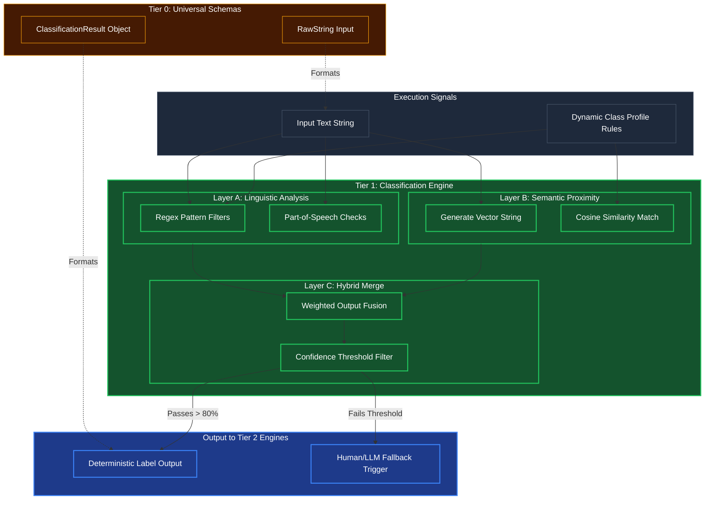

# Universal Classification Kernel

## Overview
Operating at **Tier 1 (Core Processing)**, the Universal Classification Kernel takes completely raw text and labels it according to distinct buckets (e.g., topic, intent, spam, urgency). It relies strictly on mathematical and syntactic structures rather than full logical deduction, allowing it to run at blazing fast speeds. Higher tiers use this primitive to rapidly determine the state of the world before attempting complex planning.

## Architecture & Flow

## Key Mechanisms
1. **Linguistic Analysis (Layer A)**: Runs extremely fast SpaCy models to check for literal text patterns. If the user says "Delete my account," the regex and part-of-speech taggers instantly recognize the imperative verb "Delete" and the noun "account."
2. **Semantic Proximity (Layer B)**: Runs in parallel. It converts the text into vector embeddings and checks against known intent vectors (e.g., matching "Get rid of my profile" to the label `DELETE_ACCOUNT_INTENT`).
3. **Hybrid Merge (Layer C)**: Combines the fast literal check (Layer A) with the flexible meaning check (Layer B). If the confidence is high, it returns a strict Tier 0 label schema. If the confidence is too low, it aborts the deterministic primitive and flags Tier 2 to handle the ambiguity.

## Function Decomposition

### `classify`
- **Signature**: `async classify(text: str, profile_rules: ClassProfileRules) -> ClassificationResult | FallbackTrigger`
- **Description**: Top-level orchestrator. Runs Layer A (linguistic) and Layer B (semantic) in parallel, merges their outputs via Layer C (hybrid fusion), and applies the confidence threshold. Returns a deterministic `ClassificationResult` with labels and scores if confidence exceeds the configured threshold, or a `FallbackTrigger` signaling Tier 2 to handle the ambiguity via LLM inference.
- **Calls**: `run_linguistic_analysis()`, `run_semantic_proximity()`, `merge_classification_layers()`.

### `run_linguistic_analysis`
- **Signature**: `run_linguistic_analysis(text: str, profile_rules: ClassProfileRules) -> LinguisticResult`
- **Description**: Layer A. Executes fast regex pattern matching and SpaCy part-of-speech tagging against the input text. Identifies imperative verbs, entity nouns, and structural markers using rule sets defined in the `profile_rules`. Returns a scored list of candidate labels based on syntactic signal strength.
- **Calls**: SpaCy POS tagger, compiled regex patterns from `profile_rules`.

### `run_semantic_proximity`
- **Signature**: `async run_semantic_proximity(text: str, profile_rules: ClassProfileRules) -> SemanticResult`
- **Description**: Layer B. Converts the input text into a vector embedding and computes cosine similarity against pre-indexed intent vectors defined in the class profile. Returns a ranked list of candidate labels with semantic confidence scores. Runs in parallel with Layer A.
- **Calls**: Embedding model, cosine similarity from `normalization.normalize_signal_batch()`.

### `merge_classification_layers`
- **Signature**: `merge_classification_layers(linguistic: LinguisticResult, semantic: SemanticResult, threshold: float) -> ClassificationResult | FallbackTrigger`
- **Description**: Layer C. Applies configurable weighted fusion to combine Layer A (syntactic) and Layer B (semantic) scores into a unified confidence per candidate label. Filters through the confidence threshold (config-driven, default ~80%). Labels passing the threshold are returned as a `ClassificationResult`; if no label clears the bar, returns `FallbackTrigger`.
- **Calls**: `normalization.softmax_transform()` for final probability distribution.
