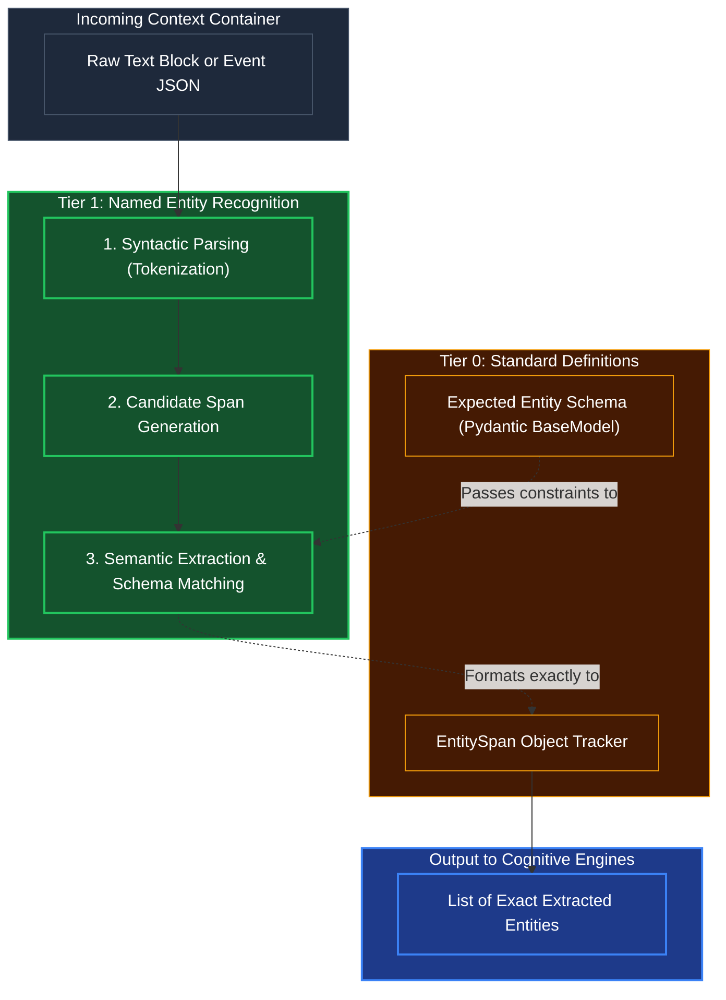

# Entity Recognition (NER)

## Overview
A high-speed **Tier 1** cognitive scanner. It looks at raw blocks of text or context, identifies strict nouns/parameters (Names, Paths, IPs, Amounts), and pulls them out so higher tiers don't have to read the exact text stream to find variables.

## Architecture & Flow

## Key Mechanisms
1. **Candidate Span Generation**: The system dynamically scans the sentence and chunks it into specific noun phrases before querying semantics. E.g., for "Send an email to John Doe at Acme Corp," it groups `[John Doe]` and `[Acme Corp]` as distinct spans.
2. **Schema Matching**: Unlike old keyword search, Kea's Tier 1 NER uses the exact Pydantic schema requested by a Tier 2 engine. If the `Expected Entity Schema` requires an `IpAddress`, the NER engine mathematically rejects `[Acme Corp]` and only extracts valid IP spans.

## Function Decomposition

### `extract_entities`
- **Signature**: `extract_entities(raw_text: str, expected_schema: type[BaseModel]) -> list[ValidatedEntity]`
- **Description**: Top-level orchestrator. Tokenizes the input, generates candidate spans, matches each span against the expected Pydantic schema, and returns only the entities that pass strict type validation. Higher tiers receive a clean, typed list of extracted variables without needing to parse raw text themselves.
- **Calls**: `tokenize_and_parse()`, `generate_candidate_spans()`, `match_spans_to_schema()`.

### `tokenize_and_parse`
- **Signature**: `tokenize_and_parse(raw_text: str) -> list[Token]`
- **Description**: Step 1: Syntactic parsing. Splits the raw text into a token stream using the configured tokenizer (SpaCy or equivalent). Each `Token` carries its text content, part-of-speech tag, character offsets, and dependency label. Provides the structural skeleton for span generation.
- **Calls**: SpaCy tokenizer pipeline.

### `generate_candidate_spans`
- **Signature**: `generate_candidate_spans(tokens: list[Token]) -> list[EntitySpan]`
- **Description**: Step 2: Noun phrase chunking and candidate detection. Scans the token stream for contiguous noun phrases, named entity patterns, and special-format strings (IPs, file paths, monetary amounts). Each `EntitySpan` records the text, character offsets, and a preliminary entity type hint.
- **Calls**: SpaCy noun chunk parser, regex detectors for structured formats.

### `match_spans_to_schema`
- **Signature**: `match_spans_to_schema(spans: list[EntitySpan], expected_schema: type[BaseModel]) -> list[ValidatedEntity]`
- **Description**: Step 3: Semantic extraction and Pydantic validation. Attempts to coerce each candidate span into a field of the `expected_schema`. Spans that fail type validation (e.g., "Acme Corp" failing `IpAddress` parsing) are silently rejected. Only spans that produce valid Pydantic field values are returned as `ValidatedEntity` objects.
- **Calls**: Pydantic `model_validate()` per field, Tier 0 `validation.check_types()`.
