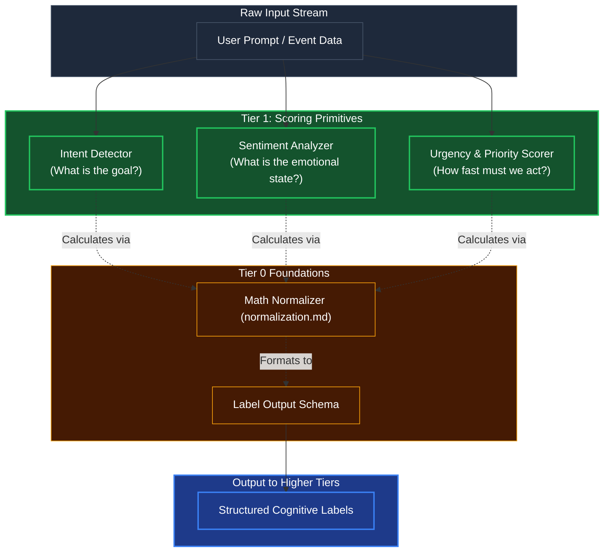

# Intent, Sentiment, & Urgency (Primitives)

## Overview
Based on Kea's Layered Pyramid Architecture, **Intent Detection, Sentiment Analysis, and Urgency/Priority** are fundamental text-in/label-out classifiers. Because they do not require complex multi-step reasoning or tool use, they are strictly **Tier 1 Core Primitives**. 

Tier 2 and Tier 3 rely heavily on these fast, deterministic primitives to make higher-level cognitive decisions. Kea does not need to spin up a complex DAG to figure out if the user is angry; it runs a sub-100ms Tier 1 primitive to inject `Urgency: HIGH` into the state context.

## Architecture & Flow

## Key Mechanisms
1. **Mathematical Grounding**: The text strings evaluated by these three engines do not return raw text back to the agent. They return probability scores. The Tier 0 Math Normalizer ensures the "Anger" sentiment score uses proper Min/Max logic before handing it off.
2. **Speed & Determinism**: Uses either small SLMs (like a very fast distilled BERT model) or pure lexical rule sets depending on context. The objective is to flag the input within milliseconds, creating an immediate context anchor for Tier 4 to observe.

## Function Decomposition

### `run_primitive_scorers`
- **Signature**: `async run_primitive_scorers(text: str) -> CognitiveLabels`
- **Description**: Top-level orchestrator. Executes all three primitive scorers (intent, sentiment, urgency) in parallel via `asyncio.gather`. Combines their individual label outputs into a single `CognitiveLabels` schema containing normalized probability scores for each dimension. Guarantees sub-100ms total latency by running all scorers concurrently.
- **Calls**: `detect_intent()`, `analyze_sentiment()`, `score_urgency()`.

### `detect_intent`
- **Signature**: `detect_intent(text: str) -> IntentLabel`
- **Description**: Classifies the underlying goal or purpose of the input text. Uses a distilled BERT model or lexical rule set (config-driven selection) to produce a ranked list of intent candidates with probability scores. The scores are normalized via `normalization.normalize_signal_batch()` before returning. Examples: `CREATE`, `DELETE`, `QUERY`, `UPDATE`.
- **Calls**: SLM inference or lexical rules, `normalization.normalize_signal_batch()`.

### `analyze_sentiment`
- **Signature**: `analyze_sentiment(text: str) -> SentimentLabel`
- **Description**: Determines the emotional valence of the input text on a continuous scale. Outputs a normalized score mapped to categorical labels (e.g., `POSITIVE`, `NEGATIVE`, `NEUTRAL`, `FRUSTRATED`). Used by Tier 2 Plausibility to detect user frustration and by Tier 4 Orient to adjust agent behavior.
- **Calls**: SLM inference or lexical rules, `normalization.min_max_scale()`.

### `score_urgency`
- **Signature**: `score_urgency(text: str) -> UrgencyLabel`
- **Description**: Measures the time-sensitivity and priority of the input. Scans for temporal pressure indicators ("ASAP", "immediately", "when you get a chance"), imperative constructs, and escalation markers. Returns a normalized urgency score mapped to priority bands (e.g., `CRITICAL`, `HIGH`, `NORMAL`, `LOW`).
- **Calls**: Lexical urgency rules, `normalization.min_max_scale()`.
