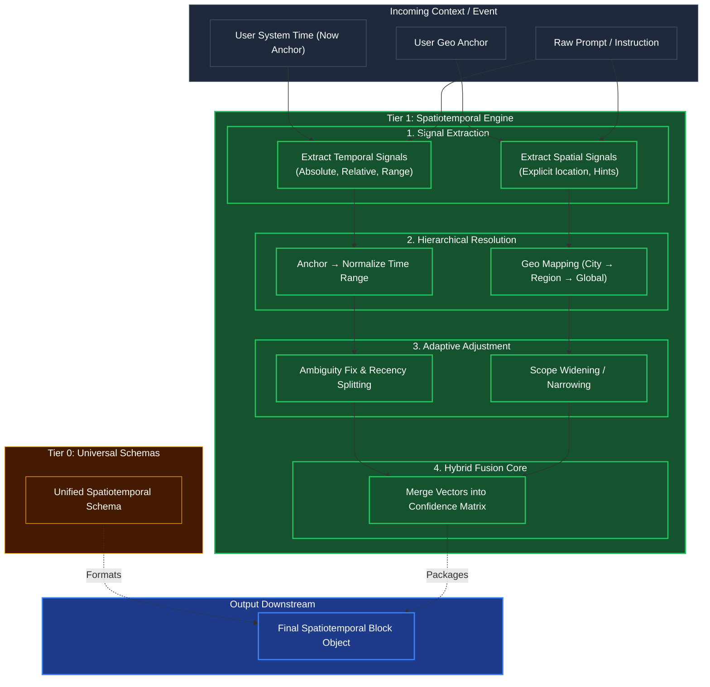

# Spatiotemporal Anchoring (Location & Time)

## Overview
A specialized **Tier 1 Primitive** dedicated exclusively to resolving "Where" and "When". When a User requests an operation, terms like "yesterday," "recently," or "near me" are highly ambiguous. 

This engine acts as a pre-processor: it takes the raw input, anchors it to physical reality (the User's System Time or Geo Anchor), and outputs a strict math-compatible range or bounds file, which Tier 2 Cognitive Engines use to safely perform Curiosity Gap detection or Task Validation.

## Architecture & Flow

## Key Mechanisms
1. **Hierarchical Resolution**: Converts implicit locations into bounding boxes. If a user asks for "Coffee in Soho," it pulls the geo anchor. Is the user in NY or London? It resolves "Soho" via the hierarchy to exact coordinates.
2. **Ambiguity & Recency Fixes**: If "Recently" is used, the Temporal Adjustment dynamically scopes "Recently" depending on the context. If the task is fetching emails, "recently" is 24 hours. If it's analyzing stock prices, "recently" might be minutes.
3. **Hybrid Fusion**: The final layer guarantees that the temporal bounds match the spatial bounds, scoring its confidence before outputting a rigid schema block.

## Function Decomposition

### `anchor_spatiotemporal`
- **Signature**: `anchor_spatiotemporal(text: str, system_time: datetime, geo_anchor: GeoAnchor | None) -> SpatiotemporalBlock`
- **Description**: Top-level orchestrator. Runs temporal and spatial extraction pipelines in parallel, resolves hierarchies, applies adaptive adjustments for ambiguity, and fuses the results into a single `SpatiotemporalBlock` with confidence scores. This block becomes the rigid time/place context that Tier 2 engines use for task validation and curiosity gap detection.
- **Calls**: `extract_temporal_signals()`, `extract_spatial_signals()`, `resolve_temporal_hierarchy()`, `resolve_spatial_hierarchy()`, `adapt_temporal_ambiguity()`, `adapt_spatial_scope()`, `fuse_spatiotemporal()`.

### `extract_temporal_signals`
- **Signature**: `extract_temporal_signals(text: str, system_time: datetime) -> list[TemporalSignal]`
- **Description**: Scans the raw text for temporal references: absolute dates ("March 15th"), relative expressions ("yesterday", "last week"), and range markers ("between Q1 and Q2"). Each extracted signal is tagged with its type (absolute, relative, range) and raw text span offsets.
- **Calls**: Regex temporal patterns, SpaCy NER for DATE/TIME entities.

### `extract_spatial_signals`
- **Signature**: `extract_spatial_signals(text: str, geo_anchor: GeoAnchor | None) -> list[SpatialSignal]`
- **Description**: Identifies location references in the text: explicit places ("New York"), directional hints ("nearby"), and contextual markers ("the office"). Tags each signal with explicitness level (explicit, implicit, hint) and raw text span.
- **Calls**: SpaCy NER for GPE/LOC entities, regex patterns for coordinates/addresses.

### `resolve_temporal_hierarchy`
- **Signature**: `resolve_temporal_hierarchy(signals: list[TemporalSignal], system_time: datetime) -> TemporalRange`
- **Description**: Converts extracted signals into a concrete UTC time range. Resolves relative expressions against the `system_time` anchor (e.g., "yesterday" becomes `system_time - 24h` to `system_time - 0h`). Merges overlapping ranges and selects the most specific interpretation when multiple signals exist.
- **Calls**: `dateutil` parsing, timezone normalization.

### `resolve_spatial_hierarchy`
- **Signature**: `resolve_spatial_hierarchy(signals: list[SpatialSignal], geo_anchor: GeoAnchor | None) -> SpatialBounds`
- **Description**: Maps spatial signals to geographic bounding boxes. Resolves ambiguous place names via the geo anchor (e.g., "Soho" resolves to NY vs London based on user location). Applies a hierarchy: explicit coordinates > named places > directional hints > geo anchor fallback.
- **Calls**: Geocoding lookup (config-driven provider), bounding box calculation.

### `adapt_temporal_ambiguity`
- **Signature**: `adapt_temporal_ambiguity(temporal_range: TemporalRange, task_context: str) -> TemporalRange`
- **Description**: Adjusts ambiguous temporal terms based on the task domain. "Recently" in email context means 24 hours; in stock analysis context it means minutes. Uses config-driven domain-to-recency mappings to widen or narrow the temporal range appropriately.
- **Calls**: Config lookup for domain recency mappings.

### `adapt_spatial_scope`
- **Signature**: `adapt_spatial_scope(spatial_bounds: SpatialBounds, task_context: str) -> SpatialBounds`
- **Description**: Widens or narrows the spatial bounding box based on task requirements. "Nearby" for a coffee search means a small radius; for a logistics query it means regional scope. Applies config-driven scope multipliers.
- **Calls**: Config lookup for domain scope mappings.

### `fuse_spatiotemporal`
- **Signature**: `fuse_spatiotemporal(temporal: TemporalRange, spatial: SpatialBounds) -> SpatiotemporalBlock`
- **Description**: Merges the resolved temporal and spatial dimensions into a unified `SpatiotemporalBlock`. Validates that the temporal bounds are logically compatible with the spatial context (e.g., a future date in a historical location query triggers a confidence penalty). Computes and attaches a fusion confidence score.
- **Calls**: `normalization.min_max_scale()` for confidence scoring.
