# Modality Ingestion & Demuxing

## Overview
A heavy-duty **Tier 1** component that acts as the agent's absolute sensory gateway. Kea supports Omni-modal inputs: Video, Audio, Complex Documents (PDF/Excel), and Images. 

Because advanced LLMs (the "Brain") are extremely slow and expensive when processing dense raw files (like a 3-hour video), Tier 1 physically decomposes and parses the structures into computationally efficient chunks or purely text formats *before* a higher cognitive tier even looks at it.

## Architecture & Flow

```mermaid
---
config:
  layout: dagre
---
flowchart TB
    %% SCHEMA IMPORTS
    subgraph sTier0["Tier 0: Universal Schemas"]
        direction LR
        nSchemaText["CognitiveContext (Text)"]
        nSchemaFile["FileHandle (Path Pointer)"]
        nSchemaVec["AssociativeMemory (Vector Object)"]
    end

    %% INPUT
    subgraph sInput["1. Sensory Input"]
        nInputText["Text Prompt"]
        nInputAudio["Audio / Voice"]
        nInputImg["Image Array"]
        nInputVid["Video Stream"]
        nInputDoc["Docs (PDF/XLSX)"]
    end

    %% TIER 1 Engine
    subgraph sTier1["Tier 1: High-Speed Demuxer"]
        direction TB
        
        %% Decomposition
        subgraph sDecompose["2. Structural Decomposition"]
            nDocling["Docling (Layout Extraction)"]
            nVideoSplit["Video Demuxer (FFMPEG KeyFrames)"]
        end

        %% STT / Translators
        subgraph sProcess["3. Translators"]
            nSTT["Speech-To-Text (Whisper/Qwen A)"]
            nOCR["Vision Parsing (Qwen VL)"]
        end

        %% Vectorizer
        subgraph sMemory["4. The Embedding Engine"]
            nEmbed["General Vector Extraction Model"]
        end
    end

    %% Outputs
    subgraph sOutput["5. Output (Kernel State Ready)"]
        nFinalText["Cognitive Context (Semantic Meaning)"]
        nFinalVector["Associative Memory (Embedding Vector)"]
        nFileOut["File Handle (Raw Path for MCP)"]
    end

    %% PASSTHROUGH (Efficiency Rule)
    nInputDoc & nInputVid & nInputImg & nInputAudio -.->|Direct Pointer Bypasses Engine| nFileOut

    %% Process Routing
    nInputDoc --> nDocling
    nDocling -->|Metadata| nFinalText
    nDocling -->|Embedded Images| nOCR

    nInputVid --> nVideoSplit
    nVideoSplit -->|Keyframes| nOCR
    nVideoSplit -->|Stems| nSTT

    nInputAudio --> nSTT
    nInputImg --> nOCR

    nInputText --> nEmbed & nFinalText

    nSTT --> nEmbed & nFinalText
    nOCR --> nEmbed & nFinalText

    %% Schema Routing
    nSchemaText -.->|Formats| nFinalText
    nSchemaFile -.->|Formats| nFileOut
    nSchemaVec -.->|Formats| nFinalVector
    
    %% Styling
    classDef t0 fill:#451A03,stroke:#F59E0B,stroke-width:1px,color:#fff
    classDef t1 fill:#14532D,stroke:#22C55E,stroke-width:2px,color:#fff
    classDef in fill:#1e293b,stroke:#475569,stroke-width:1px,color:#fff
    classDef out fill:#1E3A8A,stroke:#3B82F6,stroke-width:2px,color:#fff
    
    class sTier0,nSchemaText,nSchemaFile,nSchemaVec t0
    class sInput,nInputText,nInputAudio,nInputImg,nInputVid,nInputDoc in
    class sTier1,sDecompose,sProcess,sMemory,nDocling,nVideoSplit,nSTT,nOCR,nEmbed t1
    class sOutput,nFinalText,nFinalVector,nFileOut out
```

## Key Mechanisms
1. **Direct Passthrough**: The dotted lines show that raw files (like a 4K `.mp4`) bypass the cognitive engine and are immediately assigned a `FileHandle`. Kea refuses to keep 4K video data in RAM. Tier 4 MCP tools will grab the `FileHandle` pointer on disk.
2. **Structural Demuxing (FFMPEG / Docling)**: Cuts the file apart. It scrapes images out of PDFs for `OCR`, extracts audio out of `Video` for transcriptions, and returns a flat dictionary of extracted properties.
3. **Embedding Vectorization**: Anything translated to text or image slices is run through the `Embedding Engine` at Tier 1, creating a shared Associative Vector Space that Tier 2 can use to "remember" concepts instantly.

## Function Decomposition

### `ingest`
- **Signature**: `async ingest(input_data: RawInput) -> ModalityOutput`
- **Description**: Top-level orchestrator. Detects the modality of the input, creates a direct `FileHandle` passthrough for the raw file (efficiency rule), then routes through the appropriate decomposition and translation pipeline. Returns a `ModalityOutput` containing up to three artifacts: `CognitiveContext` (semantic text), `AssociativeMemory` (vector embedding), and `FileHandle` (raw pointer for MCP tools).
- **Calls**: `detect_modality()`, `create_file_handle()`, `decompose_document()`, `decompose_video()`, `transcribe_audio()`, `parse_vision()`, `embed_text()`.

### `detect_modality`
- **Signature**: `detect_modality(input_data: RawInput) -> ModalityType`
- **Description**: Identifies the input type based on MIME type, file extension, and content sniffing. Returns an enum value: `TEXT`, `AUDIO`, `IMAGE`, `VIDEO`, `DOCUMENT`. Determines which decomposition and translation pipeline to activate.
- **Calls**: MIME type detection, file extension lookup from config.

### `decompose_document`
- **Signature**: `async decompose_document(doc_path: str) -> DocumentParts`
- **Description**: Structural decomposition for complex documents (PDF, XLSX, DOCX). Uses Docling for layout extraction, pulling text blocks, table structures, and embedded images into separate artifacts. Text goes directly to `CognitiveContext`; embedded images are routed to `parse_vision()` for OCR.
- **Calls**: Docling library, routes images to `parse_vision()`.

### `decompose_video`
- **Signature**: `async decompose_video(video_path: str) -> VideoParts`
- **Description**: Splits video into processable components using FFMPEG. Extracts keyframes at configurable intervals (config-driven, not hardcoded) for visual analysis and separates audio stems for transcription. Returns a `VideoParts` object with keyframe paths and audio stream paths.
- **Calls**: FFMPEG keyframe extraction, audio demuxing.

### `transcribe_audio`
- **Signature**: `async transcribe_audio(audio_path: str) -> str`
- **Description**: Speech-to-text translation. Converts audio files into text transcripts using the configured STT model (e.g., Whisper, Qwen Audio). Returns the raw transcript string. The transcript is then fed to `embed_text()` for vectorization and concatenated into `CognitiveContext`.
- **Calls**: STT model inference (config-driven model selection).

### `parse_vision`
- **Signature**: `async parse_vision(image_path: str) -> str`
- **Description**: OCR and visual understanding. Processes image files through the configured vision model (e.g., Qwen VL) to extract text content, structural descriptions, and semantic meaning. Returns a text representation of the image's content for downstream cognitive processing.
- **Calls**: Vision model inference (config-driven model selection).

### `embed_text`
- **Signature**: `async embed_text(text: str) -> list[float]`
- **Description**: Generates a dense vector embedding from text using the configured embedding model. Creates the shared Associative Vector Space that Tier 2 engines use for fast semantic recall. Returns a float array (dimensionality determined by the model config).
- **Calls**: Embedding model inference.

### `create_file_handle`
- **Signature**: `create_file_handle(file_path: str, modality: ModalityType) -> FileHandle`
- **Description**: Creates a lightweight pointer to the raw file on `/tmp` (the only allowed ephemeral disk location). Bypasses the cognitive engine entirely for heavy media files. Tier 4 MCP tools grab this handle when they need the original file data without holding it in RAM.
- **Calls**: None (pure construction, validates path existence).
