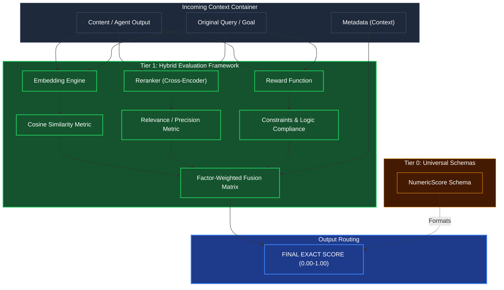

# Confidence & Precision Scoring 

## Overview
As a **Tier 1** module, the Scoring/Evaluation engine does not think; it measures. Following the mandate of evaluating safety and exactness computationally before relying on an LLM, this engine runs pure algorithms (Vector similarity, Cross-encoding, Contextual Weighting) to assess the quality of a specific action relative to an initial goal.

Tier 3 Guardrails and Tier 2 Plausibility checks use this tool precisely to decide if they should reject a DAG or trust an execution result.

## Architecture & Flow

## Key Mechanisms
1. **Semantic Evaluation (Cosine)**: Computes the basic underlying meaning gap between what the user asked and what the agent produced. If the user asked for a "Dog image" and got a "Cat image," the semantic score drops correctly.
2. **Precision Cross-Encoding**: Embedding algorithms are bad at precise negations. A Cross-Encoder reranks the results to catch exact matches. If a user says "I do NOT want a dog," ordinary embeddings fail the test, but the Reranker catches the strict semantic rejection.
3. **Reward Compliance Check**: Mechanically validates boolean logic requests ("Must be under 400 lines", "Must end in .py"). This is an instant pass/fail layer on the numeric score.
4. **Context Factor Aggregation**: Weights the above three scores based on metadata. E.g., if the user role is "Admin," the threshold for passing the reward function is higher.

## Function Decomposition

### `score`
- **Signature**: `async score(content: str, query: str, constraints: list[Constraint], metadata: ScoringMetadata) -> NumericScore`
- **Description**: Top-level orchestrator. Runs all three evaluation tracks (semantic, precision, reward) in parallel, then aggregates them through the context-weighted fusion matrix. Returns a single `NumericScore` in the `[0.00, 1.00]` range that Tier 2 Plausibility and Tier 3 Guardrails use for accept/reject decisions.
- **Calls**: `compute_semantic_similarity()`, `compute_precision_score()`, `evaluate_reward_compliance()`, `aggregate_scores()`.

### `compute_semantic_similarity`
- **Signature**: `async compute_semantic_similarity(content: str, query: str) -> float`
- **Description**: Track 1: Semantic evaluation. Generates vector embeddings for both the `content` (agent output) and the `query` (original goal), then computes their cosine similarity. Captures broad meaning alignment. Normalized to `[0.0, 1.0]` via `normalization.min_max_scale()`.
- **Calls**: Embedding model, cosine distance, `normalization.min_max_scale()`.

### `compute_precision_score`
- **Signature**: `async compute_precision_score(content: str, query: str) -> float`
- **Description**: Track 2: Precision cross-encoding. Runs a cross-encoder reranker model that evaluates the `content` against the `query` as a pair, catching exact semantic matches and negation patterns that embedding-based cosine similarity misses (e.g., "I do NOT want a dog"). Returns a normalized relevance score.
- **Calls**: Cross-encoder reranker model, `normalization.min_max_scale()`.

### `evaluate_reward_compliance`
- **Signature**: `evaluate_reward_compliance(content: str, constraints: list[Constraint]) -> float`
- **Description**: Track 3: Boolean logic validation. Mechanically checks the `content` against a list of hard constraints (e.g., "must be under 400 lines", "must end in .py", "must contain function X"). Each constraint is a pass/fail gate. The final score is the ratio of passed constraints to total constraints.
- **Calls**: Constraint evaluator functions (regex, line count, file extension checks).

### `aggregate_scores`
- **Signature**: `aggregate_scores(semantic: float, precision: float, reward: float, metadata: ScoringMetadata) -> float`
- **Description**: Combines the three track scores using a context-aware weighted fusion matrix. Weights are adjusted based on `metadata` (e.g., admin role raises reward weight; creative tasks raise semantic weight). Produces the final `[0.00, 1.00]` score. Weights are defined in `shared/config.py`, not hardcoded.
- **Calls**: Config lookup for role-based weight profiles.
