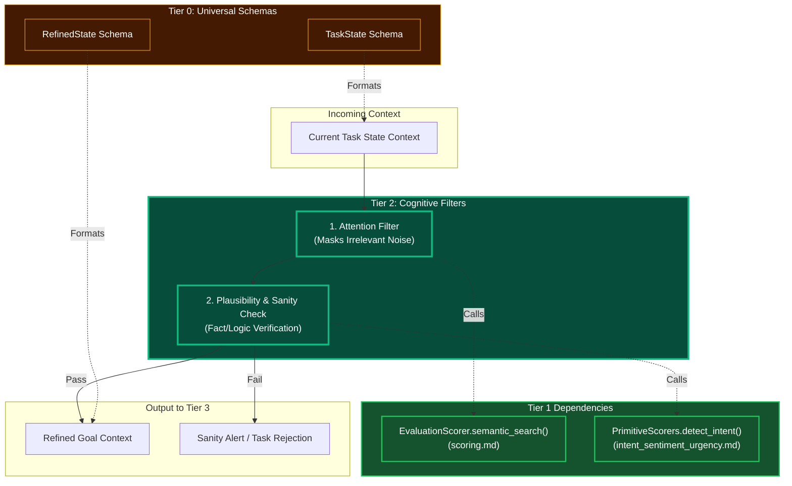

# Plausibility & Attention Filtering

## Overview
These are **Tier 2 Cognitive Engines**. Before the complex orchestrator (Tier 3) starts building an elaborate DAG, Tier 2 runs defensive cognitive checks on the incoming data. 
- **Attention Filtering**: Discards noise and highlights the critical variables necessary for the task context.
- **Plausibility & Sanity Check**: Runs a "common sense" or hallucination-check against the extracted intents to ensure the agent isn't being tricked into an impossible or illogical task.

## Architecture & Flow

## Function Decomposition

### `run_cognitive_filters`
- **Signature**: `async run_cognitive_filters(task_state: TaskState) -> RefinedState | SanityAlert`
- **Description**: Top-level orchestrator. Runs the attention filter to strip noise, then the plausibility check to verify logical coherence. Returns a `RefinedState` (cleaned, focused goal context) if the task passes both filters, or a `SanityAlert` (with rejection reason and confidence) if the task is implausible, contradictory, or impossible.
- **Calls**: `filter_attention()`, `check_plausibility()`.

### `filter_attention`
- **Signature**: `async filter_attention(task_state: TaskState) -> FilteredState`
- **Description**: Step 1: Attention filtering. Masks irrelevant noise from the incoming task context by computing semantic relevance of each context element against the active goal. Uses Tier 1 `scoring.compute_semantic_similarity()` to rank context elements. Drops elements below the relevance threshold (config-driven), producing a focused `FilteredState` containing only the critical variables for the task.
- **Calls**: Tier 1 `scoring.compute_semantic_similarity()`.

### `check_plausibility`
- **Signature**: `async check_plausibility(filtered_state: FilteredState) -> PlausibilityResult`
- **Description**: Step 2: Sanity checking. Verifies that the filtered goal is logically coherent, factually plausible, and physically achievable given the current world state. Runs Tier 1 intent detection to cross-validate the interpreted goal. Checks for contradictions (e.g., "delete and keep the same file"), impossible constraints, and hallucination indicators. Returns `PASS` with confidence or `FAIL` with specific rejection reasons.
- **Calls**: Tier 1 `intent_sentiment_urgency.detect_intent()`, Tier 1 `scoring.evaluate_reward_compliance()`.
