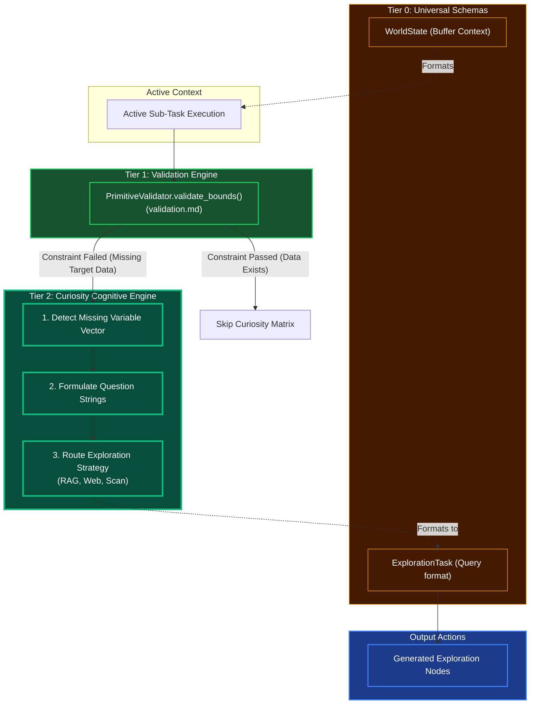

# Curiosity & Exploration Engine

## Overview
The Curiosity Engine is a Tier 2 Cognitive Module designed to identify "missing" knowledge required to solve a task. Instead of failing when data is absent, the engine autonomously formulates questions and exploration strategies to map out the unknowns before proceeding.

## Architecture & Flow

## Function Decomposition

### `explore_gaps`
- **Signature**: `async explore_gaps(task_state: WorldState) -> list[ExplorationTask]`
- **Description**: Top-level orchestrator. Triggered when Tier 1 validation fails due to missing data during task execution. Detects what variables are missing, formulates investigative questions, and routes each question to the appropriate exploration strategy (RAG, web search, tool scan). Returns a list of `ExplorationTask` nodes that the Tier 3 Graph Synthesizer injects into the active DAG.
- **Calls**: `detect_missing_variables()`, `formulate_questions()`, `route_exploration_strategy()`.

### `detect_missing_variables`
- **Signature**: `detect_missing_variables(task_state: WorldState, validation_result: ErrorResponse) -> list[KnowledgeGap]`
- **Description**: Step 1: Gap detection. Analyzes the validation failure to determine exactly which variables, entities, or context pieces are absent. Compares the required schema fields against the available world state and identifies each missing piece as a `KnowledgeGap` with its field name, expected type, and importance score.
- **Calls**: Tier 1 `validation.validate()` result inspection.

### `formulate_questions`
- **Signature**: `formulate_questions(gaps: list[KnowledgeGap]) -> list[ExplorationQuery]`
- **Description**: Step 2: Query generation. Translates each `KnowledgeGap` into a natural-language or structured query string optimized for the target knowledge source. For RAG gaps, produces vector-search-friendly queries. For web gaps, produces search-engine-optimized queries. For tool gaps, produces parameter-discovery queries.
- **Calls**: None (template-based query construction from config).

### `route_exploration_strategy`
- **Signature**: `route_exploration_strategy(queries: list[ExplorationQuery]) -> list[ExplorationTask]`
- **Description**: Step 3: Strategy routing. Assigns each query to the optimal exploration strategy: `RAG` for internal knowledge retrieval, `WEB` for external information gathering, or `SCAN` for tool/filesystem discovery. Returns fully formed `ExplorationTask` objects ready for DAG injection, each with its target service, query payload, and expected response schema.
- **Calls**: Config-driven strategy mapping from `shared/config.py`.
