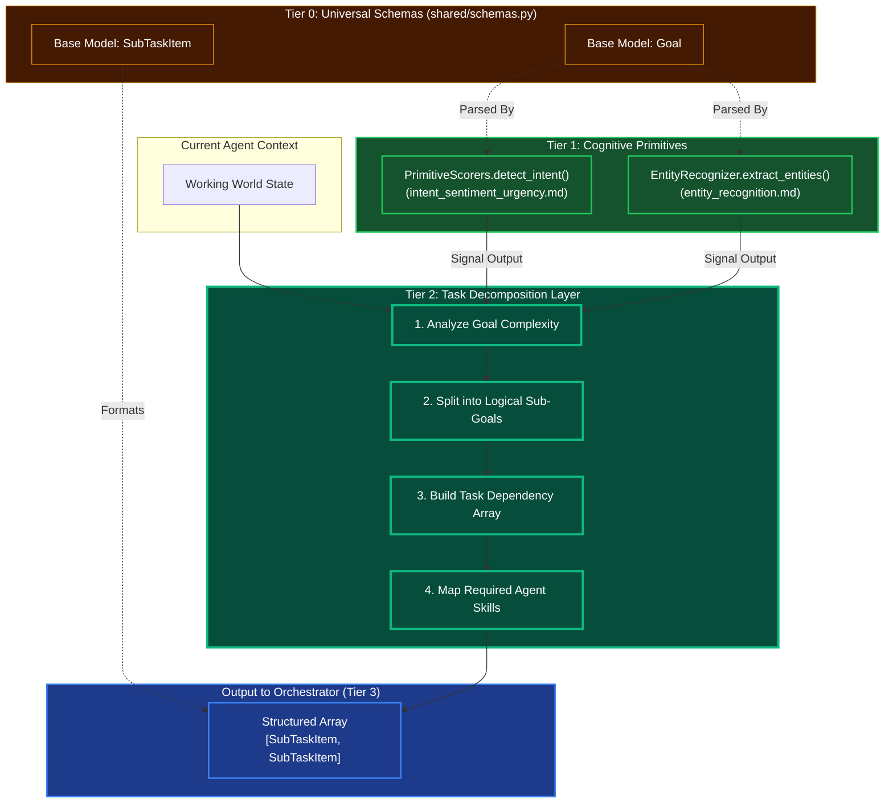

# Task Decomposition Engine

## Overview
The Task Decomposition Engine is a Tier 2 Cognitive Module. It takes a high-level goal, breaks it down down into sequential and parallel subtasks, and outputs a structured node graph that the Tier 3 Orchestrator can turn into an actionable DAG.

## Architecture & Flow

## Function Decomposition

### `decompose_goal`
- **Signature**: `async decompose_goal(context: WorldState) -> list[SubTaskItem]`
- **Description**: Top-level orchestrator. Takes the current agent world state (containing the high-level goal), runs complexity analysis, splits into sub-goals, builds the dependency array, and maps required skills. Returns a structured list of `SubTaskItem` objects ready for the Tier 3 Graph Synthesizer to assemble into an executable DAG.
- **Calls**: `analyze_goal_complexity()`, `split_into_sub_goals()`, `build_dependency_array()`, `map_required_skills()`.

### `analyze_goal_complexity`
- **Signature**: `async analyze_goal_complexity(context: WorldState, intent: IntentLabel, entities: list[ValidatedEntity]) -> ComplexityAssessment`
- **Description**: Step 1. Evaluates the complexity of the high-level goal by examining the intent (from Tier 1 `detect_intent()`), the number and types of extracted entities, and the breadth of the world state context. Produces a `ComplexityAssessment` that categorizes the goal (atomic, compound, multi-domain) and estimates the number of sub-tasks needed.
- **Calls**: Tier 1 `intent_sentiment_urgency.detect_intent()`, Tier 1 `entity_recognition.extract_entities()`.

### `split_into_sub_goals`
- **Signature**: `split_into_sub_goals(assessment: ComplexityAssessment) -> list[SubGoal]`
- **Description**: Step 2. Decomposes the assessed goal into logical sub-goals. Atomic goals produce a single sub-goal. Compound goals are split along natural semantic boundaries (e.g., "build and deploy" becomes two sub-goals). Multi-domain goals are split by domain expertise (frontend, backend, infrastructure).
- **Calls**: None (pure logic based on assessment).

### `build_dependency_array`
- **Signature**: `build_dependency_array(sub_goals: list[SubGoal]) -> DependencyGraph`
- **Description**: Step 3. Analyzes input/output relationships between sub-goals to determine execution ordering. Identifies which sub-goals can run in parallel (no data dependencies) and which must run sequentially (output of one feeds input of another). Returns a directed graph of dependencies.
- **Calls**: None (topological sort algorithm).

### `map_required_skills`
- **Signature**: `map_required_skills(sub_goals: list[SubGoal], dependency_graph: DependencyGraph) -> list[SubTaskItem]`
- **Description**: Step 4. Annotates each sub-goal with the agent skills, tool categories, and knowledge domains required to execute it. Maps sub-goals to `SubTaskItem` schema objects with dependency edges, skill requirements, and estimated resource needs. This output directly feeds the Tier 3 Graph Synthesizer.
- **Calls**: Skill registry lookup from `knowledge/` profiles.
