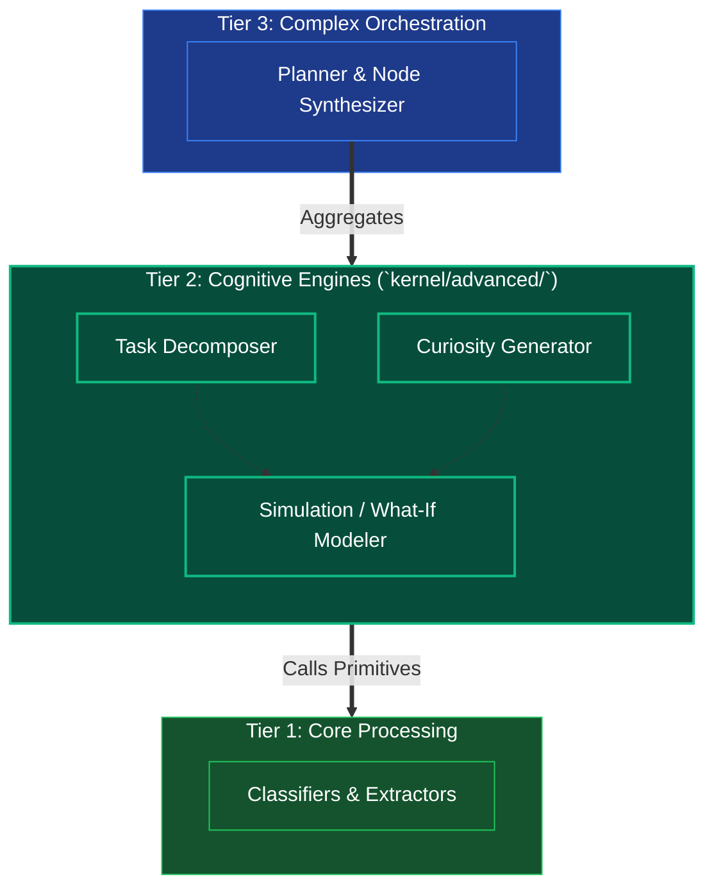

# Tier 2: Cognitive Engines (Intermediate Logic)

## Overview
Tier 2 serves as the strategic processing layer that combines basic primitives (from Tier 1) to derive more complex logical states. It manages the "what if" scenarios, exploratory analysis, and task-decomposition required by an autonomous agent.

**CRITICAL RULE**: Tier 2 depends heavily on Tiers 1 and 0, but remains oblivious to the existence of higher-level planners (Tier 3) or the OODA loop (Tier 4). It is purely a deterministic set of powerful functions that perform cognitive lifting.

## Scope & Responsibilities
- **Task Decomposition**: Takes a complex problem and breaks it down into sensible, actionable sub-tasks utilizing both syntactic parsing and semantic embedding constraints.
- **Curiosity Engine**: Evaluates unknown variables and creates investigative strategies to fill information gaps via the Knowledge base or MCP tools.
- **What-If Simulations**: Runs small-scale logic trees or counter-factual scenarios offline before handing a finalized recommendation up to Tier 3.

## Architecture

## Function Registry

| Module | Function | Signature | Purpose |
|--------|----------|-----------|---------|
| `task_decomposition` | `decompose_goal` | `async (context: WorldState) -> list[SubTaskItem]` | Top-level goal decomposition |
| `task_decomposition` | `analyze_goal_complexity` | `async (context, intent, entities) -> ComplexityAssessment` | Evaluate goal complexity |
| `task_decomposition` | `split_into_sub_goals` | `(assessment: ComplexityAssessment) -> list[SubGoal]` | Split into logical sub-goals |
| `task_decomposition` | `build_dependency_array` | `(sub_goals: list[SubGoal]) -> DependencyGraph` | Task ordering via topological sort |
| `task_decomposition` | `map_required_skills` | `(sub_goals, dependency_graph) -> list[SubTaskItem]` | Skill/role mapping per sub-task |
| `curiosity_engine` | `explore_gaps` | `async (task_state: WorldState) -> list[ExplorationTask]` | Top-level gap exploration |
| `curiosity_engine` | `detect_missing_variables` | `(task_state, validation_result) -> list[KnowledgeGap]` | Identify missing data/variables |
| `curiosity_engine` | `formulate_questions` | `(gaps: list[KnowledgeGap]) -> list[ExplorationQuery]` | Generate investigation queries |
| `curiosity_engine` | `route_exploration_strategy` | `(queries: list[ExplorationQuery]) -> list[ExplorationTask]` | Route to RAG/Web/Scan |
| `what_if_scenario` | `simulate_outcomes` | `async (proposed_action, knowledge) -> SimulationVerdict` | Top-level simulation (Approve/Reject/Modify) |
| `what_if_scenario` | `generate_outcome_branches` | `(action, knowledge) -> list[OutcomeBranch]` | Generate success/fail trees |
| `what_if_scenario` | `predict_consequences` | `async (branches) -> list[ConsequencePrediction]` | Environmental impact prediction |
| `what_if_scenario` | `calculate_risk_reward` | `(predictions) -> SimulationVerdict` | Risk/reward ratio + verdict |
| `attention_and_plausibility` | `run_cognitive_filters` | `async (task_state: TaskState) -> RefinedState \| SanityAlert` | Top-level attention + plausibility check |
| `attention_and_plausibility` | `filter_attention` | `async (task_state: TaskState) -> FilteredState` | Mask irrelevant noise |
| `attention_and_plausibility` | `check_plausibility` | `async (filtered_state: FilteredState) -> PlausibilityResult` | Fact/logic/sanity verification |
