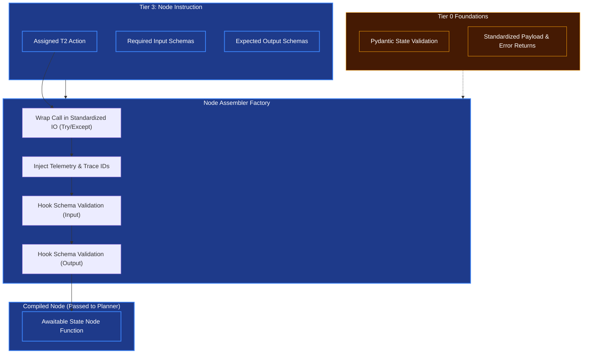

# Node Assembler

## Overview
Where the **Graph Synthesizer** creates the broad highway the agent travels on (the DAG map), the **Node Assembler** creates the specific cars that drive on it. 

Every node in the DAG needs to be an executable Python function (a `LangGraph Node`) wrapped consistently so the OODA loop can process it without crashing.

## Architecture & Flow

## Key Abstraction Logic
1. **The Telemetry Injection (Tier 0 Rule)**: Because of the Corporate Kernel rule that "Distrusted components will fail," every single generated node is automatically injected with Telemetry (tracing and logs bounds) by the node assembler. This guarantees Tier 4 execution never loses track of a nested function.
2. **Schema Wrapper (Tier 0 Pydantic)**: A node never begins processing without automatically doing a Tier 0 Pydantic validation on its inputs, acting as an immediate armor against invalid states in the Graph.

## Function Decomposition

### `assemble_node`
- **Signature**: `assemble_node(instruction: ActionInstruction, input_schema: type[BaseModel], output_schema: type[BaseModel]) -> StateNodeFunction`
- **Description**: Top-level factory. Takes a raw action instruction (from Tier 2/3), wraps it in standard I/O error handling, injects telemetry, and hooks input/output schema validation. Returns an awaitable `StateNodeFunction` that LangGraph can execute as a graph node. Guarantees that every node in the DAG is observable, type-safe, and fault-tolerant.
- **Calls**: `wrap_in_standard_io()`, `inject_telemetry()`, `hook_input_validation()`, `hook_output_validation()`.

### `wrap_in_standard_io`
- **Signature**: `wrap_in_standard_io(action_callable: Callable) -> WrappedCallable`
- **Description**: Step 1. Wraps the raw action callable in a try/except boundary that catches all exceptions and formats them into Tier 0 `ErrorResponse` objects via `standard_io.create_error_response()`. Ensures that node failures never raise raw Python exceptions into the OODA loop; instead, they produce structured error payloads that the Decide phase can act upon.
- **Calls**: Tier 0 `standard_io.create_error_response()`.

### `inject_telemetry`
- **Signature**: `inject_telemetry(wrapped_callable: WrappedCallable, trace_id: str) -> InstrumentedCallable`
- **Description**: Step 2. Injects OpenTelemetry span creation, structlog context binding (`trace_id`, `node_id`, `dag_id`), and execution timing into the wrapped callable. Guarantees that every node execution is fully traceable in distributed monitoring, satisfying the "Distrusted components will fail" observability mandate.
- **Calls**: Tier 0 `shared/logging/main.py` context binding, OpenTelemetry span API.

### `hook_input_validation`
- **Signature**: `hook_input_validation(callable: InstrumentedCallable, input_schema: type[BaseModel]) -> ValidatedCallable`
- **Description**: Step 3. Decorates the callable with a pre-execution gate that runs Tier 1 `validate()` on the incoming state slice against the declared `input_schema`. If validation fails, the node short-circuits immediately and returns the structured error without executing the action body.
- **Calls**: Tier 1 `validation.validate()`.

### `hook_output_validation`
- **Signature**: `hook_output_validation(callable: ValidatedCallable, output_schema: type[BaseModel]) -> StateNodeFunction`
- **Description**: Step 4. Decorates the callable with a post-execution gate that validates the action's return value against the declared `output_schema`. Catches LLM hallucinations and malformed tool outputs before they propagate to downstream nodes in the DAG.
- **Calls**: Tier 1 `validation.validate()`.
