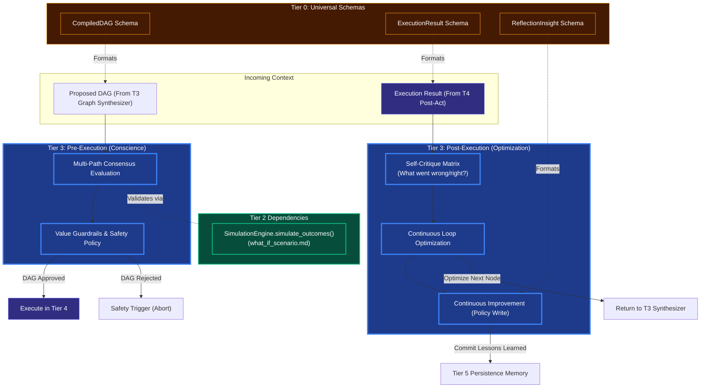

# Guardrails, Conscience, & Reflection

## Overview
These modules are the **Tier 3 (Advanced Cognition)** equivalents of safety and self-improvement loops. Before the OODA loop executes a DAG, and immediately after a DAG concludes, Tier 3 analyzes the results using advanced multi-agent methodologies.

- **Alignment & Value Guardrails (The Conscience)**: A strict, final check before execution that matches the generated DAG against Kea's non-negotiable ethical, security, and corporate rules.
- **Consensus Building**: For highly critical tasks, Tier 3 can spawn multiple localized DAG hypotheses and take a "vote" weighted by Plausibility scores to find the most likely success path.
- **Reflection & Self Critique (Continuous Optimization)**: A post-execution evaluation matrix that takes the result state of Tier 4, critiques the logic that led there, and saves the insight back to the Tier 5 long-term memory to ensure Continuous Improvement across epochs.

## Architecture & Flow

## Function Decomposition

### `run_pre_execution_check`
- **Signature**: `async run_pre_execution_check(dag: CompiledDAG) -> ApprovalResult`
- **Description**: Top-level pre-execution orchestrator (The Conscience). Runs multi-path consensus evaluation and value guardrails before the OODA loop is allowed to execute the DAG. Returns `APPROVED` (safe to execute), `REJECTED` (abort with reason), or `MODIFIED` (execute with appended safeguard nodes).
- **Calls**: `evaluate_consensus()`, `check_value_guardrails()`.

### `evaluate_consensus`
- **Signature**: `async evaluate_consensus(dag_candidates: list[CompiledDAG]) -> CompiledDAG`
- **Description**: For critical tasks, spawns multiple localized DAG hypotheses (alternative execution strategies) and scores each via Tier 2 `simulate_outcomes()`. Takes a weighted vote based on plausibility scores to select the most likely success path. For non-critical tasks, passes the single candidate through directly.
- **Calls**: Tier 2 `what_if_scenario.simulate_outcomes()`, Tier 1 `scoring.score()`.

### `check_value_guardrails`
- **Signature**: `check_value_guardrails(dag: CompiledDAG) -> GuardrailResult`
- **Description**: The final ethical/security/corporate gate before execution. Matches every node in the DAG against Kea's non-negotiable rules: no data exfiltration, no unauthorized resource access, no violation of user privacy constraints, and compliance with the agent's role-specific boundaries loaded from `knowledge/` profiles. Returns pass/fail with specific violation details.
- **Calls**: Policy rules from `knowledge/` cognitive profiles, config-driven safety policies.

### `run_post_execution_reflection`
- **Signature**: `async run_post_execution_reflection(result: ExecutionResult, expected: list[ExpectedOutcome]) -> ReflectionInsight`
- **Description**: Top-level post-execution orchestrator (Continuous Optimization). Critiques the execution result against expectations, identifies optimization opportunities, and commits lessons learned back to Tier 5 long-term memory for future improvement.
- **Calls**: `critique_execution()`, `optimize_loop()`, `commit_policy_update()`.

### `critique_execution`
- **Signature**: `critique_execution(result: ExecutionResult, expected: list[ExpectedOutcome]) -> CritiqueReport`
- **Description**: Post-execution analysis. Compares actual outcomes against the hypotheses generated in `advanced_planning.generate_hypotheses()`. Identifies what went right (hypothesis met), what went wrong (hypothesis failed), and root causes for failures. Uses Tier 1 `scoring.score()` to quantify the gap between expected and actual outputs.
- **Calls**: Tier 1 `scoring.score()`.

### `optimize_loop`
- **Signature**: `optimize_loop(critique: CritiqueReport) -> OptimizationSuggestion`
- **Description**: Analyzes the critique report to produce actionable optimization suggestions. If a node consistently fails, suggests alternative tool bindings. If a sequence is slow, suggests parallelization. If a hypothesis was poorly calibrated, suggests adjusted expectations. Returns an `OptimizationSuggestion` that can be applied to the next DAG cycle.
- **Calls**: None (pattern matching on critique data).

### `commit_policy_update`
- **Signature**: `async commit_policy_update(suggestion: OptimizationSuggestion) -> ReflectionInsight`
- **Description**: Packages the optimization suggestion into a `ReflectionInsight` and commits it to the Tier 5 Lifecycle Controller's long-term memory (via the Vault). Ensures that lessons learned from one execution epoch improve future DAG generation, implementing continuous improvement across the agent's lifespan.
- **Calls**: Tier 5 `lifecycle_controller.commit_epoch_memory()` (via service API).
