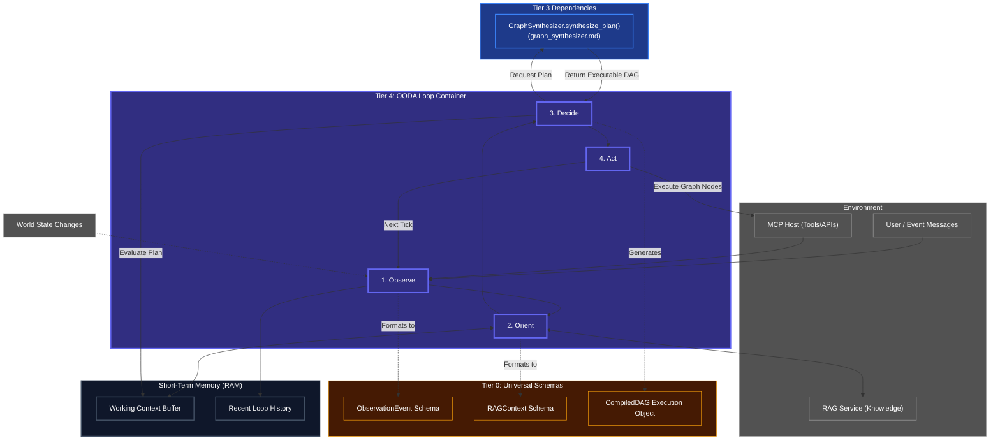

# The OODA Loop (Execution Engine)

## Overview
The OODA Loop (Tier 4) is the real-time beating heart of the Human Kernel. It is responsible for bridging the gap between Kea's internal cognition and the external world. Instead of calculating *how* to solve a problem (Tier 2/3), it simply dictates *when* things happen, *what* state we are currently in, and reacts immediately to environmental changes.

**CRITICAL RULE**: The OODA Loop must never block synchronously on slow LLM calls. The loop must iterate rapidly, dispatching asynchronous tasks and relying on Short-Term Memory to track the state of those operations.

## Architecture & Flow

## Phase Breakdown

1. **Observe (Sense)**: The Engine rapidly polls or listens to its event stream. Did the user send a new message? Did the RAG database update? Did an MCP tool crash? It drops these events immediately into the `Recent Loop History`.
2. **Orient (Contextualize)**: Looks at the new observations against its `Working Context Buffer` and pulls external knowledge from the `RAG Service`. If the agent was trying to download a file and the observation says "Network Disconnected", the orientation phase updates the state to *Blocked*.
3. **Decide (Plan)**: Compares the Oriented State against its current goals. If the state is *Blocked*, it tosses out the old plan, reaches down to **Tier 3 (The Graph Synthesizer)**, and asks for a new dynamic DAG to handle the disconnect.
4. **Act (Execute)**: Triggers the execution of the active DAG's current nodes. It does not calculate *how* the node works (Tier 2/3 built the node); it simply runs it, pushing the output back into the environment (MCP).

## Function Decomposition

### `run_ooda_loop`
- **Signature**: `async run_ooda_loop(initial_state: AgentState) -> LoopResult`
- **Description**: Continuous loop runner. Repeatedly executes `run_ooda_cycle()` until the Tier 5 Lifecycle Controller issues a sleep/terminate signal or the active macro-objective is completed. Manages the tick rate, handles graceful shutdown on interrupt signals, and reports final state back to Tier 5 on exit.
- **Calls**: `run_ooda_cycle()`, Tier 5 lifecycle signal checks.

### `run_ooda_cycle`
- **Signature**: `async run_ooda_cycle(state: AgentState) -> CycleResult`
- **Description**: Single cycle orchestrator. Executes the four OODA phases in sequence: Observe, Orient, Decide, Act. Each phase mutates the `AgentState` progressively. Returns a `CycleResult` containing the updated state, any produced artifacts, and a flag indicating whether the loop should continue, park (async wait), or terminate.
- **Calls**: `observe()`, `orient()`, `decide()`, `act()`.

### `observe`
- **Signature**: `async observe(event_stream: EventStream, short_term_memory: ShortTermMemory) -> list[ObservationEvent]`
- **Description**: Phase 1: Sense. Rapidly polls the event stream for new signals: user messages, MCP tool responses, RAG updates, artifact bus notifications, and system health events. Drops each event into the Short-Term Memory's `HistoryQueue` for future reference. Returns the batch of new observations for the Orient phase. Must never block on slow sources; uses configurable poll timeouts.
- **Calls**: Event stream polling, `short_term_memory.push_event()`.

### `orient`
- **Signature**: `async orient(observations: list[ObservationEvent], rag_service: RAGClient, context_buffer: ContextBuffer) -> OrientedState`
- **Description**: Phase 2: Contextualize. Updates the working context buffer by merging new observations with existing knowledge. Pulls relevant context from the RAG Service to ground the agent's understanding. If a blocking observation is detected (e.g., "Network Disconnected"), updates the agent state to `BLOCKED`. Returns the fully contextualized `OrientedState`.
- **Calls**: RAG Service HTTP API, `short_term_memory.read_context()`, `short_term_memory.cache_entity()`.

### `decide`
- **Signature**: `async decide(oriented_state: OrientedState, current_goals: list[MacroObjective], graph_synthesizer: GraphSynthesizer) -> Decision`
- **Description**: Phase 3: Plan. Compares the oriented state against the active goals. If the current DAG is still valid and progressing, continues with the next node. If the state has changed (blocked, new priority), requests a new DAG from the Tier 3 Graph Synthesizer. Returns a `Decision` containing the action to execute (continue current node, switch to new DAG, or park and wait).
- **Calls**: Tier 3 `graph_synthesizer.synthesize_plan()` (when replanning needed).

### `act`
- **Signature**: `async act(decision: Decision, compiled_dag: CompiledDAG, mcp_host: MCPClient) -> ActionResult`
- **Description**: Phase 4: Execute. Runs the active DAG's current node(s) by dispatching them to the MCP Host for tool execution. Collects the results, updates the Short-Term Memory's DAG state tracker, and pushes artifacts back into the environment. If a node returns an async `Job ID`, delegates to the async multitasking manager.
- **Calls**: MCP Host HTTP API, `short_term_memory.update_dag_state()`, `async_multitasking.manage_async_tasks()`.
