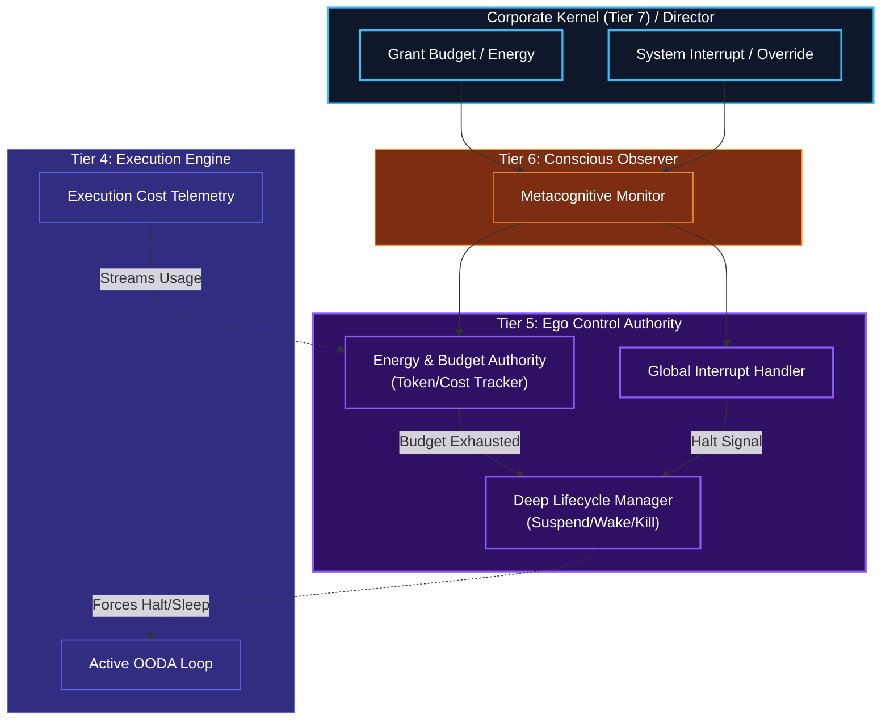

# Energy, Budget, & Interrupt Authority

## Overview
These macro-level control mechanisms reside in **Tier 5 (The Autonomous Ego)**, which is wrapped by Tier 6 (The Conscious Observer) for metacognitive oversight.

Because Tier 5 governs the *existence* and long-term viability of the agent, it must manage the agent's absolute constraints. It acts as the final judge on whether the agent has the resources to continue, and it handles absolute commands from the Corporate Kernel (Tier 7) relayed through Tier 6.

- **Energy / Budget Authority**: Tracks the total computational cost (API tokens, execution time, database writes) against the agent's assigned budget. If the budget runs out, Tier 5 forces the agent into an idle/suspended state until the Corporate Kernel grants more.
- **Interrupt Handling (Top-Down)**: The Corporate Kernel or an assigned Human Overseer can send a "Priority Override" or "Kill" signal. Tier 5 intercepts this, immediately halts Tier 4's OODA loop, and forces a context switch.
- **Lifecycle Management (Wake/Sleep)**: Expands on the basic waker/sleeper. If the agent hits a `Waiting State` in Tier 4 and has no other parallel tasks, Tier 5 puts the agent to sleep to conserve its Budget, setting a cron-job or webhook to wake it back up when the wait is over.

## Architecture & Flow

## Function Decomposition

### `enforce_energy_authority`
- **Signature**: `async enforce_energy_authority(cost_telemetry: AsyncStream[CostEvent], interrupt_queue: AsyncQueue[InterruptSignal]) -> ControlDecision`
- **Description**: Top-level control loop. Continuously monitors both the cost telemetry stream (from Tier 4 execution) and the interrupt queue (from Tier 7 Corporate Kernel, relayed via Tier 6). Makes real-time decisions about whether the agent can continue, must pause, or must terminate. Returns a `ControlDecision` that the Lifecycle Controller acts upon.
- **Calls**: `track_budget()`, `check_budget_exhaustion()`, `handle_interrupt()`, `manage_lifecycle_state()`.

### `track_budget`
- **Signature**: `track_budget(cost_event: CostEvent, budget_state: BudgetState) -> BudgetState`
- **Description**: Updates the running budget tracker with a new cost event. Accumulates API token costs, compute time, database write counts, and any other metered resources. Returns the updated `BudgetState` containing total consumed, remaining allowance, and burn rate. All budget limits are defined in `shared/config.py`.
- **Calls**: Config lookup for budget limits.

### `check_budget_exhaustion`
- **Signature**: `check_budget_exhaustion(budget_state: BudgetState) -> bool`
- **Description**: Evaluates whether the agent has exhausted its assigned budget. Checks total token consumption, compute cost, and per-epoch limits against the configured thresholds. Returns `True` if any budget dimension is exhausted, triggering the lifecycle manager to suspend the agent until the Corporate Kernel grants additional resources.
- **Calls**: Config-driven threshold comparisons.

### `handle_interrupt`
- **Signature**: `async handle_interrupt(interrupt_signal: InterruptSignal) -> InterruptAction`
- **Description**: Processes top-down control signals from the Corporate Kernel or Human Overseer. Handles `PRIORITY_OVERRIDE` (drop current task, start new one), `KILL` (immediate graceful termination), and `BUDGET_GRANT` (resume from suspended state). Returns an `InterruptAction` that the lifecycle manager translates into a state transition.
- **Calls**: None (signal interpretation logic).

### `manage_lifecycle_state`
- **Signature**: `async manage_lifecycle_state(trigger: ControlTrigger) -> LifecycleTransition`
- **Description**: Executes agent state transitions: `ACTIVE` -> `SUSPENDED` (budget exhausted), `ACTIVE` -> `TERMINATED` (kill signal), `SUSPENDED` -> `ACTIVE` (budget granted), `ACTIVE` -> `SLEEPING` (no work available). Coordinates with Tier 4's OODA loop to ensure graceful transitions. Returns the `LifecycleTransition` record for audit logging.
- **Calls**: Tier 4 OODA loop control, Tier 0 logging.
