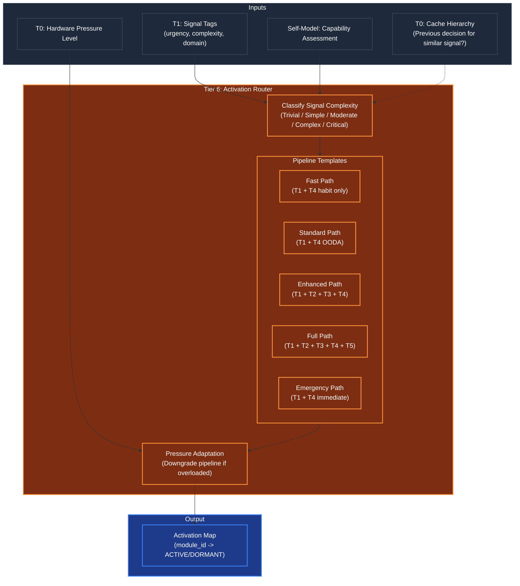

# Activation Router (Selective Module Activation)

## Overview
The Activation Router is the agent's **energy-conservation system** — the module that ensures the kernel doesn't waste compute by running all cognitive modules on every input. Operating at **Tier 6 (The Conscious Observer)** in the pre-execution phase, it determines the **minimal set of modules** required to process the current signal.

This is the direct implementation of the principle: **the Human Kernel is not active all at once, but part by part, activating only the necessary modules.** A greeting doesn't need the full planning pipeline. A complex strategy request doesn't need the habit system. The Activation Router makes this decision in milliseconds, before any expensive processing begins.

## Architecture & Flow

## Key Mechanisms

1. **Complexity Classification**: Maps signal tags (from T1) into five complexity levels. Uses a weighted scoring model combining urgency, domain specificity, structural complexity (is it a question? a command? a multi-part request?), and the Self-Model's capability assessment.

2. **Pipeline Templates**: Pre-defined activation patterns that map complexity levels to module sets. These are config-driven (in `shared/config.py`), not hardcoded. The templates define which tiers and which specific modules within each tier should activate.

3. **Pressure Adaptation**: Under high hardware pressure (detected via Tier 0 `hardware.monitor`), the router **downgrades** the selected pipeline. A signal that would normally get the Full Path may be downgraded to Enhanced or Standard to preserve system stability. This is the agent's equivalent of "I'm overwhelmed, let me simplify."

4. **Decision Caching**: The router checks the T0 Cache Hierarchy for recent decisions on similar signals. If the same type of signal was routed 30 seconds ago, the cached activation map is reused without recomputation. This prevents oscillation and saves compute on repetitive inputs.

5. **Emergency Override**: Signals classified as CRITICAL urgency bypass the normal routing logic and go directly to the Emergency Path — minimal modules, maximum speed. The agent drops everything else and responds immediately.

## Pipeline Definitions

| Complexity | Active Tiers | Active Modules | Use Case |
|---|---|---|---|
| **TRIVIAL** | T1, T4 | classify, habit_exec | Greetings, acknowledgments |
| **SIMPLE** | T1, T4 | classify, intent, OODA (1 cycle) | Direct questions, lookups |
| **MODERATE** | T1, T2, T4 | classify, intent, attention, OODA | Multi-step queries, tool use |
| **COMPLEX** | T1, T2, T3, T4 | full classify, decompose, what-if, DAG, full OODA | Strategy, analysis, design |
| **CRITICAL** | T1, T4, T5 | urgency, immediate_act, panic | Emergencies, system alerts |

## Function Decomposition

### `compute_activation_map`
- **Signature**: `async compute_activation_map(signal_tags: SignalTags, capability: CapabilityAssessment, pressure: float) -> ActivationMap`
- **Description**: Top-level activation decision. Takes the signal tags from T1, the capability assessment from the Self-Model, and the current hardware pressure level. Classifies signal complexity, selects the appropriate pipeline template, applies pressure adaptation, checks the decision cache, and returns an `ActivationMap` — a dictionary of module IDs to ACTIVE/DORMANT states. This map is passed to T4 to control which modules participate in the current cognitive cycle.
- **Calls**: `classify_signal_complexity()`, `select_pipeline()`, T0 cache hierarchy lookup.

### `classify_signal_complexity`
- **Signature**: `(signal_tags: SignalTags) -> ComplexityLevel`
- **Description**: Maps signal tags into a `ComplexityLevel` enum (TRIVIAL, SIMPLE, MODERATE, COMPLEX, CRITICAL). Scoring is weighted: urgency contributes 30%, structural complexity 25%, domain specificity 25%, and capability gap size 20%. Weights are config-driven. CRITICAL is triggered by urgency alone (any signal tagged as EMERGENCY or PANIC).
- **Calls**: None (pure scoring logic on signal tags).

### `select_pipeline`
- **Signature**: `(complexity: ComplexityLevel, pressure: float) -> PipelineConfig`
- **Description**: Selects the pipeline template for the given complexity level and applies pressure-based downgrade if needed. Under normal pressure (<0.6), the optimal pipeline is used. Under moderate pressure (0.6-0.8), the pipeline is downgraded one level (COMPLEX -> MODERATE). Under high pressure (>0.8), downgraded two levels. CRITICAL pipeline is never downgraded — emergencies always get full priority. Returns a `PipelineConfig` listing active module IDs.
- **Calls**: Config lookup for pipeline templates and pressure thresholds.

### `check_decision_cache`
- **Signature**: `(signal_tags: SignalTags) -> ActivationMap | None`
- **Description**: Checks the T0 Cache Hierarchy for a recent activation decision on a signal with matching tags. Returns the cached `ActivationMap` if a match is found within the configured TTL (default 30 seconds), or `None` if no cache hit. Matching uses a configurable similarity threshold on the signal tag vector to handle near-identical (but not identical) signals.
- **Calls**: T0 `cache_hierarchy.read_cache()`.

### `cache_decision`
- **Signature**: `(signal_tags: SignalTags, activation_map: ActivationMap) -> None`
- **Description**: Stores the current activation decision in the T0 Cache Hierarchy for future reuse. The entry is keyed by signal tag vector with a configurable TTL (default 30 seconds). This prevents the router from recomputing the same decision for repetitive or similar signals within a short time window.
- **Calls**: T0 `cache_hierarchy.write_cache()`.
