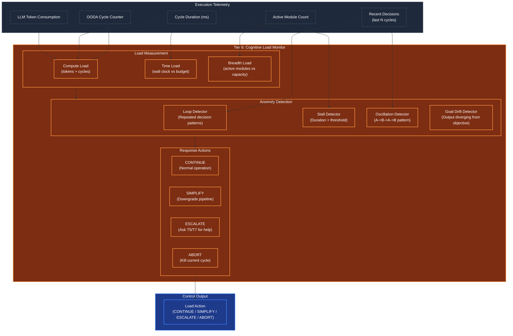

# Cognitive Load Monitor (Processing Budget & Loop Detection)

## Overview
The Cognitive Load Monitor is the agent's **internal performance monitor** — the module that detects when the agent is stuck, overloaded, oscillating, or taking too long. Operating at **Tier 6 (The Conscious Observer)** during the execution phase, it continuously reads telemetry from the running OODA loop and intervenes when processing goes off-track.

Without load monitoring, an agent can silently spin in infinite loops, burn through its entire compute budget on a single query, or stall indefinitely waiting for a response that will never come. The Load Monitor prevents all of these failure modes.

## Architecture & Flow

## Key Mechanisms

1. **Three-Dimensional Load Measurement**: Cognitive load is measured across three axes:
   - **Compute**: Total LLM tokens consumed + OODA cycles executed vs. budget
   - **Time**: Wall clock elapsed vs. expected duration for this complexity level
   - **Breadth**: Number of active modules vs. hardware capacity (from Tier 0 pressure)

2. **Loop Detection**: Analyzes the last N decisions (configurable, default 10) for repetitive patterns. If the agent makes the same decision 3+ times in a row (e.g., "call the same tool with the same arguments"), it's stuck in a loop. Uses sequence comparison (Levenshtein distance on decision hashes) rather than exact matching to catch near-loops.

3. **Oscillation Detection**: A subtler failure mode than loops. The agent alternates between two decisions: A -> B -> A -> B. This happens when two conflicting heuristics fight for control. Detection uses autocorrelation on the decision hash sequence — a period-2 pattern triggers oscillation alert.

4. **Stall Detection**: If a single OODA cycle exceeds the expected duration (based on complexity level, configurable per pipeline type), the monitor flags a stall. Stalls typically indicate a hung tool call, a network timeout, or an LLM that's generating an excessively long response.

5. **Goal Drift Detection**: Compares the current output trajectory against the original objective (from T5 macro-objective tracker). If the semantic similarity between recent outputs and the original goal drops below a threshold, the agent is drifting — solving the wrong problem. This triggers a re-orientation via T4's Orient phase.

6. **Graduated Response**: The monitor doesn't immediately abort on detecting problems. It follows an escalation ladder:
   - **CONTINUE**: Normal, no issues
   - **SIMPLIFY**: Reduce pipeline complexity (tell Activation Router to downgrade)
   - **ESCALATE**: Notify T5 (lifecycle) or T7 (corporate) for intervention
   - **ABORT**: Kill the current cycle, preserve state for retry

## Function Decomposition

### `measure_load`
- **Signature**: `(active_modules: ActivationMap, telemetry: CycleTelemetry) -> CognitiveLoad`
- **Description**: Computes the current cognitive load across all three dimensions (compute, time, breadth). Takes the current activation map and cycle telemetry (tokens consumed, cycles executed, wall clock time, active module count). Returns a `CognitiveLoad` object containing per-dimension scores (0.0-1.0) and an aggregate load score. The aggregate uses config-driven dimension weights (default: compute 40%, time 35%, breadth 25%).
- **Calls**: Config lookup for dimension weights and budget limits.

### `detect_loop`
- **Signature**: `(recent_decisions: list[Decision]) -> LoopDetection`
- **Description**: Analyzes the last N decisions for repetitive patterns. Computes decision hashes and checks for exact matches (strict loop) and near-matches (fuzzy loop via Levenshtein distance < threshold). Returns a `LoopDetection` object containing: `is_looping` (bool), `loop_length` (how many decisions repeat), `loop_count` (how many times repeated), and the repeated decision pattern. The detection window and similarity threshold are configurable.
- **Calls**: None (pure pattern analysis on decision hashes).

### `detect_stall`
- **Signature**: `(cycle_duration: float, expected_duration: float) -> bool`
- **Description**: Compares the current cycle duration against the expected duration for this pipeline type. Returns `True` if `cycle_duration > expected_duration * stall_multiplier` (configurable, default 3.0x). This provides a simple, fast check that runs on every cycle without expensive computation.
- **Calls**: Config lookup for stall multiplier.

### `detect_oscillation`
- **Signature**: `(recent_decisions: list[Decision]) -> OscillationDetection`
- **Description**: Detects alternating A->B->A->B decision patterns using autocorrelation on decision hash sequences. Checks for period-2 oscillation (two alternating decisions) and period-3 oscillation (three rotating decisions). Returns an `OscillationDetection` object with `is_oscillating`, `period`, and the conflicting decisions. More subtle than loop detection — catches cases where the agent flips between two valid but contradictory approaches.
- **Calls**: None (pure sequence analysis).

### `detect_goal_drift`
- **Signature**: `async (recent_outputs: list[str], original_objective: str) -> GoalDriftDetection`
- **Description**: Computes semantic similarity between recent outputs and the original macro-objective. If the rolling average similarity drops below the configured drift threshold (default 0.4), flags goal drift. Returns a `GoalDriftDetection` with `is_drifting`, `similarity_trend` (list of recent similarity scores), and the `drift_magnitude`. Uses Tier 0 embedding for similarity computation.
- **Calls**: Tier 0 `embedding.embed_query()`, Tier 1 `scoring.compute_semantic_similarity()`.

### `recommend_action`
- **Signature**: `(load: CognitiveLoad, loops: LoopDetection) -> LoadAction`
- **Description**: Maps the current cognitive state to a recommended action. Decision logic:
  - Load < 0.6 AND no loops/stalls → **CONTINUE**
  - Load 0.6-0.8 OR minor loop detected → **SIMPLIFY** (downgrade pipeline)
  - Load > 0.8 OR persistent loop OR goal drift → **ESCALATE** (notify T5/T7)
  - Load > 0.95 OR unbreakable loop → **ABORT** (kill cycle, save state)
  All thresholds are config-driven. Returns a `LoadAction` enum with optional metadata (e.g., suggested simplified pipeline for SIMPLIFY).
- **Calls**: Config lookup for load thresholds.
