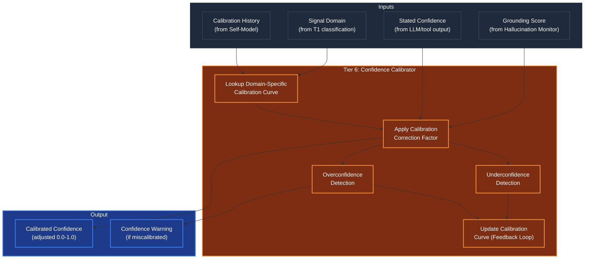

# Confidence Calibrator (Accuracy-Confidence Alignment)

## Overview
The Confidence Calibrator ensures the agent's **stated confidence matches its actual accuracy**. Operating at **Tier 6 (The Conscious Observer)** in the post-execution phase, it takes the raw confidence score from the agent's output and adjusts it based on historical accuracy data from the Self-Model.

An uncalibrated agent that says "I'm 95% confident" but is historically correct only 60% of the time is **dangerous** — it misleads users into trusting unreliable outputs. The Calibrator fixes this by learning the agent's systematic biases and correcting them in real-time.

## Architecture & Flow

## Key Mechanisms

1. **Domain-Specific Calibration Curves**: The agent's accuracy varies by domain — it might be well-calibrated for code review but systematically overconfident on financial analysis. The Calibrator maintains separate calibration curves per domain (using T1 classification domain tags). Each curve maps stated confidence bins (0-10%, 10-20%, ..., 90-100%) to observed accuracy rates.

2. **Correction Factor**: The calibration curve produces a correction factor. If the agent says "90% confident" but historical accuracy at 90% stated confidence is only 70%, the correction factor is 0.70/0.90 = 0.78, and the calibrated confidence becomes 0.90 * 0.78 = 0.70. This is a Platt-style scaling approach.

3. **Grounding Integration**: The Hallucination Monitor's grounding score is a hard override. Even if historical calibration suggests high accuracy, a low grounding score (many fabricated claims) forces the calibrated confidence down. The formula is: `calibrated = min(historical_correction(stated), grounding_score)`.

4. **Overconfidence Detection**: Flags when the gap between stated and calibrated confidence exceeds a threshold (configurable, default 0.2). This triggers a warning annotation on the output — the user sees both the agent's stated confidence and the system's calibrated assessment.

5. **Feedback Learning**: After task outcomes are known (success/failure via T5 epoch commit), the Calibrator updates its curves. Over time, a well-functioning Calibrator converges to perfect calibration: stated 80% = actual 80%.

## Function Decomposition

### `calibrate_confidence`
- **Signature**: `(stated_confidence: float, grounding_score: float, history: CalibrationHistory) -> CalibratedConfidence`
- **Description**: Top-level calibration. Looks up the domain-specific calibration curve, applies the correction factor to the stated confidence, integrates the grounding score as a hard upper bound, and returns a `CalibratedConfidence` containing: the original stated value, the calibrated value, the correction factor applied, and an optional overconfidence warning. This is the primary output consumed by the Noise Gate.
- **Calls**: `detect_overconfidence()`, config lookup for calibration thresholds.

### `detect_overconfidence`
- **Signature**: `(stated: float, calibrated: float) -> bool`
- **Description**: Checks whether the gap between stated and calibrated confidence exceeds the configured warning threshold (default 0.2). Returns `True` if the agent is significantly overconfident, triggering a warning annotation on the output. This is a safety mechanism — it doesn't block the output, but ensures the user is informed that the agent's confidence may be inflated.
- **Calls**: Config lookup for overconfidence threshold.

### `detect_underconfidence`
- **Signature**: `(stated: float, calibrated: float) -> bool`
- **Description**: The inverse of overconfidence detection. Checks if the agent is systematically underconfident (calibrated > stated + threshold). While less dangerous than overconfidence, underconfidence wastes user time by presenting solid results with excessive hedging. Returns `True` to trigger a calibration curve update.
- **Calls**: Config lookup for underconfidence threshold.

### `update_calibration_curve`
- **Signature**: `(predicted: float, actual_accuracy: float) -> None`
- **Description**: Feedback loop entry point. When a task outcome is known (via T5 epoch commit or immediate user feedback), updates the calibration curve for the current domain. Uses an exponential moving average (EMA) to weight recent data points more heavily than old ones. The decay factor is configurable (default 0.1). Over time, this converges the calibration curve to reflect the agent's true accuracy distribution.
- **Calls**: Self-Model `update_accuracy_history()`.

### `get_calibration_curve`
- **Signature**: `(domain: str) -> CalibrationCurve`
- **Description**: Retrieves the calibration curve for a specific domain. Returns a `CalibrationCurve` object containing the mapping from stated confidence bins to observed accuracy rates, plus metadata (sample count, last update timestamp, confidence interval). If no domain-specific curve exists, returns the global default curve.
- **Calls**: Self-Model accuracy tracker, config for default curve.
