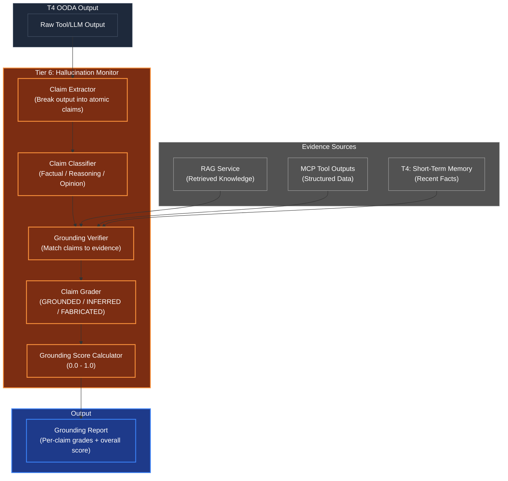

# Hallucination Monitor (Epistemic Grounding Verifier)

## Overview
The Hallucination Monitor is the agent's **internal fact-checker** — the module that prevents the agent from confidently presenting fabricated information as truth. Operating at **Tier 6 (The Conscious Observer)** in the post-execution phase, it intercepts every output before it reaches the user or downstream systems and grades each claim against available evidence.

This is arguably the most critical safety module in the entire Human Kernel. An agent without hallucination monitoring is an agent that lies with confidence.

## Architecture & Flow

## Key Mechanisms

1. **Claim Extraction**: Decomposes a natural-language output into atomic, independently verifiable claims. "The company was founded in 2020 and has 500 employees" becomes two claims: (a) "founded in 2020" and (b) "has 500 employees". Uses Tier 1 entity extraction and sentence parsing primitives.

2. **Claim Classification**: Not all claims need the same verification. A factual claim ("revenue was $10M") needs hard evidence. A reasoning claim ("therefore margins are thin") needs logical chain validation. An opinion ("I recommend approach A") needs no grounding — but must be labeled as opinion, not fact.

3. **Grounding Verification**: Each factual claim is matched against the evidence pool (RAG retrieval results, tool outputs, cached STM facts). The match uses Tier 0 embedding similarity + Tier 1 semantic scoring. A claim is grounded if evidence supports it above the configured similarity threshold.

4. **Three-Grade System**: Every claim receives one of three grades:
   - **GROUNDED**: Direct evidence found (similarity > threshold, source traceable)
   - **INFERRED**: Logically derivable from grounded claims (reasoning chain valid, but no direct source)
   - **FABRICATED**: No evidence found, no valid reasoning chain — the agent made this up

5. **Grounding Score**: A weighted aggregate across all claims. Grounded claims score 1.0, inferred claims score 0.5 (configurable), fabricated claims score 0.0. The overall score determines whether the output passes the Noise Gate.

## Function Decomposition

### `verify_grounding`
- **Signature**: `async verify_grounding(output: ToolOutput, evidence: list[Origin]) -> GroundingReport`
- **Description**: Top-level grounding verification. Takes the raw output from T4 and the evidence pool accumulated during the OODA cycle (RAG results, tool outputs). Extracts claims, classifies them, grades each against evidence, and produces a `GroundingReport` with per-claim grades and an overall grounding score. The report is consumed by the Confidence Calibrator and Noise Gate.
- **Calls**: `classify_claims()`, `grade_claim()`, `calculate_grounding_score()`.

### `classify_claims`
- **Signature**: `(output_text: str) -> list[Claim]`
- **Description**: Decomposes the output text into atomic claims. Each `Claim` object contains the claim text, its type (FACTUAL, REASONING, OPINION), the sentence it originated from, and its position in the output. Uses Tier 1 entity extraction for factual claims and sentence-level dependency parsing for reasoning claims. Opinions are detected via sentiment markers and hedging language.
- **Calls**: Tier 1 `entity_recognition.extract_entities()`, Tier 1 `classification.classify()` for claim type.

### `grade_claim`
- **Signature**: `async grade_claim(claim: Claim, evidence: list[Origin]) -> ClaimGrade`
- **Description**: Grades a single claim against the evidence pool. For FACTUAL claims, computes embedding similarity between the claim and each evidence source, returning GROUNDED if any source exceeds the similarity threshold. For REASONING claims, validates the logical chain back to grounded premises. For OPINION claims, automatically returns GROUNDED (opinions don't need evidence, but are labeled as such). Returns a `ClaimGrade` containing the grade, supporting evidence references, and the similarity score.
- **Calls**: Tier 0 `embedding.embed_query()`, Tier 1 `scoring.compute_semantic_similarity()`.

### `calculate_grounding_score`
- **Signature**: `(grades: list[ClaimGrade]) -> float`
- **Description**: Computes the overall grounding score (0.0 to 1.0) as a weighted average across all claim grades. GROUNDED claims contribute their full similarity score, INFERRED claims contribute a discounted score (default 0.5x), FABRICATED claims contribute 0.0. The weights are configurable in `shared/config.py`. Returns the aggregate score used by the Noise Gate threshold check.
- **Calls**: Config lookup for grade weights.

### `trace_evidence_chain`
- **Signature**: `(claim: Claim, evidence: list[Origin]) -> list[EvidenceLink]`
- **Description**: For INFERRED claims, traces the reasoning chain back to grounded premises. Returns the full evidence chain as a list of `EvidenceLink` objects, each connecting a claim to its supporting evidence with a confidence score. If the chain breaks (no grounded premise found), the claim is reclassified as FABRICATED. This function provides the audit trail for why a claim was graded as it was.
- **Calls**: Tier 1 `scoring.compute_semantic_similarity()` for chain link validation.
