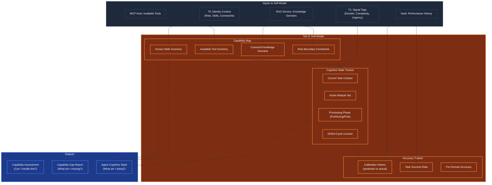

# Self-Model (Cognitive Self-Awareness)

## Overview
The Self-Model is the agent's **internal representation of itself** — a live, continuously updated map of what it IS, what it CAN do, what it CANNOT do, and how well it has been performing. Operating at **Tier 6 (The Conscious Observer)**, it provides the foundational self-knowledge that all other T6 modules depend on.

Without a Self-Model, the agent is blind to its own limitations. It cannot know when to say "I don't know," when to escalate, or when to skip unnecessary reasoning. The Self-Model transforms a reactive executor into a self-aware cognitive agent.

## Architecture & Flow

## Key Mechanisms

1. **Capability Map**: Built at agent genesis (T5) from the cognitive profile and continuously updated as tools become available/unavailable and knowledge domains are accessed. The map answers: "Given my role, tools, and knowledge — can I handle signal X?"

2. **Cognitive State Tracker**: A real-time snapshot of what the agent is currently doing. Unlike T4's Short-Term Memory (which tracks task data), the State Tracker tracks *the agent's own processing* — which modules are active, what phase it's in, how many cycles it has run. This is pure introspection.

3. **Accuracy Tracker**: Maintains a running history of the agent's prediction accuracy. When the Confidence Calibrator (another T6 module) says "I'm 90% confident," the Accuracy Tracker knows whether the agent's 90% predictions are historically correct 90% of the time, or only 60%.

4. **Capability Gap Detection**: When a signal arrives requiring skills or tools the agent doesn't have, the Self-Model generates a `CapabilityGap` report. This can trigger: (a) escalation to T7 for re-assignment, (b) tool discovery via MCP, or (c) honest admission to the user: "I cannot do this."

## Function Decomposition

### `assess_capability`
- **Signature**: `async assess_capability(signal_tags: SignalTags, identity: IdentityContext) -> CapabilityAssessment`
- **Description**: Top-level capability check. Cross-references the incoming signal's domain, required skills, and tool needs against the agent's Capability Map. Returns a `CapabilityAssessment` containing a boolean `can_handle`, a confidence score, and an optional list of partial gaps (e.g., "I can do most of this, but lack the database tool for step 3"). This is the first function called in every T6 pre-execution phase.
- **Calls**: `detect_capability_gap()`, reads from Capability Map state.

### `get_current_state`
- **Signature**: `() -> AgentCognitiveState`
- **Description**: Returns a snapshot of the agent's current cognitive state — which modules are active, what processing phase it's in (pre/during/post-execution), current OODA cycle count, current task context, and elapsed time. Used by the Cognitive Load Monitor to detect stalls and loops, and by T7 for status reporting.
- **Calls**: None (reads internal state).

### `update_accuracy_history`
- **Signature**: `(prediction: float, actual: float) -> None`
- **Description**: Records a calibration data point. When the agent predicts a confidence level (e.g., 0.85) and the actual outcome is later known (success=1.0 or failure=0.0), this function updates the running calibration curve. Over time, this enables the Confidence Calibrator to correct systematic over- or under-confidence.
- **Calls**: None (appends to internal calibration history, periodic flush to Vault via T5 epoch commit).

### `detect_capability_gap`
- **Signature**: `(signal_tags: SignalTags) -> CapabilityGap | None`
- **Description**: Compares the signal's requirements (domains, tools, skill levels) against the agent's Capability Map. Returns `None` if fully capable, or a `CapabilityGap` object detailing what's missing: missing tools (e.g., "needs SQL executor but only has web search"), missing knowledge domains (e.g., "requires financial accounting knowledge"), or constraint violations (e.g., "my role prohibits code execution").
- **Calls**: MCP Host tool listing (cached), RAG Service domain listing (cached).

### `refresh_capability_map`
- **Signature**: `async () -> None`
- **Description**: Rebuilds the Capability Map from current sources. Called at agent genesis, after tool discovery events, and periodically during long-running tasks. Queries the MCP Host for available tools, the RAG Service for accessible knowledge domains, and the identity context for role constraints. Updates the internal state atomically.
- **Calls**: MCP Host `list_tools()`, RAG Service domain API, T5 `IdentityContext`.
