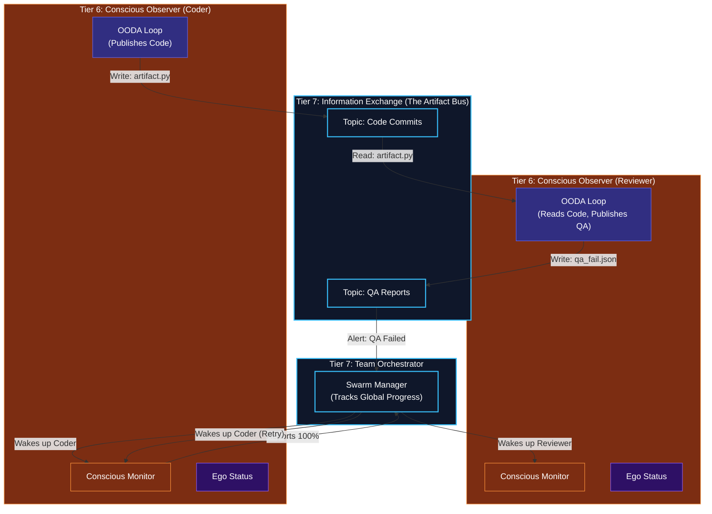

# Team Orchestration & Information Exchange

## Overview
Once multiple Tier 6 agents (Conscious Observers, each wrapping a full T1-T5 Human Kernel) are spawned by Tier 7, they need to talk to each other to accomplish the Master Objective. Since they run completely isolated from each other (Zero-Trust boundaries), they cannot share their internal Short-Term Memories directly.

- **Information Exchange (Artifact Bus)**: The physical "watercooler" of the corporation. When an agent creates a file, insight, or artifact, it publishes it to the Artifact Bus. Other agents subscribed to that artifact type can instantly pull it into their own OODA Loops (via Tier 4 `Observe`).
- **Team Orchestration**: Acts as the Manager/Director of the spawned swarm. It listens to the status reported by every Tier 6 Conscious Observer. If the Coder Agent finishes its DAG, the Team Orchestrator signals the Reviewer Agent to wake up and start evaluating the Coder's Artifact.

## Architecture & Flow

## Function Decomposition

### `orchestrate_team`
- **Signature**: `async orchestrate_team(agent_handles: list[AgentHandle], master_goal: MasterObjective) -> TeamResult`
- **Description**: Top-level team management loop. Monitors progress across all spawned Tier 6 Conscious Observers, sequences workflow handoffs (e.g., Coder finishes -> Reviewer starts), handles agent failures and re-spawning, and aggregates final results. Returns a `TeamResult` containing the combined artifacts, completion status, and performance metrics for the enterprise objective.
- **Calls**: `track_team_progress()`, `signal_agent_wake()`, `sequence_workflow()`.

### `publish_artifact`
- **Signature**: `async publish_artifact(agent_id: str, topic: str, artifact: Artifact) -> None`
- **Description**: Pushes an artifact to the Information Exchange (Artifact Bus). The publishing agent specifies the topic channel (e.g., "code_commits", "qa_reports") and the artifact payload. All agents subscribed to that topic receive the artifact in their next OODA Observe cycle. Uses the Tier 0 `Notification` schema (fire-and-forget, no response expected).
- **Calls**: Tier 0 `standard_io.create_notification()`, Artifact Bus message broker.

### `subscribe_to_topic`
- **Signature**: `async subscribe_to_topic(agent_id: str, topic: str) -> Subscription`
- **Description**: Registers an agent as a subscriber to a specific Artifact Bus topic. Returns a `Subscription` handle that the agent's OODA Observe phase uses to poll for new artifacts. Subscriptions are managed per-agent and cleaned up when the agent terminates.
- **Calls**: Artifact Bus subscription API.

### `consume_artifacts`
- **Signature**: `async consume_artifacts(subscription: Subscription) -> list[Artifact]`
- **Description**: Pulls all pending artifacts from a subscription since the last consumption. Called by the agent's OODA Observe phase to ingest artifacts published by other team members. Returns an empty list if no new artifacts are available. Automatically acknowledges consumed artifacts to prevent re-delivery.
- **Calls**: Artifact Bus consumption API.

### `track_team_progress`
- **Signature**: `async track_team_progress(agent_handles: list[AgentHandle]) -> TeamProgressReport`
- **Description**: Polls the status of all spawned Tier 6 Conscious Observers and aggregates their progress into a global `TeamProgressReport`. Tracks which agents are active, completed, failed, or sleeping. Calculates overall enterprise objective completion percentage and identifies blockers.
- **Calls**: Tier 6 status API for each agent handle.

### `signal_agent_wake`
- **Signature**: `async signal_agent_wake(agent_handle: AgentHandle, reason: WakeReason) -> None`
- **Description**: Sends a wake signal to a specific sleeping or suspended agent. Used by the Team Orchestrator to trigger workflow continuation (e.g., "Reviewer, wake up: Coder has published code for you to review"). The `reason` payload includes the triggering event and any artifact references.
- **Calls**: Tier 6 `conscious_observer.handle_corporate_signal()` via service API.

### `sequence_workflow`
- **Signature**: `async sequence_workflow(completion_event: CompletionEvent, workflow_rules: list[WorkflowRule]) -> None`
- **Description**: Implements inter-agent workflow sequencing. When an agent completes its objective (e.g., Coder publishes final code), checks the workflow rules to determine which agent should be woken next (e.g., Reviewer). Triggers the appropriate wake signals and artifact subscriptions to chain the pipeline. Rules are config-driven, not hardcoded.
- **Calls**: `signal_agent_wake()`, `subscribe_to_topic()`, config-driven workflow rules.
