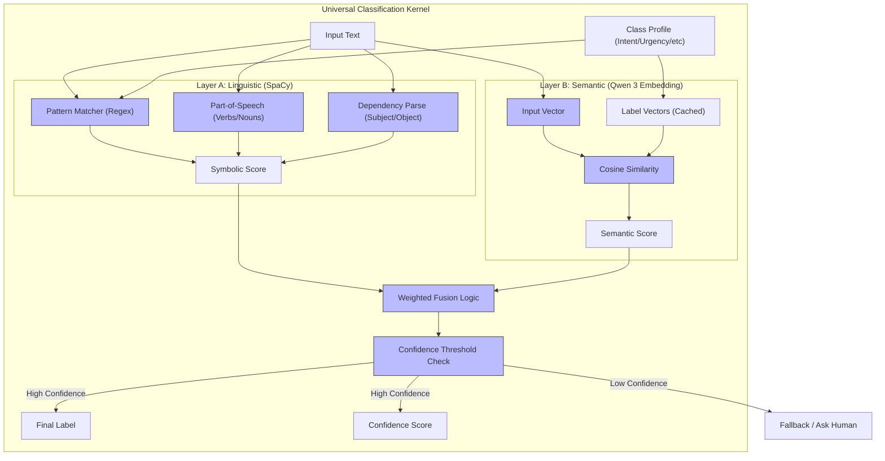

```mermaid
---
config:
  layout: dagre
---
flowchart TB
 subgraph sUniversal["Universal Classification Kernel"]
        direction TB
        
        %% INPUTS
        nInput["Input Text"]
        nProfile["Class Profile (Intent/Urgency/etc)"]
        
        %% LAYER 1: SpaCy (Fast/Syntax)
        subgraph sSpacy["Layer A: Linguistic (SpaCy)"]
            nPattern["Pattern Matcher (Regex)"]
            nPOS["Part-of-Speech (Verbs/Nouns)"]
            nDep["Dependency Parse (Subject/Object)"]
            nScoreA["Symbolic Score"]
        end

        %% LAYER 2: Embedding (Slow/Semantic)
        subgraph sEmbed["Layer B: Semantic (Qwen 3 Embedding)"]
            nVecInput["Input Vector"]
            nVecLabels["Label Vectors (Cached)"]
            nCosine["Cosine Similarity"]
            nScoreB["Semantic Score"]
        end

        %% LAYER 3: Hybrid Fusion
        nFusion["Weighted Fusion Logic"]
        nThreshold["Confidence Threshold Check"]
        
        %% OUTPUTS
        nLabel["Final Label"]
        nConf["Confidence Score"]
  end

    %% Flow
    nInput --> nPattern & nPOS & nDep
    nInput --> nVecInput
    nProfile --> nPattern
    nProfile --> nVecLabels

    %% Spacy Logic
    nPattern & nPOS & nDep --> nScoreA

    %% Embedding Logic
    nVecInput & nVecLabels --> nCosine
    nCosine --> nScoreB

    %% Fusion
    nScoreA --> nFusion
    nScoreB --> nFusion
    nFusion --> nThreshold
    
    nThreshold -- "High Confidence" --> nLabel & nConf
    nThreshold -- "Low Confidence" --> nFallback["Fallback / Ask Human"]

    classDef proc fill:#bbf,stroke:#333,stroke-width:1px;
    class nPattern,nPOS,nDep,nVecInput,nCosine,nFusion,nThreshold proc;
```
