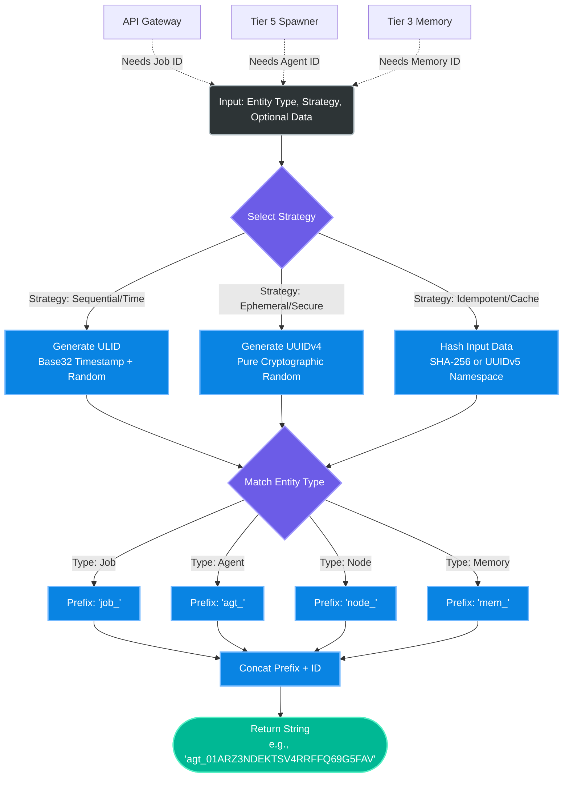

```mermaid
graph TD
    %% Styling
    classDef external fill:#2d3436,stroke:#b2bec3,stroke-width:2px,color:#fff;
    classDef process fill:#0984e3,stroke:#74b9ff,stroke-width:2px,color:#fff;
    classDef decision fill:#6c5ce7,stroke:#a29bfe,stroke-width:2px,color:#fff;
    classDef success fill:#00b894,stroke:#55efc4,stroke-width:2px,color:#fff;

    %% Entry Points
    CallerAPI[API Gateway] -.->|Needs Job ID| RequestID
    CallerSpawn[Tier 5 Spawner] -.->|Needs Agent ID| RequestID
    CallerMem[Tier 3 Memory] -.->|Needs Memory ID| RequestID

    %% Core Entry
    RequestID(Input: Entity Type, Strategy, Optional Data):::external --> Router{Select Strategy}:::decision

    %% Path 1: Time-Sortable (ULID)
    Router -->|Strategy: Sequential/Time| GenULID[Generate ULID<br/>Base32 Timestamp + Random]:::process
    
    %% Path 2: Cryptographic Random (UUIDv4)
    Router -->|Strategy: Ephemeral/Secure| GenUUID[Generate UUIDv4<br/>Pure Cryptographic Random]:::process
    
    %% Path 3: Deterministic (UUIDv5 / SHA)
    Router -->|Strategy: Idempotent/Cache| HashData[Hash Input Data<br/>SHA-256 or UUIDv5 Namespace]:::process

    %% Prefix Injection (The "Stripe" Method)
    GenULID --> InjectPrefix{Match Entity Type}:::decision
    GenUUID --> InjectPrefix
    HashData --> InjectPrefix

    %% Prefix Mapping
    InjectPrefix -->|Type: Job| PreJob[Prefix: 'job_']:::process
    InjectPrefix -->|Type: Agent| PreAgt[Prefix: 'agt_']:::process
    InjectPrefix -->|Type: Node| PreNode[Prefix: 'node_']:::process
    InjectPrefix -->|Type: Memory| PreMem[Prefix: 'mem_']:::process

    %% Final Assembly
    PreJob --> FinalConcat[Concat Prefix + ID]:::process
    PreAgt --> FinalConcat
    PreNode --> FinalConcat
    PreMem --> FinalConcat

    %% Output
    FinalConcat --> OutputID([Return String<br/>e.g., 'agt_01ARZ3NDEKTSV4RRFFQ69G5FAV']):::success
```
