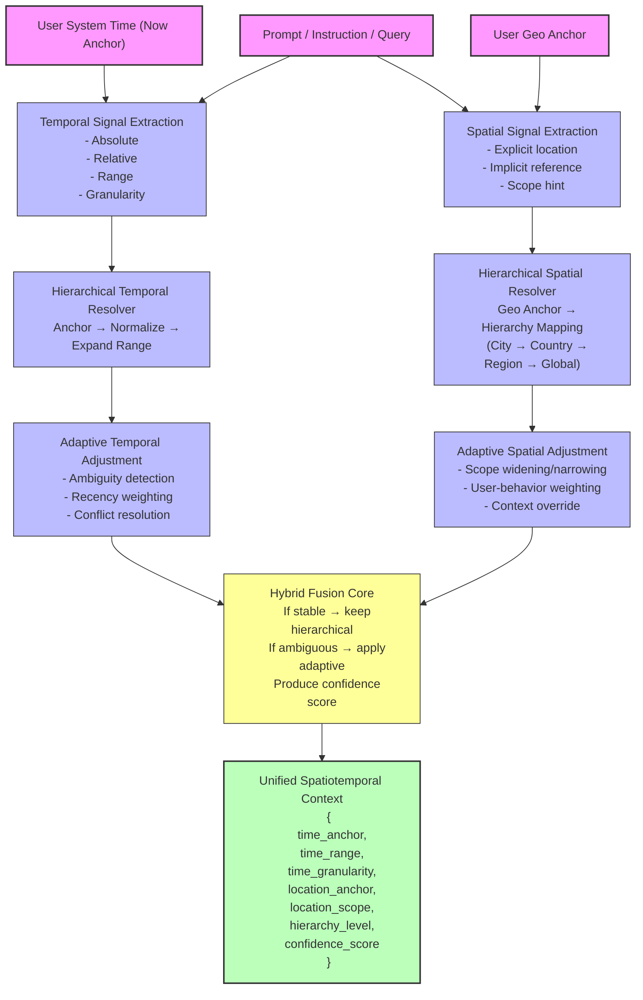

```mermaid
---
config:
  layout: fixed
---
flowchart TB
    A1["User System Time (Now Anchor)"] --> B1["Temporal Signal Extraction
    - Absolute
    - Relative
    - Range
    - Granularity"]
    A3["Prompt / Instruction / Query"] --> B1 & B2["Spatial Signal Extraction
    - Explicit location
    - Implicit reference
    - Scope hint"]
    A2["User Geo Anchor"] --> B2
    B1 --> C1["Hierarchical Temporal Resolver
    Anchor → Normalize → Expand Range"]
    B2 --> C2["Hierarchical Spatial Resolver
    Geo Anchor → Hierarchy Mapping
    (City → Country → Region → Global)"]
    C1 --> D1["Adaptive Temporal Adjustment
    - Ambiguity detection
    - Recency weighting
    - Conflict resolution"]
    C2 --> D2["Adaptive Spatial Adjustment
    - Scope widening/narrowing
    - User-behavior weighting
    - Context override"]
    D1 --> E1["Hybrid Fusion Core
    If stable → keep hierarchical
    If ambiguous → apply adaptive
    Produce confidence score"]
    D2 --> E1
    E1 --> F1["Unified Spatiotemporal Context
    {
      time_anchor,
      time_range,
      time_granularity,
      location_anchor,
      location_scope,
      hierarchy_level,
      confidence_score
    }"]

     A1:::input
     B1:::calc
     A3:::input
     B2:::calc
     A2:::input
     C1:::calc
     C2:::calc
     D1:::calc
     D2:::calc
     E1:::score
     F1:::final
    classDef input fill:#f9f,stroke:#333,stroke-width:2px
    classDef calc fill:#bbf,stroke:#333,stroke-width:1px
    classDef score fill:#ff9,stroke:#333,stroke-width:1px
    classDef final fill:#bfb,stroke:#333,stroke-width:2px
```
