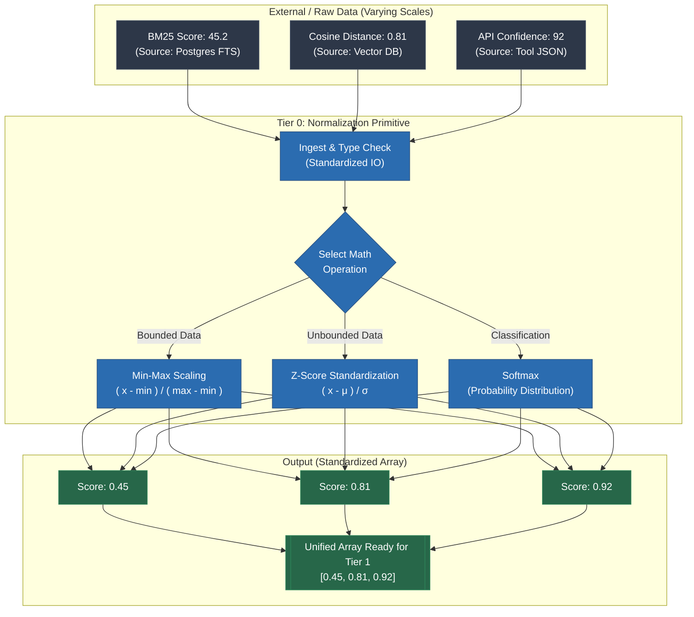

```mermaid
graph TD
    subgraph Raw_Inputs ["External / Raw Data (Varying Scales)"]
        A["BM25 Score: 45.2\n(Source: Postgres FTS)"]
        B["Cosine Distance: 0.81\n(Source: Vector DB)"]
        C["API Confidence: 92\n(Source: Tool JSON)"]
    end

    subgraph Tier0_Normalization ["Tier 0: Normalization Primitive"]
        D["Ingest & Type Check\n(Standardized IO)"]
        
        E{"Select Math\nOperation"}
        
        F["Min-Max Scaling\n( x - min ) / ( max - min )"]
        G["Z-Score Standardization\n( x - μ ) / σ"]
        H["Softmax\n(Probability Distribution)"]
        
        D --> E
        E -->|Bounded Data| F
        E -->|Unbounded Data| G
        E -->|Classification| H
    end

    subgraph Tier1_Ready ["Output (Standardized Array)"]
        I["Score: 0.45"]
        J["Score: 0.81"]
        K["Score: 0.92"]
        
        L[["Unified Array Ready for Tier 1\n[0.45, 0.81, 0.92]"]]
    end

    A --> D
    B --> D
    C --> D
    
    F --> I & J & K
    G --> I & J & K
    H --> I & J & K
    
    I --> L
    J --> L
    K --> L

    classDef input fill:#2d3748,stroke:#4a5568,color:#fff;
    classDef process fill:#2b6cb0,stroke:#2c5282,color:#fff;
    classDef output fill:#276749,stroke:#2f855a,color:#fff;
    
    class A,B,C input;
    class D,E,F,G,H process;
    class I,J,K,L output;
```
