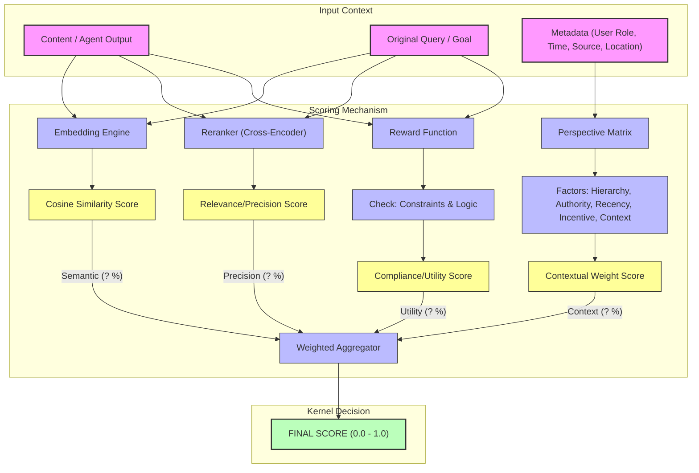

```mermaid
---
config:
  layout: dagre
---
flowchart TB
 subgraph sInput["Input Context"]
        nInput["Content / Agent Output"]
        nQuery["Original Query / Goal"]
        nMeta["Metadata (User Role, Time, Source, Location)"]
  end

 subgraph s2["Scoring Mechanism"]
        direction TB
        
        %% 1. Semantic Path
        n15["Embedding Engine"]
        nScoreVector["Cosine Similarity Score"]

        %% 2. Precision Path
        n16["Reranker (Cross-Encoder)"]
        nScoreRelevance["Relevance/Precision Score"]

        %% 3. Context Path (Perspective)
        n18["Perspective Matrix"]
        nPerspFactors["Factors: Hierarchy, Authority, Recency, Incentive, Context"]
        nScorePersp["Contextual Weight Score"]

        %% 4. Objective Path (Reward)
        n17["Reward Function"]
        nConstraints["Check: Constraints & Logic"]
        nScoreReward["Compliance/Utility Score"]

        %% Aggregation
        nAggregator["Weighted Aggregator"]
  end

 subgraph sOutput["Kernel Decision"]
        nFinalScore["FINAL SCORE (0.0 - 1.0)"]
  end

    %% Wiring Inputs to Scorers
    nInput & nQuery --> n15
    n15 --> nScoreVector

    nInput & nQuery --> n16
    n16 --> nScoreRelevance

    nMeta --> n18
    n18 --> nPerspFactors
    nPerspFactors --> nScorePersp

    nInput & nQuery --> n17
    n17 --> nConstraints
    nConstraints --> nScoreReward

    %% Aggregation Wiring
    nScoreVector -- "Semantic (? %)" --> nAggregator
    nScoreRelevance -- "Precision (? %)" --> nAggregator
    nScorePersp -- "Context (? %)" --> nAggregator
    nScoreReward -- "Utility (? %)" --> nAggregator

    %% Final Output
    nAggregator --> nFinalScore

    %% Styling
    classDef input fill:#f9f,stroke:#333,stroke-width:2px;
    classDef calc fill:#bbf,stroke:#333,stroke-width:1px;
    classDef score fill:#ff9,stroke:#333,stroke-width:1px;
    classDef final fill:#bfb,stroke:#333,stroke-width:2px;

    class nInput,nQuery,nMeta input;
    class n15,n16,n17,n18,nPerspFactors,nConstraints,nAggregator calc;
    class nScoreVector,nScoreRelevance,nScorePersp,nScoreReward score;
    class nFinalScore final;
```
