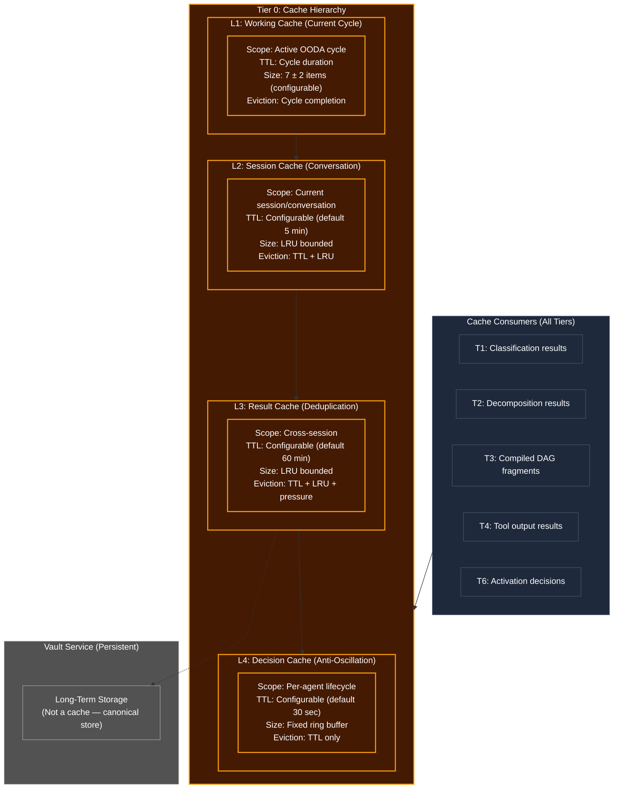

# Cache Hierarchy (Multi-Tier Memory Performance Layer)

## Overview
The Cache Hierarchy is the agent's **memory performance layer** — a multi-level caching system that prevents redundant computation across all tiers. Operating at **Tier 0 (Base Foundation)**, it provides infrastructure that every tier can read from and write to, analogous to how CPU caches (L1/L2/L3) accelerate memory access.

Caching is part of memory, but it is not memory itself. Memory (T4 Short-Term, T5 Vault persistence) defines **what to remember**. The Cache Hierarchy defines **what to keep hot** — optimizing for speed by avoiding redundant computation, embedding, tool calls, and decision-making.

## Architecture & Flow

## Cache Levels

| Level | Human Analog | Scope | TTL | Size | Purpose |
|---|---|---|---|---|---|
| **L1** | Sensory buffer | Current OODA cycle | Cycle duration | 7 ± 2 items | Immediate working context |
| **L2** | Short-term memory | Current session | 5 min (config) | LRU bounded | Conversation-scope deduplication |
| **L3** | Result memory | Cross-session | 60 min (config) | LRU bounded | Tool output / embedding dedup |
| **L4** | Decision memory | Agent lifecycle | 30 sec (config) | Ring buffer | Prevent decision oscillation |

## Key Mechanisms

1. **Cascading Lookup**: Cache reads cascade from L1 -> L2 -> L3 -> L4. A hit at any level returns immediately without checking deeper levels. A miss at all levels triggers a full computation, and the result is written to the appropriate cache level based on the data type.

2. **Type-Aware Routing**: Not all data goes to all levels. The cache manager routes based on data type:
   - **Classifications/Signal Tags** → L1 (cycle-scoped, fast expiry)
   - **Embedding Vectors** → L3 (expensive to compute, reusable across sessions)
   - **Tool Outputs** → L2 (session-scoped) or L3 (if deterministic tool + same input)
   - **Activation Decisions** → L4 (anti-oscillation, short TTL)

3. **Pressure-Aware Eviction**: Under high memory pressure (from Tier 0 `hardware.monitor`), the cache proactively evicts L2 and L3 entries to free RAM. L1 and L4 are never pressure-evicted (they're small and critical). Eviction priority: least-recently-used entries first, then lowest-hit-count entries.

4. **Content-Addressed Keys**: Cache keys are generated via Tier 0 `id_and_hash.generate_deterministic_hash()`, ensuring that semantically identical inputs always produce the same cache key regardless of formatting differences. This prevents cache misses due to whitespace changes, argument reordering, or other trivial variations.

5. **Invalidation Protocol**: Cache entries can be explicitly invalidated by upper tiers. T6's Activation Router invalidates L4 decision cache when the Self-Model detects a capability change. T5's lifecycle controller invalidates L2 session cache on objective pivot. T4 invalidates L1 working cache on each OODA cycle boundary.

## What Gets Cached (Examples)

| Operation | Without Cache | With Cache | Level |
|---|---|---|---|
| Classify same greeting twice | 2 LLM calls | 1 LLM call + 1 cache hit | L2 |
| Embed same text in same cycle | 2 embedding calls | 1 embedding call + 1 hit | L1 |
| Call same tool with same args | 2 tool executions | 1 execution + 1 hit | L3 |
| Route same signal type | 2 activation computations | 1 computation + 1 hit | L4 |
| Reranker on same query+docs | 2 reranker passes | 1 pass + 1 hit | L2 |

## Function Registry

| Function | Signature | Purpose |
|----------|-----------|---------|
| `read_cache` | `(key: str, level: CacheLevel \| None) -> CacheEntry \| None` | Cascading read from specified or all levels |
| `write_cache` | `(key: str, value: Any, level: CacheLevel, ttl: int \| None) -> None` | Write to specific cache level |
| `invalidate` | `(key: str, level: CacheLevel \| None) -> int` | Remove entry from specific or all levels |
| `invalidate_by_prefix` | `(prefix: str, level: CacheLevel) -> int` | Bulk invalidation by key prefix |
| `generate_cache_key` | `(namespace: str, payload: bytes) -> str` | Content-addressed key via deterministic hash |
| `get_stats` | `(level: CacheLevel \| None) -> CacheStats` | Hit rate, miss rate, eviction count |
| `pressure_evict` | `(target_freed_bytes: int) -> int` | Free memory under pressure |
| `flush_level` | `(level: CacheLevel) -> int` | Clear entire cache level |

## Function Decomposition

### `read_cache`
- **Signature**: `(key: str, level: CacheLevel | None) -> CacheEntry | None`
- **Description**: Primary cache read. If `level` is specified, checks only that level. If `None`, cascades from L1 -> L2 -> L3 -> L4, returning the first hit. A `CacheEntry` contains the cached value, the level it was found at, its TTL remaining, and a hit counter. Returns `None` on complete miss. Increments hit/miss counters for observability.
- **Calls**: None (in-memory lookup).

### `write_cache`
- **Signature**: `(key: str, value: Any, level: CacheLevel, ttl: int | None) -> None`
- **Description**: Writes a value to a specific cache level. If `ttl` is None, uses the configured default TTL for that level. If the level is at capacity, triggers LRU eviction before writing. The value is stored with metadata: write timestamp, TTL, hit count (initialized to 0), and byte size estimate (for pressure eviction). Keys are expected to be generated via `generate_cache_key()`.
- **Calls**: Level-specific eviction if at capacity.

### `invalidate`
- **Signature**: `(key: str, level: CacheLevel | None) -> int`
- **Description**: Removes a specific entry from the cache. If `level` is specified, removes only from that level. If `None`, removes from all levels. Returns the count of entries removed (0 if not found). Used by upper tiers for explicit invalidation on state changes (e.g., T5 objective pivot invalidates L2 session cache).
- **Calls**: None (in-memory deletion).

### `generate_cache_key`
- **Signature**: `(namespace: str, payload: bytes) -> str`
- **Description**: Generates a content-addressed cache key using Tier 0 `id_and_hash.generate_deterministic_hash()`. The namespace parameter scopes keys by data type (e.g., "classification", "embedding", "tool_output", "activation"). This ensures no key collisions across different cache consumers while allowing identical inputs to always produce identical keys.
- **Calls**: Tier 0 `id_and_hash.generate_deterministic_hash()`.

### `pressure_evict`
- **Signature**: `(target_freed_bytes: int) -> int`
- **Description**: Called by the Tier 0 hardware monitor when memory pressure exceeds the configured threshold. Evicts entries from L2 and L3 (never L1 or L4) until the target byte count is freed. Eviction priority: (1) expired TTL entries, (2) lowest hit count, (3) oldest write timestamp. Returns the actual bytes freed.
- **Calls**: Tier 0 `hardware.monitor.get_pressure()`.
