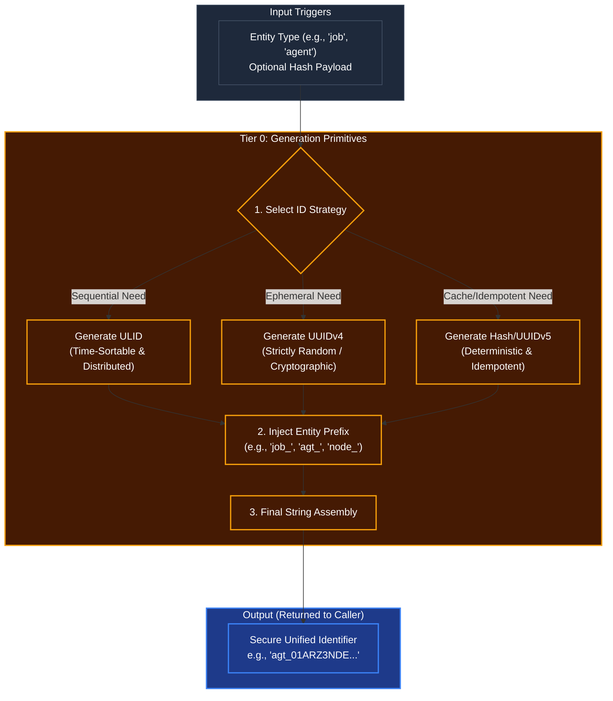

# Global ID & Hashing Primitives

## Overview
As part of **Tier 0 (Base Foundation)**, the ID generation rules dictate how Kea uniquely tracks everything from tiny internal sub-tasks to massive long-term macro-goals stored in the Vault. Tier 0 functions are strictly self-contained and do not depend on any higher-level cognitive layer. They provide the universal bedrock of identity for the entire system.

By standardizing ID generation here, we ensure that the database (Vault) never receives conflicting primary keys, and distributed instances of the Corporate Kernel can spawn agents without race conditions.

## Architecture & Flow

## Key Mechanisms
1. **ULID for Time-Sortable Objects**: When creating an Agent, a Job, or a Memory, Kea uses ULIDs (Universally Unique Lexicographically Sortable Identifiers). This allows the Vault database to sort billions of events natively by time without needing a separate `created_at` index, dramatically speeding up Tier 4 context retrieval.
2. **UUIDv4 for Ephemeral/Secure Objects**: If an ID is only needed for a temporary session token or a cryptographic nonce, a pure random UUID is generated to prevent sequence prediction attacks.
3. **Deterministic Hashing (UUIDv5)**: If an agent processes the exact same document twice, the system uses a SHA-256 hash or UUIDv5 based on the document's contents. This guarantees "Idempotency"—the database knows it's the same file and won't duplicate the vector embeddings, saving massive amounts of Corporate storage budget.
4. **The Stripe Prefix Rule**: All IDs are prefixed with a human-readable tag (like Stripe's API: `cus_x` or `ch_y`). For example, `agt_` for agents, `job_` for OODA loop tasks. This ensures developers and monitoring tools instantly know what an ID represents without querying the database.
