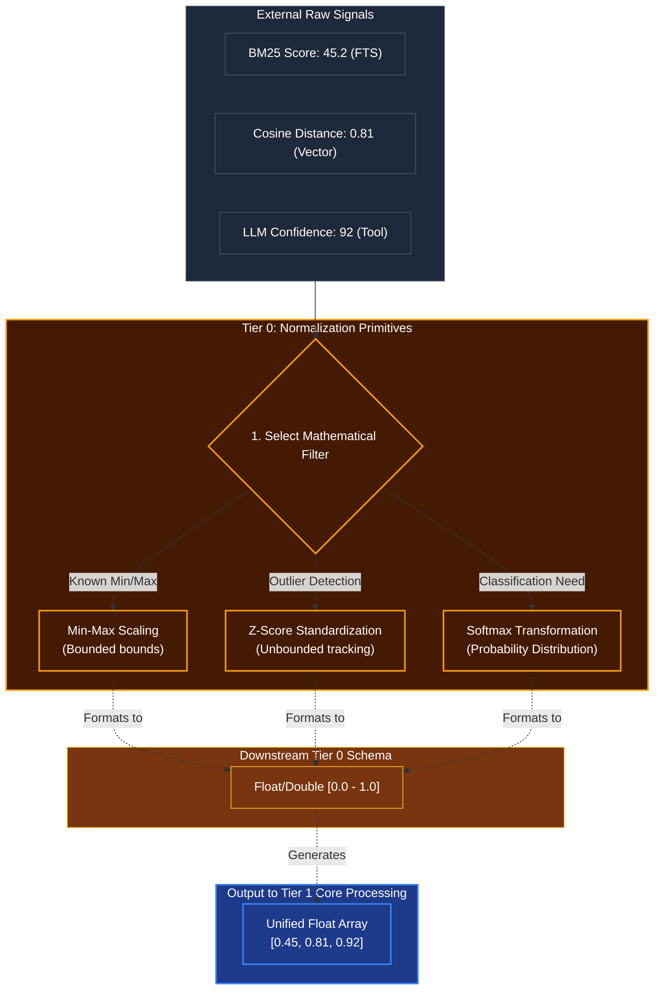

# Mathematical Normalization

## Overview
A critical **Tier 0** mathematical foundation. Different external sources provide confidence metrics in wildly varying formats: Vector Databases return cosine distances (0.0 to 2.0), SQL Full-Text Search returns BM25 scores (unbounded positives like 45.2), and NLP models return percentages (0 to 100). 

The normalization module scales all incoming numerical data to standard `0.0 - 1.0` arrays. This guarantees that Tier 1 (Classification) and Tier 2 (Cognitive Engines) can perform cross-signal math (like adding a vector score to a keyword score) without crashing or heavily biasing one metric.

## Architecture & Flow

## Key Mechanisms
1. **Min-Max Scaling**: Used when we know the absolute upper and lower limits of a signal. E.g., if a tool outputs a confidence rating from 1 to 10, Min-Max scales it cleanly linearly down to 0.1 to 1.0.
2. **Z-Score Standardization**: Used for unbounded data, like database search relevance where a score could theoretically be anything from 10 to 1,000. Z-Score tracks the arithmetic mean and standard deviation, allowing Kea to identify if a specific search result is a wild outlier (highly relevant) compared to the rest of the batch.
3. **Softmax**: Applied at the very end of Tier 1 Classification engines. It takes the output arrays and squeezes them so they all sum up to exactly `1.0`. This gives Tier 2 Plausibility a pure "Probability Distribution" (e.g. 70% chance of Intent A, 20% chance of Intent B, 10% chance of Intent C).
