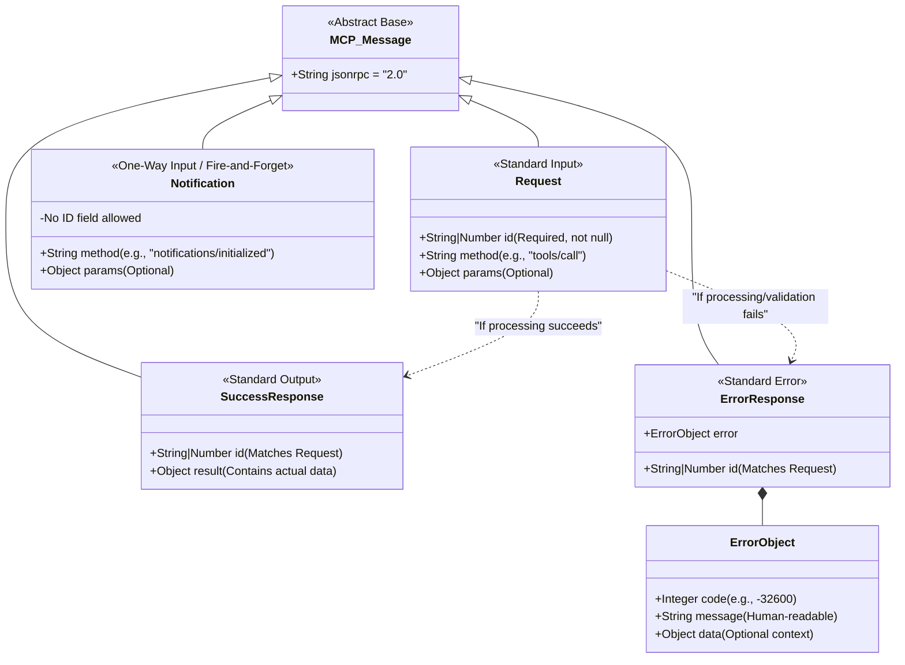

```mermaid
classDiagram
    direction TB

    class MCP_Message {
        <<Abstract Base>>
        +String jsonrpc = "2.0"
    }

    class Request {
        <<Standard Input>>
        +String|Number id (Required, not null)
        +String method (e.g., "tools/call")
        +Object params (Optional)
    }

    class Notification {
        <<One-Way Input / Fire-and-Forget>>
        +String method (e.g., "notifications/initialized")
        +Object params (Optional)
        -No ID field allowed
    }

    class SuccessResponse {
        <<Standard Output>>
        +String|Number id (Matches Request)
        +Object result (Contains actual data)
    }

    class ErrorResponse {
        <<Standard Error>>
        +String|Number id (Matches Request)
        +ErrorObject error
    }

    class ErrorObject {
        +Integer code (e.g., -32600)
        +String message (Human-readable)
        +Object data (Optional context)
    }

    MCP_Message <|-- Request
    MCP_Message <|-- Notification
    MCP_Message <|-- SuccessResponse
    MCP_Message <|-- ErrorResponse
    ErrorResponse *-- ErrorObject

    %% Workflow connections
    Request ..> SuccessResponse : "If processing succeeds"
    Request ..> ErrorResponse : "If processing/validation fails"
```
