# Standardized Input/Output (MCP Schema)

## Overview
**Tier 0** requires all internal and external communication to strictly adhere to a standardized schema structure, effectively wrapping Kea into a unified container. Kea uses the **Model Context Protocol (MCP)** inspired JSON-RPC 2.0 format. 

By having a single standard I/O format, the Corporate Router (Tier 6) can pass messages to a Tier 5 Ego, which passes it to a Tier 4 OODA loop, without any messy data translation. It guarantees type-safety across distributed network boundaries.

## Architecture & Flow

```mermaid
---
config:
  layout: dagre
---
classDiagram
    direction TB
    
    class MCP_Message {
        <<Base Event>>
        +String jsonrpc : "2.0"
    }

    class Request {
        <<Input Schema>>
        +String id (Required UUID/ULID)
        +String method (Target Action)
        +Object params (Optional payload)
    }

    class Notification {
        <<One-Way Emit Schema>>
        +String method (Target Event)
        +Object params (Optional payload)
        -No ID field (Fire & Forget)
    }

    class SuccessResponse {
        <<Output Schema>>
        +String id (Matches Request ID)
        +Object result (Data block)
    }

    class ErrorResponse {
        <<Failure Schema>>
        +String id (Matches Request ID)
        +ErrorObject error
    }

    class ErrorObject {
        +Integer code (e.g., -32600)
        +String message (Human Readable)
        +Object data (Stacktrace / Context)
    }

    MCP_Message <|-- Request
    MCP_Message <|-- Notification
    MCP_Message <|-- SuccessResponse
    MCP_Message <|-- ErrorResponse
    ErrorResponse *-- ErrorObject

    %% Connections
    Request ..> SuccessResponse : Valid Processing
    Request ..> ErrorResponse : Exception Handled (Tier 1 Validation Failed)
```

## Key Mechanisms
1. **Request & Response Coupling**: Because the OODA loop is asynchronous and highly multithreaded (Tier 4), requests and responses must share a strictly mapped `id`. This allows an agent to fire off 50 Parallel tools in Tier 3, and seamlessly map the 50 returning `SuccessResponses` back to their origin node via the ID marker.
2. **Notifications (Emits)**: Used extensively by the `Information Exchange / Artifact Bus` in Tier 6. When a human or another agent needs to broadcast an action ("File Uploaded"), they send a `Notification`. Because it has no ID, the agents do not halt their OODA loop waiting for a response; it is pure "fire-and-forget" telemetry.
3. **Structured Error Handling**: "Distrusted components will fail." Instead of allowing Python exceptions to crash an agent, Tier 1 `Validation` will intercept the failure and format it tightly into the `ErrorObject` schema. The OODA Loop reads the `-32600` code, realizes it was a bad request, and seamlessly triggers the `Curiosity Engine` to fix the request without failing.

## Function Decomposition

### `validate_message_envelope`
- **Signature**: `validate_message_envelope(raw_payload: dict) -> MCPMessage`
- **Description**: Parses and validates any incoming raw dictionary against the MCP JSON-RPC 2.0 base schema. Determines the message subtype (Request, Notification, SuccessResponse, ErrorResponse) based on the presence or absence of `id`, `result`, and `error` fields. Returns the correctly typed Pydantic model or raises a structured `ErrorResponse`.
- **Calls**: Tier 0 Pydantic discriminated union parsing.

### `create_request`
- **Signature**: `create_request(method: str, params: dict | None, entity_type: str) -> Request`
- **Description**: Factory that constructs a fully formed MCP `Request` object. Generates a unique `id` via the Tier 0 ID generator (`generate_id` from `id_and_hash`), stamps the `jsonrpc: "2.0"` header, and attaches the target `method` and optional `params` payload.
- **Calls**: `id_and_hash.generate_id()`.

### `create_notification`
- **Signature**: `create_notification(method: str, params: dict | None) -> Notification`
- **Description**: Factory for fire-and-forget broadcast messages. Produces a `Notification` with no `id` field, meaning no response is expected. Used by the Artifact Bus (Tier 6) and telemetry systems.
- **Calls**: None (pure construction).

### `create_success_response`
- **Signature**: `create_success_response(request_id: str, result: dict) -> SuccessResponse`
- **Description**: Constructs a `SuccessResponse` coupled to the originating `Request` via its `id`. The `result` block carries the output data from a successfully processed node or service call.
- **Calls**: None (pure construction).

### `create_error_response`
- **Signature**: `create_error_response(request_id: str, code: int, message: str, data: dict | None) -> ErrorResponse`
- **Description**: Packages a failure into the structured `ErrorObject` schema (code, human-readable message, optional stacktrace/context data). Used by the Tier 1 Validation engine to format exceptions without crashing the OODA loop.
- **Calls**: None (pure construction).

### `match_response_to_request`
- **Signature**: `match_response_to_request(request_id: str, response_pool: list[MCPMessage]) -> SuccessResponse | ErrorResponse | None`
- **Description**: Given a request's `id`, scans a pool of buffered responses and returns the matching `SuccessResponse` or `ErrorResponse`. Returns `None` if the response has not yet arrived, enabling the OODA loop to continue polling asynchronously.
- **Calls**: None (pure lookup).
