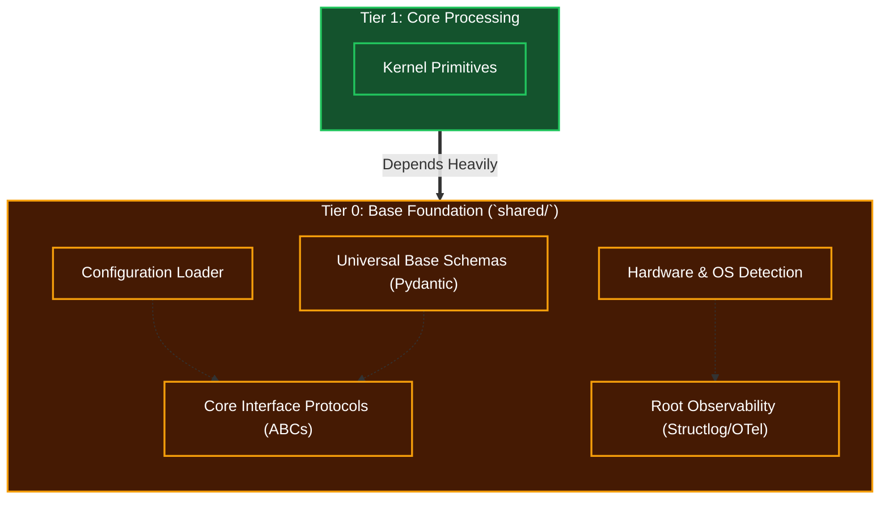

# Tier 0: Base Foundation (Shared Standards)

## Overview
Tier 0 forms the bedrock of the entire Kea system, primarily residing within the `shared/` directory. It contains the most general functions, fundamental abstractions, network protocols, configuration parsers, database schemas, and global standards.

**CRITICAL RULE**: Tier 0 MUST NOT import or depend on any component from Tiers 1 through 5. It is completely blind to upper-level cognitive logic.

## Scope & Responsibilities
- **Data Schemas**: Defines Pydantic models for universal data structures.
- **Protocols & ABCs (Interfaces)**: Defines Python `Protocol` or `ABC` interfaces that upper layers must implement, allowing for dependency injection and mocking.
- **Hardware Abstraction**: Detects available resources (GPU, RAM, cores) to enable Adaptive Scalability.
- **Observability**: Houses base loggers (e.g., `structlog` bindings), telemetry, and tracing components.
- **Configurations**: Parses system variables, paths, and API keys.

## Architecture

## Function Registry

| Module | Function | Signature | Purpose |
|--------|----------|-----------|---------|
| `standard_io` | `validate_message_envelope` | `(raw_payload: dict) -> MCPMessage` | Parse and validate MCP JSON-RPC 2.0 messages |
| `standard_io` | `create_request` | `(method: str, params: dict \| None, entity_type: str) -> Request` | Factory for MCP request objects |
| `standard_io` | `create_notification` | `(method: str, params: dict \| None) -> Notification` | Factory for fire-and-forget broadcasts |
| `standard_io` | `create_success_response` | `(request_id: str, result: dict) -> SuccessResponse` | Factory for success response objects |
| `standard_io` | `create_error_response` | `(request_id: str, code: int, message: str, data: dict \| None) -> ErrorResponse` | Factory for structured error objects |
| `standard_io` | `match_response_to_request` | `(request_id: str, response_pool: list[MCPMessage]) -> SuccessResponse \| ErrorResponse \| None` | Correlate async responses by ID |
| `normalization` | `select_normalization_strategy` | `(signal_metadata: SignalMetadata) -> NormalizationStrategy` | Route signals to appropriate normalizer |
| `normalization` | `min_max_scale` | `(value: float, min_bound: float, max_bound: float) -> float` | Bounded linear normalization to [0.0, 1.0] |
| `normalization` | `z_score_normalize` | `(value: float, running_stats: RunningStatistics) -> float` | Statistical normalization for unbounded data |
| `normalization` | `softmax_transform` | `(scores: list[float]) -> list[float]` | Probability distribution (sums to 1.0) |
| `normalization` | `normalize_signal_batch` | `(raw_signals: list[RawSignal]) -> list[float]` | Batch normalize heterogeneous signals |
| `id_and_hash` | `generate_id` | `(entity_type: str, payload: bytes \| None) -> str` | Unified ID generation entry point |
| `id_and_hash` | `select_id_strategy` | `(entity_type: str, has_payload: bool) -> IdStrategy` | Choose ULID/UUID/Hash strategy |
| `id_and_hash` | `generate_ulid` | `() -> str` | Time-sortable unique identifier |
| `id_and_hash` | `generate_uuid4` | `() -> str` | Cryptographically random identifier |
| `id_and_hash` | `generate_deterministic_hash` | `(payload: bytes, namespace: str) -> str` | Content-based idempotent identifier |
| `id_and_hash` | `inject_entity_prefix` | `(raw_id: str, entity_type: str) -> str` | Apply Stripe-style prefix (agt_, job_, etc.) |
