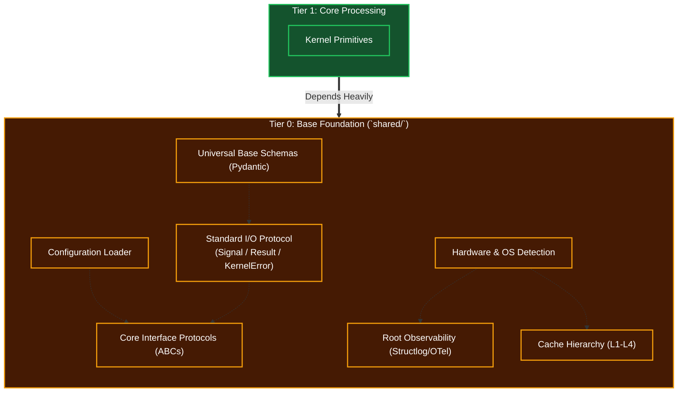

# Tier 0: Base Foundation (Shared Standards)

## Overview
Tier 0 forms the bedrock of the entire Kea system, primarily residing within the `shared/` directory. It contains the most general functions, fundamental abstractions, network protocols, configuration parsers, database schemas, and global standards.

**CRITICAL RULE**: Tier 0 MUST NOT import or depend on any component from Tiers 1 through 6. It is completely blind to upper-level cognitive logic.

## Scope & Responsibilities
- **Data Schemas**: Defines Pydantic models for universal data structures.
- **Protocols & ABCs (Interfaces)**: Defines Python `Protocol` or `ABC` interfaces that upper layers must implement, allowing for dependency injection and mocking.
- **Hardware Abstraction**: Detects available resources (GPU, RAM, cores) to enable Adaptive Scalability.
- **Observability**: Houses base loggers (e.g., `structlog` bindings), telemetry, and tracing components.
- **Configurations**: Parses system variables, paths, and API keys.
- **Cache Hierarchy**: Multi-tier caching infrastructure (L1 working, L2 session, L3 result, L4 decision) used by all upper tiers.
- **Standard I/O Protocol**: Defines Signal, Result, and KernelError — the universal data types flowing through the kernel. Includes protocol bridges between internal (kernel bus) and external (MCP/HTTP) communication.

## Architecture

## Function Registry

| Module | Function | Signature | Purpose |
|--------|----------|-----------|---------|
| `standard_io` | `create_signal` | `(kind: SignalKind, body: dict, origin: ModuleRef, trace_id: str, tags: dict \| None, parent_id: str \| None) -> Signal` | Universal signal factory |
| `standard_io` | `create_text_signal` | `(text: str, origin: ModuleRef, trace_id: str, tags: dict \| None) -> Signal` | TEXT signal from string |
| `standard_io` | `create_data_signal` | `(data: Any, schema: str, origin: ModuleRef, trace_id: str, tags: dict \| None) -> Signal` | DATA signal from typed data |
| `standard_io` | `create_file_signal` | `(file_id: str, file_type: str, path: str \| None, origin: ModuleRef, trace_id: str) -> Signal` | FILE signal from reference |
| `standard_io` | `create_command_signal` | `(action: str, target: ModuleRef, origin: ModuleRef, trace_id: str, payload: dict \| None) -> Signal` | COMMAND signal for control flow |
| `standard_io` | `create_error_signal` | `(error: KernelError, origin: ModuleRef, trace_id: str) -> Signal` | Wrap KernelError as pipeline signal |
| `standard_io` | `ok` | `(signals: list[Signal], metrics: Metrics) -> Result` | Successful result factory |
| `standard_io` | `partial` | `(signals: list[Signal], error: KernelError, metrics: Metrics) -> Result` | Partial success factory |
| `standard_io` | `fail` | `(error: KernelError, metrics: Metrics) -> Result` | Failed result factory |
| `standard_io` | `skip` | `(reason: str, metrics: Metrics) -> Result` | Skipped result factory |
| `standard_io` | `create_error` | `(code: str, category: ErrorCategory, severity: Severity, message: str, source: ModuleRef, retry: bool, detail: dict \| None, cause: KernelError \| None) -> KernelError` | Universal error factory |
| `standard_io` | `wrap_error` | `(outer_code: str, inner: KernelError, source: ModuleRef, message: str \| None) -> KernelError` | Wrap lower-tier error with context |
| `standard_io` | `tool_result_to_signal` | `(result: ToolResult, tool_name: str, trace_id: str) -> list[Signal]` | Bridge: MCP ToolResult → Signals |
| `standard_io` | `signal_to_tool_call` | `(signal: Signal) -> ToolCallRequest` | Bridge: Signal → MCP ToolCallRequest |
| `standard_io` | `result_to_http_response` | `(result: Result) -> SuccessResponse \| ProblemDetails` | Bridge: Result → HTTP envelope |
| `standard_io` | `http_request_to_signal` | `(request: JobRequest, trace_id: str) -> Signal` | Bridge: HTTP request → Signal |
| `standard_io` | `validate_signal` | `(signal: Signal) -> Signal \| KernelError` | Validate body matches kind conventions |
| `standard_io` | `validate_result` | `(result: Result) -> Result \| KernelError` | Validate result consistency |
| `normalization` | `select_normalization_strategy` | `(signal_metadata: SignalMetadata) -> NormalizationStrategy` | Route signals to appropriate normalizer |
| `normalization` | `min_max_scale` | `(value: float, min_bound: float, max_bound: float) -> float` | Bounded linear normalization to [0.0, 1.0] |
| `normalization` | `z_score_normalize` | `(value: float, running_stats: RunningStatistics) -> float` | Statistical normalization for unbounded data |
| `normalization` | `softmax_transform` | `(scores: list[float]) -> list[float]` | Probability distribution (sums to 1.0) |
| `normalization` | `normalize_signal_batch` | `(raw_signals: list[RawSignal]) -> list[float]` | Batch normalize heterogeneous signals |
| `id_and_hash` | `generate_id` | `(entity_type: str, payload: bytes \| None) -> str` | Unified ID generation entry point |
| `id_and_hash` | `select_id_strategy` | `(entity_type: str, has_payload: bool) -> IdStrategy` | Choose ULID/UUID/Hash strategy |
| `id_and_hash` | `generate_ulid` | `() -> str` | Time-sortable unique identifier |
| `id_and_hash` | `generate_uuid4` | `() -> str` | Cryptographically random identifier |
| `id_and_hash` | `generate_deterministic_hash` | `(payload: bytes, namespace: str) -> str` | Content-based idempotent identifier |
| `id_and_hash` | `inject_entity_prefix` | `(raw_id: str, entity_type: str) -> str` | Apply Stripe-style prefix (agt_, job_, etc.) |
| `cache_hierarchy` | `read_cache` | `(key: str, level: CacheLevel \| None) -> CacheEntry \| None` | Cascading read from specified or all levels |
| `cache_hierarchy` | `write_cache` | `(key: str, value: Any, level: CacheLevel, ttl: int \| None) -> None` | Write to specific cache level |
| `cache_hierarchy` | `invalidate` | `(key: str, level: CacheLevel \| None) -> int` | Remove entry from specific or all levels |
| `cache_hierarchy` | `generate_cache_key` | `(namespace: str, payload: bytes) -> str` | Content-addressed key via deterministic hash |
| `cache_hierarchy` | `pressure_evict` | `(target_freed_bytes: int) -> int` | Free memory under hardware pressure |
