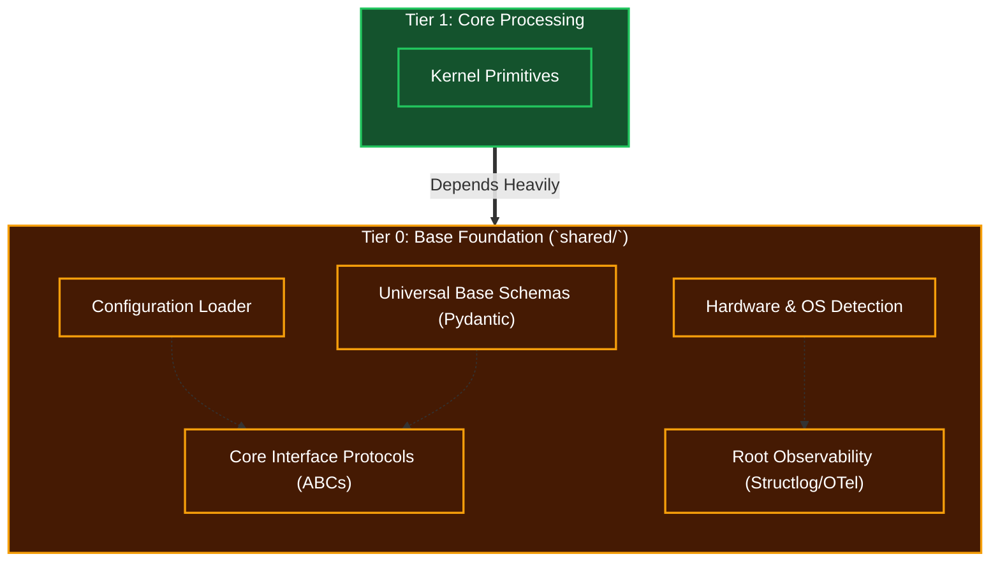

# Tier 0: Base Foundation (Shared Standards)

## Overview
Tier 0 forms the bedrock of the entire Kea system, primarily residing within the `shared/` directory. It contains the most general functions, fundamental abstractions, network protocols, configuration parsers, database schemas, and global standards.

**CRITICAL RULE**: Tier 0 MUST NOT import or depend on any component from Tiers 1 through 5. It is completely blind to upper-level cognitive logic.

## Scope & Responsibilities
- **Data Schemas**: Defines Pydantic models for universal data structures.
- **Protocols & ABCs (Interfaces)**: Defines Python `Protocol` or `ABC` interfaces that upper layers must implement, allowing for dependency injection and mocking.
- **Hardware Abstraction**: Detects available resources (GPU, RAM, cores) to enable Adaptive Scalability.
- **Observability**: Houses base loggers (e.g., `structlog` bindings), telemetry, and tracing components.
- **Configurations**: Parses system variables, paths, and API keys.

## Architecture

