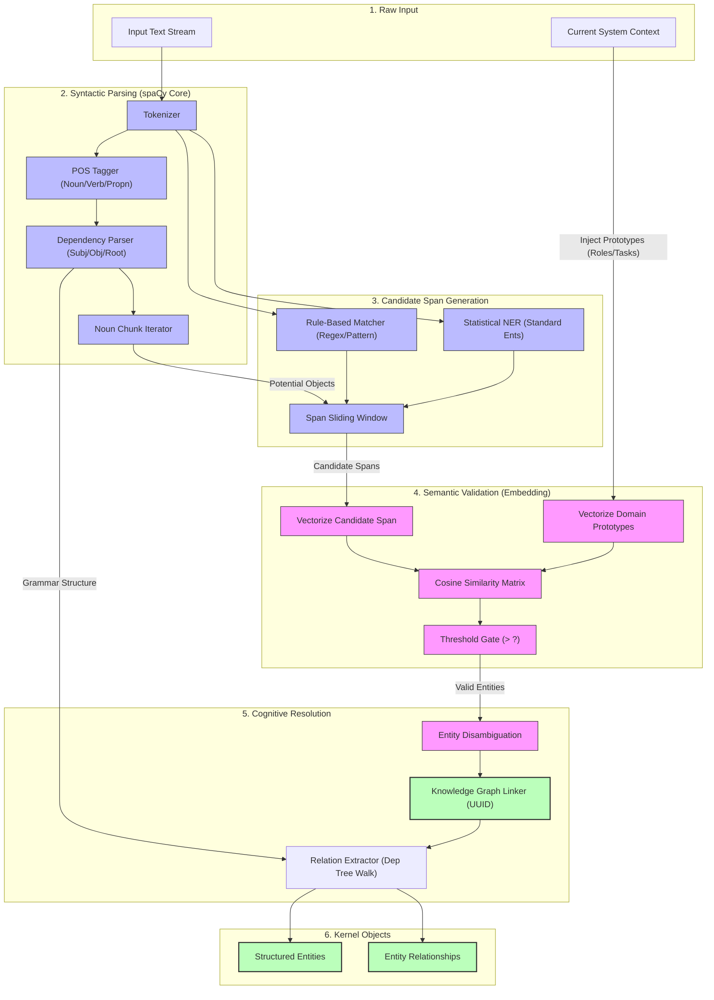

```mermaid
---
config:
  layout: dagre
---
flowchart TB
 subgraph sInput["1. Raw Input"]
        nText["Input Text Stream"]
        nContext["Current System Context"]
  end

 subgraph sSyntax["2. Syntactic Parsing (spaCy Core)"]
        direction TB
        nTok["Tokenizer"]
        nPOS["POS Tagger (Noun/Verb/Propn)"]
        nDep["Dependency Parser (Subj/Obj/Root)"]
        nChunks["Noun Chunk Iterator"]
        
        nTok --> nPOS --> nDep --> nChunks
  end

 subgraph sCandidate["3. Candidate Span Generation"]
        direction TB
        nRule["Rule-Based Matcher (Regex/Pattern)"]
        nModel["Statistical NER (Standard Ents)"]
        nSpanGen["Span Sliding Window"]
  end

 subgraph sSemantic["4. Semantic Validation (Embedding)"]
        direction TB
        nVecTarget["Vectorize Candidate Span"]
        nVecProto["Vectorize Domain Prototypes"]
        nSimMatrix["Cosine Similarity Matrix"]
        nFilter["Threshold Gate (> ?)"]
  end

 subgraph sResolution["5. Cognitive Resolution"]
        direction TB
        nDisambig["Entity Disambiguation"]
        nLink["Knowledge Graph Linker (UUID)"]
        nRelExtract["Relation Extractor (Dep Tree Walk)"]
  end

 subgraph sOutput["6. Kernel Objects"]
        nObjects["Structured Entities"]
        nRelations["Entity Relationships"]
  end

    %% Flow: Syntax Phase
    nText --> nTok
    nChunks -- "Potential Objects" --> nSpanGen
    nDep -- "Grammar Structure" --> nRelExtract

    %% Flow: Candidate Generation
    nTok --> nRule
    nTok --> nModel
    nRule & nModel --> nSpanGen

    %% Flow: Semantic Phase (The Hybrid)
    nSpanGen -- "Candidate Spans" --> nVecTarget
    nContext -- "Inject Prototypes (Roles/Tasks)" --> nVecProto
    
    nVecTarget & nVecProto --> nSimMatrix
    nSimMatrix --> nFilter

    %% Flow: Resolution Phase
    nFilter -- "Valid Entities" --> nDisambig
    nDisambig --> nLink
    
    %% Relation Extraction (Connecting the dots)
    nLink --> nRelExtract
    nRelExtract --> nObjects & nRelations

    %% Styling
    classDef syn fill:#bbf,stroke:#333,stroke-width:1px;
    classDef sem fill:#f9f,stroke:#333,stroke-width:1px;
    classDef out fill:#bfb,stroke:#333,stroke-width:2px;

    class nTok,nPOS,nDep,nChunks,nRule,nModel,nSpanGen syn;
    class nVecTarget,nVecProto,nSimMatrix,nFilter,nDisambig sem;
    class nObjects,nRelations,nLink out;
```