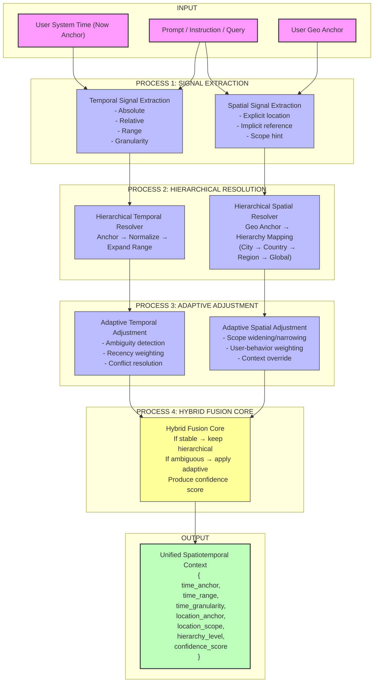

```mermaid
---
config:
  layout: fixed
---
flowchart TB
 subgraph INPUT_LAYER["INPUT"]
        A1["User System Time (Now Anchor)"]
        A2["User Geo Anchor"]
        A3["Prompt / Instruction / Query"]
  end
 subgraph PROCESS_EXTRACTION["PROCESS 1: SIGNAL EXTRACTION"]
        B1["Temporal Signal Extraction
    - Absolute
    - Relative
    - Range
    - Granularity"]
        B2["Spatial Signal Extraction
    - Explicit location
    - Implicit reference
    - Scope hint"]
  end
 subgraph PROCESS_HIERARCHICAL["PROCESS 2: HIERARCHICAL RESOLUTION"]
        C1["Hierarchical Temporal Resolver
    Anchor → Normalize → Expand Range"]
        C2["Hierarchical Spatial Resolver
    Geo Anchor → Hierarchy Mapping
    (City → Country → Region → Global)"]
  end
 subgraph PROCESS_ADAPTIVE["PROCESS 3: ADAPTIVE ADJUSTMENT"]
        D1["Adaptive Temporal Adjustment
    - Ambiguity detection
    - Recency weighting
    - Conflict resolution"]
        D2["Adaptive Spatial Adjustment
    - Scope widening/narrowing
    - User-behavior weighting
    - Context override"]
  end
 subgraph PROCESS_FUSION["PROCESS 4: HYBRID FUSION CORE"]
        E1["Hybrid Fusion Core
    If stable → keep hierarchical
    If ambiguous → apply adaptive
    Produce confidence score"]
  end
 subgraph OUTPUT_LAYER["OUTPUT"]
        F1["Unified Spatiotemporal Context
    {
      time_anchor,
      time_range,
      time_granularity,
      location_anchor,
      location_scope,
      hierarchy_level,
      confidence_score
    }"]
  end
    A1 --> B1
    A3 --> B1 & B2
    A2 --> B2
    B1 --> C1
    B2 --> C2
    C1 --> D1
    C2 --> D2
    D1 --> E1
    D2 --> E1
    E1 --> F1

     A1:::input
     A2:::input
     A3:::input
     B1:::calc
     B2:::calc
     C1:::calc
     C2:::calc
     D1:::calc
     D2:::calc
     E1:::score
     F1:::final
    classDef input fill:#f9f,stroke:#333,stroke-width:2px
    classDef calc fill:#bbf,stroke:#333,stroke-width:1px
    classDef score fill:#ff9,stroke:#333,stroke-width:1px
    classDef final fill:#bfb,stroke:#333,stroke-width:2px
```
