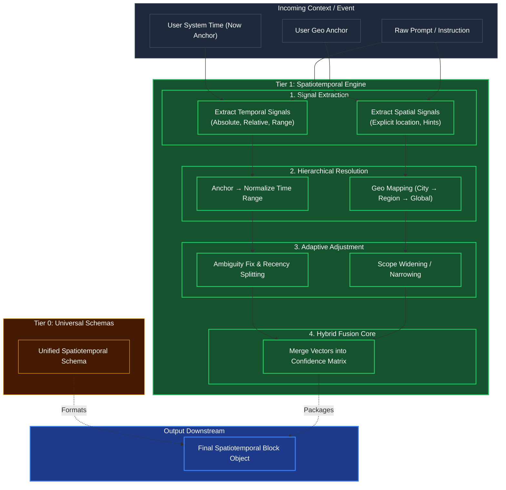

# Spatiotemporal Anchoring (Location & Time)

## Overview
A specialized **Tier 1 Primitive** dedicated exclusively to resolving "Where" and "When". When a User requests an operation, terms like "yesterday," "recently," or "near me" are highly ambiguous. 

This engine acts as a pre-processor: it takes the raw input, anchors it to physical reality (the User's System Time or Geo Anchor), and outputs a strict math-compatible range or bounds file, which Tier 2 Cognitive Engines use to safely perform Curiosity Gap detection or Task Validation.

## Architecture & Flow

## Key Mechanisms
1. **Hierarchical Resolution**: Converts implicit locations into bounding boxes. If a user asks for "Coffee in Soho," it pulls the geo anchor. Is the user in NY or London? It resolves "Soho" via the hierarchy to exact coordinates.
2. **Ambiguity & Recency Fixes**: If "Recently" is used, the Temporal Adjustment dynamically scopes "Recently" depending on the context. If the task is fetching emails, "recently" is 24 hours. If it's analyzing stock prices, "recently" might be minutes.
3. **Hybrid Fusion**: The final layer guarantees that the temporal bounds match the spatial bounds, scoring its confidence before outputting a rigid schema block.
