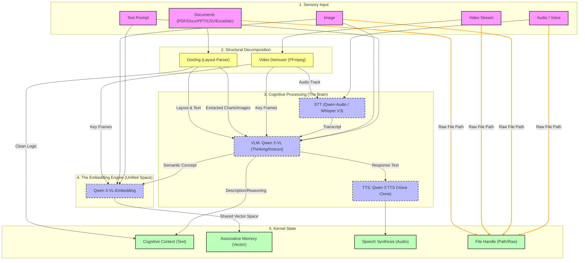

```mermaid
---
config:
  layout: dagre
---
flowchart TB
 subgraph sInput["1. Sensory Input"]
        nInputText["Text Prompt"]
        nInputAudio["Audio / Voice"]
        nInputImage["Image"]
        nInputVideo["Video Stream"]
        nInputDoc["Documents (PDF/Docx/PPT/CSV/Excel/etc)"]
  end

 subgraph sDecompose["2. Structural Decomposition"]
        direction TB
        nDocling["Docling (Layout Parser)"]
        nVideoSplit["Video Demuxer (FFmpeg)"]
 end

 subgraph sProcess["3. Cognitive Processing (The Brain)"]
        direction TB
        nSTT["STT (Qwen-Audio / Whisper V3)"]
        nBrain["VLM: Qwen 3-VL (Thinking/Instruct)"]
        nTTS["TTS: Qwen 3 TTS (Voice Clone)"]
  end

 subgraph sMemory["4. The Embedding Engine (Unified Space)"]
        direction TB
        nUnifiedEmbed["Qwen 3-VL-Embedding"]
  end

 subgraph sOutput["5. Kernel State"]
        nFinalText["Cognitive Context (Text)"]
        nFinalVector["Associative Memory (Vector)"]
        nAudioOut["Speech Synthesis (Audio)"]
        nFileOut["File Handle (Path/Raw)"]
  end

    %% ==========================================
    %% 1. DIRECT PASSTHROUGH (The New Fix)
    %% Skips the brain, preserves the file path/pointer
    %% ==========================================
    nInputDoc -- "Raw File Path" --> nFileOut
    nInputVideo -- "Raw File Path" --> nFileOut
    nInputImage -- "Raw File Path" --> nFileOut
    nInputAudio -- "Raw File Path" --> nFileOut

    %% ==========================================
    %% 2. COGNITIVE PATHWAYS
    %% ==========================================
    
    %% Flow: Documents
    nInputDoc --> nDocling
    nDocling -- "Layout & Text" --> nBrain
    nDocling -- "Extracted Charts/Images" --> nBrain
    nDocling -- "Clean Logic" --> nFinalText

    %% Flow: Video
    nInputVideo --> nVideoSplit
    nVideoSplit -- "Audio Track" --> nSTT
    nVideoSplit -- "Key Frames" --> nBrain
    nVideoSplit -- "Key Frames" --> nUnifiedEmbed

    %% Flow: Audio/Voice
    nInputAudio --> nSTT
    nSTT -- "Transcript" --> nBrain
    nBrain -- "Response Text" --> nTTS
    nTTS --> nAudioOut

    %% Flow: Image
    nInputImage --> nBrain
    nInputImage --> nUnifiedEmbed

    %% Flow: Text
    nInputText --> nBrain
    nInputText --> nUnifiedEmbed

    %% The Unification
    nBrain -- "Description/Reasoning" --> nFinalText
    nBrain -- "Semantic Concept" --> nUnifiedEmbed
    nUnifiedEmbed -- "Shared Vector Space" --> nFinalVector

    %% Styling
    classDef input fill:#f9f,stroke:#333,stroke-width:2px;
    classDef tools fill:#ff9,stroke:#333,stroke-width:1px;
    classDef qwen fill:#bbf,stroke:#333,stroke-width:2px,stroke-dasharray: 5 5;
    classDef output fill:#bfb,stroke:#333,stroke-width:2px;
    classDef passthrough stroke:#ff0000,stroke-width:2px,stroke-dasharray: 2 2;

    class nInputText,nInputAudio,nInputImage,nInputVideo,nInputDoc input;
    class nDocling,nVideoSplit tools;
    class nBrain,nTTS,nUnifiedEmbed,nSTT qwen;
    class nFinalText,nFinalVector,nAudioOut,nFileOut output;
    
    %% Apply specific style to the passthrough lines links
    linkStyle 0,1,2,3 stroke:#ff9900,stroke-width:2px;
```
