# Modality Ingestion & Demuxing

## Overview
A heavy-duty **Tier 1** component that acts as the agent's absolute sensory gateway. Kea supports Omni-modal inputs: Video, Audio, Complex Documents (PDF/Excel), and Images. 

Because advanced LLMs (the "Brain") are extremely slow and expensive when processing dense raw files (like a 3-hour video), Tier 1 physically decomposes and parses the structures into computationally efficient chunks or purely text formats *before* a higher cognitive tier even looks at it.

## Architecture & Flow

```mermaid
---
config:
  layout: dagre
---
flowchart TB
    %% SCHEMA IMPORTS
    subgraph sTier0["Tier 0: Universal Schemas"]
        direction LR
        nSchemaText["CognitiveContext (Text)"]
        nSchemaFile["FileHandle (Path Pointer)"]
        nSchemaVec["AssociativeMemory (Vector Object)"]
    end

    %% INPUT
    subgraph sInput["1. Sensory Input"]
        nInputText["Text Prompt"]
        nInputAudio["Audio / Voice"]
        nInputImg["Image Array"]
        nInputVid["Video Stream"]
        nInputDoc["Docs (PDF/XLSX)"]
    end

    %% TIER 1 Engine
    subgraph sTier1["Tier 1: High-Speed Demuxer"]
        direction TB
        
        %% Decomposition
        subgraph sDecompose["2. Structural Decomposition"]
            nDocling["Docling (Layout Extraction)"]
            nVideoSplit["Video Demuxer (FFMPEG KeyFrames)"]
        end

        %% STT / Translators
        subgraph sProcess["3. Translators"]
            nSTT["Speech-To-Text (Whisper/Qwen A)"]
            nOCR["Vision Parsing (Qwen VL)"]
        end

        %% Vectorizer
        subgraph sMemory["4. The Embedding Engine"]
            nEmbed["General Vector Extraction Model"]
        end
    end

    %% Outputs
    subgraph sOutput["5. Output (Kernel State Ready)"]
        nFinalText["Cognitive Context (Semantic Meaning)"]
        nFinalVector["Associative Memory (Embedding Vector)"]
        nFileOut["File Handle (Raw Path for MCP)"]
    end

    %% PASSTHROUGH (Efficiency Rule)
    nInputDoc & nInputVid & nInputImg & nInputAudio -.->|Direct Pointer Bypasses Engine| nFileOut

    %% Process Routing
    nInputDoc --> nDocling
    nDocling -->|Metadata| nFinalText
    nDocling -->|Embedded Images| nOCR

    nInputVid --> nVideoSplit
    nVideoSplit -->|Keyframes| nOCR
    nVideoSplit -->|Stems| nSTT

    nInputAudio --> nSTT
    nInputImg --> nOCR

    nInputText --> nEmbed & nFinalText

    nSTT --> nEmbed & nFinalText
    nOCR --> nEmbed & nFinalText

    %% Schema Routing
    nSchemaText -.->|Formats| nFinalText
    nSchemaFile -.->|Formats| nFileOut
    nSchemaVec -.->|Formats| nFinalVector
    
    %% Styling
    classDef t0 fill:#451A03,stroke:#F59E0B,stroke-width:1px,color:#fff
    classDef t1 fill:#14532D,stroke:#22C55E,stroke-width:2px,color:#fff
    classDef in fill:#1e293b,stroke:#475569,stroke-width:1px,color:#fff
    classDef out fill:#1E3A8A,stroke:#3B82F6,stroke-width:2px,color:#fff
    
    class sTier0,nSchemaText,nSchemaFile,nSchemaVec t0
    class sInput,nInputText,nInputAudio,nInputImg,nInputVid,nInputDoc in
    class sTier1,sDecompose,sProcess,sMemory,nDocling,nVideoSplit,nSTT,nOCR,nEmbed t1
    class sOutput,nFinalText,nFinalVector,nFileOut out
```

## Key Mechanisms
1. **Direct Passthrough**: The dotted lines show that raw files (like a 4K `.mp4`) bypass the cognitive engine and are immediately assigned a `FileHandle`. Kea refuses to keep 4K video data in RAM. Tier 4 MCP tools will grab the `FileHandle` pointer on disk.
2. **Structural Demuxing (FFMPEG / Docling)**: Cuts the file apart. It scrapes images out of PDFs for `OCR`, extracts audio out of `Video` for transcriptions, and returns a flat dictionary of extracted properties.
3. **Embedding Vectorization**: Anything translated to text or image slices is run through the `Embedding Engine` at Tier 1, creating a shared Associative Vector Space that Tier 2 can use to "remember" concepts instantly.
