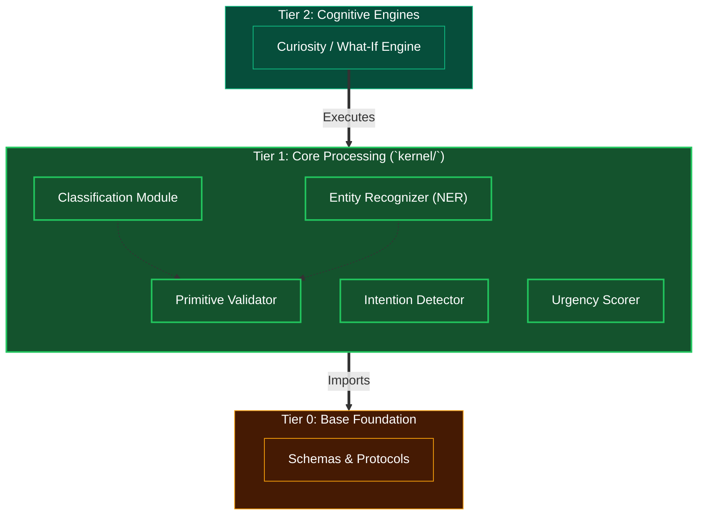

# Tier 1: Core Processing (Kernel Primitives)

## Overview
Tier 1 represents the fundamental cognitive and computational building blocks for the Human Kernel, located primarily within the `kernel/` directory. It defines pure programmatic processing units meant to be invoked by higher-order cognitive layers.

**CRITICAL RULE**: Tier 1 may ONLY import from Tier 0. It must remain stateless on its own, processing inputs and returning outputs cleanly.

## Scope & Responsibilities
- **Classification**: Text categorization, structural analysis, and basic semantic grouping.
- **Intention Detection**: Recognizing underlying goals or objectives within a given input stream.
- **Urgency Measurement**: Determining the priority/time-sensitivity of incoming information.
- **Entity Extraction**: Identifying and standardizing real-world objects, numbers, parameters, or entities in a text.
- **Validation**: Fundamental logical and type sanity-checks on parsed data.

## Architecture

## Function Registry

| Module | Function | Signature | Purpose |
|--------|----------|-----------|---------|
| `classification` | `classify` | `async (text: str, profile_rules: ClassProfileRules) -> ClassificationResult \| FallbackTrigger` | Top-level text classification orchestrator |
| `classification` | `run_linguistic_analysis` | `(text: str, profile_rules: ClassProfileRules) -> LinguisticResult` | Layer A: Regex + POS tagging |
| `classification` | `run_semantic_proximity` | `async (text: str, profile_rules: ClassProfileRules) -> SemanticResult` | Layer B: Vector embedding cosine match |
| `classification` | `merge_classification_layers` | `(linguistic, semantic, threshold: float) -> ClassificationResult \| FallbackTrigger` | Layer C: Weighted fusion + threshold |
| `entity_recognition` | `extract_entities` | `(raw_text: str, expected_schema: type[BaseModel]) -> list[ValidatedEntity]` | Top-level NER orchestrator |
| `entity_recognition` | `tokenize_and_parse` | `(raw_text: str) -> list[Token]` | Syntactic tokenization |
| `entity_recognition` | `generate_candidate_spans` | `(tokens: list[Token]) -> list[EntitySpan]` | Noun phrase chunking |
| `entity_recognition` | `match_spans_to_schema` | `(spans: list[EntitySpan], expected_schema: type[BaseModel]) -> list[ValidatedEntity]` | Pydantic schema matching |
| `intent_sentiment_urgency` | `run_primitive_scorers` | `async (text: str) -> CognitiveLabels` | Parallel intent + sentiment + urgency |
| `intent_sentiment_urgency` | `detect_intent` | `(text: str) -> IntentLabel` | Classify goal/purpose |
| `intent_sentiment_urgency` | `analyze_sentiment` | `(text: str) -> SentimentLabel` | Emotional valence scoring |
| `intent_sentiment_urgency` | `score_urgency` | `(text: str) -> UrgencyLabel` | Time-sensitivity measurement |
| `location_and_time` | `anchor_spatiotemporal` | `(text: str, system_time: datetime, geo_anchor: GeoAnchor \| None) -> SpatiotemporalBlock` | Top-level spatiotemporal orchestrator |
| `location_and_time` | `extract_temporal_signals` | `(text: str, system_time: datetime) -> list[TemporalSignal]` | Extract time references |
| `location_and_time` | `extract_spatial_signals` | `(text: str, geo_anchor: GeoAnchor \| None) -> list[SpatialSignal]` | Extract location references |
| `location_and_time` | `resolve_temporal_hierarchy` | `(signals, system_time) -> TemporalRange` | Resolve relative times to UTC ranges |
| `location_and_time` | `resolve_spatial_hierarchy` | `(signals, geo_anchor) -> SpatialBounds` | Map places to bounding boxes |
| `location_and_time` | `adapt_temporal_ambiguity` | `(temporal_range, task_context: str) -> TemporalRange` | Domain-aware time scoping |
| `location_and_time` | `adapt_spatial_scope` | `(spatial_bounds, task_context: str) -> SpatialBounds` | Domain-aware geo scoping |
| `location_and_time` | `fuse_spatiotemporal` | `(temporal, spatial) -> SpatiotemporalBlock` | Merge time + space with confidence |
| `scoring` | `score` | `async (content: str, query: str, constraints, metadata) -> NumericScore` | Top-level hybrid evaluation |
| `scoring` | `compute_semantic_similarity` | `async (content: str, query: str) -> float` | Cosine similarity scoring |
| `scoring` | `compute_precision_score` | `async (content: str, query: str) -> float` | Cross-encoder reranking |
| `scoring` | `evaluate_reward_compliance` | `(content: str, constraints: list[Constraint]) -> float` | Boolean constraint validation |
| `scoring` | `aggregate_scores` | `(semantic, precision, reward, metadata) -> float` | Context-weighted fusion |
| `validation` | `validate` | `(raw_data: Any, expected_schema: type[BaseModel]) -> SuccessResult \| ErrorResponse` | Top-level validation sentinel |
| `validation` | `check_syntax` | `(raw_data: Any) -> SyntaxResult` | JSON/parseability gate |
| `validation` | `check_structure` | `(parsed_data: dict, expected_schema) -> StructureResult` | Key matching gate |
| `validation` | `check_types` | `(parsed_data: dict, expected_schema) -> TypeResult` | Type annotation gate |
| `validation` | `check_bounds` | `(parsed_data: dict, expected_schema) -> BoundsResult` | Logical limits gate |
| `validation` | `package_validation_error` | `(gate_name: str, failure_detail: str, raw_data: Any) -> ErrorResponse` | Format error into Standard Error Object |
| `modality` | `ingest` | `async (input_data: RawInput) -> ModalityOutput` | Top-level modality ingestion |
| `modality` | `detect_modality` | `(input_data: RawInput) -> ModalityType` | Identify input type |
| `modality` | `decompose_document` | `async (doc_path: str) -> DocumentParts` | Docling layout extraction |
| `modality` | `decompose_video` | `async (video_path: str) -> VideoParts` | FFMPEG keyframe/audio split |
| `modality` | `transcribe_audio` | `async (audio_path: str) -> str` | Speech-to-text |
| `modality` | `parse_vision` | `async (image_path: str) -> str` | OCR/vision extraction |
| `modality` | `embed_text` | `async (text: str) -> list[float]` | Vector embedding generation |
| `modality` | `create_file_handle` | `(file_path: str, modality: ModalityType) -> FileHandle` | Raw file pointer bypass |
