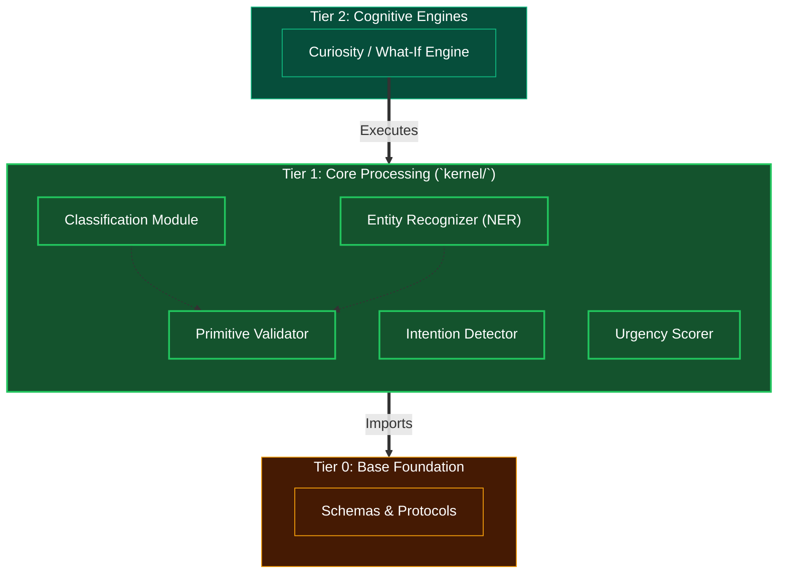

# Tier 1: Core Processing (Kernel Primitives)

## Overview
Tier 1 represents the fundamental cognitive and computational building blocks for the Human Kernel, located primarily within the `kernel/` directory. It defines pure programmatic processing units meant to be invoked by higher-order cognitive layers.

**CRITICAL RULE**: Tier 1 may ONLY import from Tier 0. It must remain stateless on its own, processing inputs and returning outputs cleanly.

## Scope & Responsibilities
- **Classification**: Text categorization, structural analysis, and basic semantic grouping.
- **Intention Detection**: Recognizing underlying goals or objectives within a given input stream.
- **Urgency Measurement**: Determining the priority/time-sensitivity of incoming information.
- **Entity Extraction**: Identifying and standardizing real-world objects, numbers, parameters, or entities in a text.
- **Validation**: Fundamental logical and type sanity-checks on parsed data.

## Architecture

