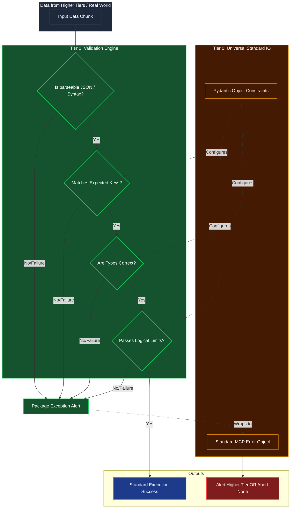

# Core Validation Primitive

## Overview
The gateway **Tier 1 Sentinel**. It accepts raw text, JSON, or structures generated by the MCP/User and mechanically checks it against expected bounds and types. Instead of using prompt engineering to tell an agent to be careful, Kea relies on this deterministic Python engine to instantly kill or fix malformed logic before it can poison a graph. 

## Architecture & Flow

## Key Mechanisms
1. **Mechanical Short-Circuit**: If an LLM incorrectly hallucinates a boolean as a string `"true"` instead of `true`, the `Are Types Correct?` check catches it instantaneously, saving seconds of generation time and preventing a python backend crash.
2. **Bounds Checking**: Ensures the data not only fits the type, but fits physical limits. If a task requires an urgency score from 1-10, and the input provides `99`, it fails the bounds check.
3. **Structured Packaging**: Rather than raising a raw Python exception, it safely packages the exact failure point into the Tier 0 Standard Error Object so the Tier 4 OODA loop can elegantly read the reason why it failed and adjust its strategy.

## Function Decomposition

### `validate`
- **Signature**: `validate(raw_data: Any, expected_schema: type[BaseModel]) -> SuccessResult | ErrorResponse`
- **Description**: Top-level sentinel. Runs the full validation cascade (syntax, structure, types, bounds) in sequence, short-circuiting on the first failure. Returns a `SuccessResult` containing the parsed and validated data if all checks pass, or a structured `ErrorResponse` (via `package_validation_error()`) that the OODA loop can read and act upon without crashing.
- **Calls**: `check_syntax()`, `check_structure()`, `check_types()`, `check_bounds()`, `package_validation_error()`.

### `check_syntax`
- **Signature**: `check_syntax(raw_data: Any) -> SyntaxResult`
- **Description**: Gate 1: Verifies that the raw data is parseable. For string inputs, attempts JSON deserialization. For dict inputs, confirms structural integrity. Returns a `SyntaxResult` with the parsed object or a failure indicator with the exact parse error location.
- **Calls**: `json.loads()`, basic type introspection.

### `check_structure`
- **Signature**: `check_structure(parsed_data: dict, expected_schema: type[BaseModel]) -> StructureResult`
- **Description**: Gate 2: Validates that all required keys exist in the parsed data and no unexpected keys are present (if strict mode is enabled). Compares the data's key set against the Pydantic schema's field definitions. Reports missing and extraneous keys.
- **Calls**: Pydantic `model_fields` introspection.

### `check_types`
- **Signature**: `check_types(parsed_data: dict, expected_schema: type[BaseModel]) -> TypeResult`
- **Description**: Gate 3: Confirms that each value matches its expected type annotation. Catches common LLM hallucinations like string `"true"` instead of boolean `true`, or `"42"` instead of integer `42`. Reports the exact field and expected vs. actual type on failure.
- **Calls**: Pydantic type coercion and validation.

### `check_bounds`
- **Signature**: `check_bounds(parsed_data: dict, expected_schema: type[BaseModel]) -> BoundsResult`
- **Description**: Gate 4: Enforces logical and physical limits defined via Pydantic field validators (e.g., `ge=0, le=10` for urgency scores, `max_length=255` for strings). Catches values that pass type checking but violate business constraints (urgency score of 99 when max is 10).
- **Calls**: Pydantic `model_validate()` with field constraints.

### `package_validation_error`
- **Signature**: `package_validation_error(gate_name: str, failure_detail: str, raw_data: Any) -> ErrorResponse`
- **Description**: Formats a validation failure into the Tier 0 Standard Error Object (`ErrorResponse`). Includes the gate that failed (syntax/structure/types/bounds), a human-readable message, and the offending data in the `data` field. Allows the OODA loop to read the error code and trigger the Curiosity Engine to fix the request.
- **Calls**: `standard_io.create_error_response()`.
