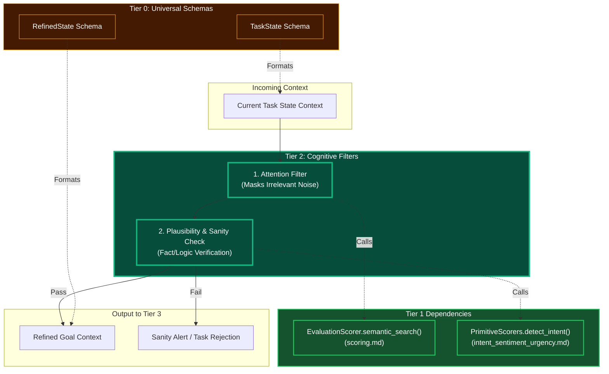

# Plausibility & Attention Filtering

## Overview
These are **Tier 2 Cognitive Engines**. Before the complex orchestrator (Tier 3) starts building an elaborate DAG, Tier 2 runs defensive cognitive checks on the incoming data. 
- **Attention Filtering**: Discards noise and highlights the critical variables necessary for the task context.
- **Plausibility & Sanity Check**: Runs a "common sense" or hallucination-check against the extracted intents to ensure the agent isn't being tricked into an impossible or illogical task.

## Architecture & Flow

