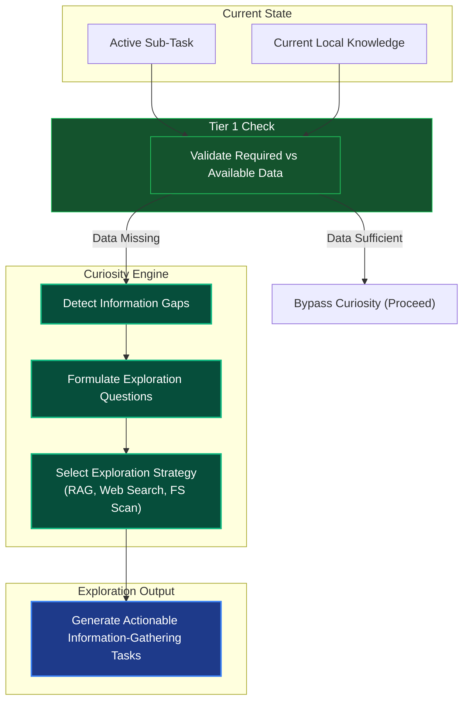

# Curiosity & Exploration Engine

## Overview
The Curiosity Engine is a Tier 2 Cognitive Module designed to identify "missing" knowledge required to solve a task. Instead of failing when data is absent, the engine autonomously formulates questions and exploration strategies to map out the unknowns before proceeding.

## Architecture & Flow

