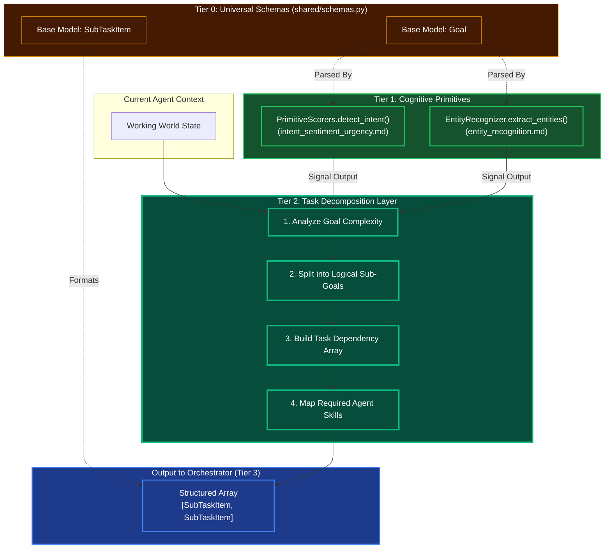

# Task Decomposition Engine

## Overview
The Task Decomposition Engine is a Tier 2 Cognitive Module. It takes a high-level goal, breaks it down down into sequential and parallel subtasks, and outputs a structured node graph that the Tier 3 Orchestrator can turn into an actionable DAG.

## Architecture & Flow

